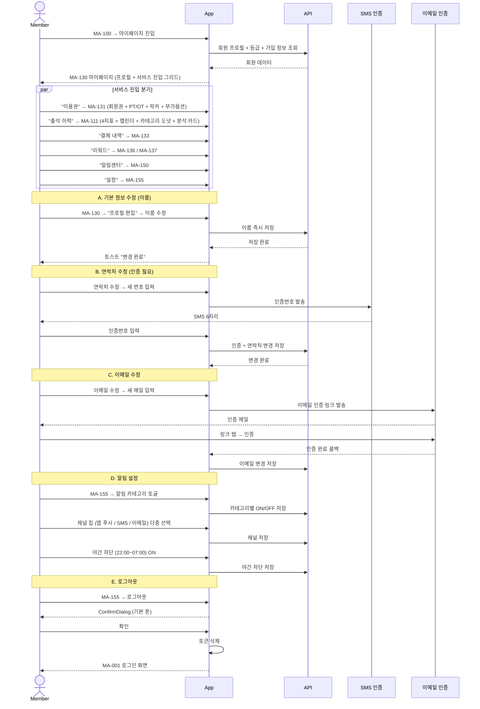

# X09. 마이페이지 / 설정 시나리오

> xlsx 항목: #28 기본 정보 관리, #29 회원권/락커 만료일, #30 방문 히스토리, #31 PT/GX/필라테스 이력, #32 알림 설정, #33 개인정보·로그아웃

회원이 마이페이지에서 본인 정보 수정, 이용권 확인, 출석 분석, 알림 설정, 개인정보·약관·동의·탈퇴 등 마이페이지 허브를 사용하는 흐름.

## 출석 분석 카드 (MA-111)

| 분석 | 표시 |
|---|---|
| 4지표 | 이번 달 출석 / 주간 평균 / 월간 평균 / 연속 출석 |
| 카테고리 비중 | PT / OT / GX / 필라테스 / Golf 도넛 (필라테스 별도 분리) |
| 출석 패턴 히트맵 | 요일 × 시간대 격자 |
| 분석 카드 | 가장 많이 참여한 클래스 / 자주 가는 시간대 / 전월 대비 +/- / 개근 진척률 |

## 락커 + 부가옵션 카드 (MA-131)

| 카드 | 내용 |
|---|---|
| 회원권 | 종류 + 시작일 + 만료일 + D-day |
| PT 잔여 | 총/사용/잔여 + 차감 이력 + 다음 예약 |
| OT 잔여 | OT1/OT2 분리 표시 |
| 락커 | 번호 + 만료일 + 연장 결제(MA-141) |
| 부가옵션 | 운동복 / 수건 / 사우나 ON-OFF + 잔여 + 만료 |
