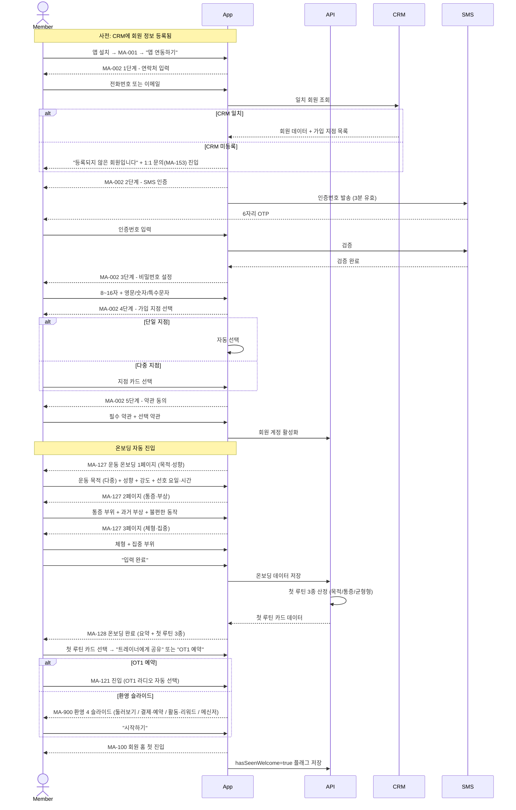

# X10. 회원가입 / 온보딩 시나리오

> xlsx 항목: #36 계정 생성 (전화/이메일 인증 + 지점 선택), #37 운동 목적/성향, #38 통증/체형, #39 온보딩 요약 + 첫 루틴

CRM에 사전 등록된 회원이 앱 연동 5단계 → 운동 온보딩 3페이지 → 첫 루틴 제안 → 환영 슬라이드 → 홈 진입까지 완성하는 흐름.

## 입력 완료율 → 첫 루틴 정확도

| 입력 완료율 | 첫 루틴 정확도 | 안내 |
|---|---|---|
| 100% | 높음 | "당신에게 딱 맞는 루틴" |
| 80% | 중간 | "추가 입력 시 더 정확해져요" |
| 50% 미만 | 낮음 | "일반 추천 - 추가 입력 권장" |

## 온보딩 옵션 풀

| 항목 | 옵션 |
|---|---|
| 운동 목적 (다중) | 감량 / 근비대 / 체형교정 / 통증완화 / 체력증진 / 자세교정 / 재활 / 대회 준비 |
| 운동 성향 (단일) | 강하게 / 친절하게 / 조용한 운동 / 그룹 / 자율 |
| 강도 선호 | 저·중·고강도 |
| 통증 부위 | 목·어깨·등·허리·골반·무릎·발목·손목·팔꿈치·없음 |
| 과거 부상 | 디스크·회전근개·십자인대·발목인대·골절·수술·기타·없음 |
| 불편한 동작 | 스쿼트·데드리프트·푸쉬업·풀업·러닝·점프·회전·없음 |
| 체형 | 상체비만 / 하체비만 / 복부비만 / 마른비만 / 표준 / 근육형 |
| 집중 부위 | 복부·등·어깨·가슴·팔·엉덩이·다리·종아리 |
