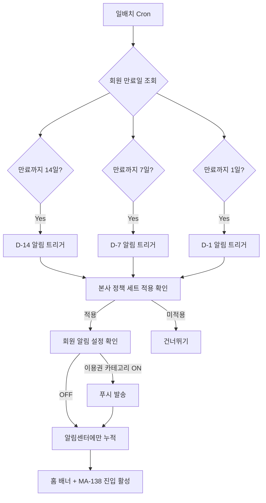

# A1. D-day 트리거 자동화

> 본사 정책 세트 기반 만료 D-14 / D-7 / D-1 자동 트리거. 매일 새벽 일배치로 실행.

## 일배치 스케줄

| 시간 (KST) | 작업 |
|---|---|
| 00:00 | 만료 회원 조회 |
| 00:10 | D-14 트리거 발동 |
| 00:20 | D-7 트리거 발동 |
| 00:30 | D-1 트리거 발동 |
| 01:00 | 트리거 결과 본사 KPI 집계 |

## 본사 정책 세트 변경 시

본사 정책 세트는 관리자 웹에서 수정. 변경 시:
- 새로운 D-day 기준이 다음 일배치부터 적용
- 회원앱은 정책 결과만 표시 (소유권 X)
- 회원 화면(MA-138)에는 항상 최신 정책 결과 노출

## 푸시 메시지 템플릿

| D-day | 톤 | 메시지 |
|---|---|---|
| D-14 | info | "회원권이 14일 후 만료돼요. 추천 플랜을 확인해 보세요" |
| D-7 | warning | "이번 주 만료 - 재등록 시 +10% 혜택" |
| D-1 | danger | "내일 만료 - 마지막 안내" |
