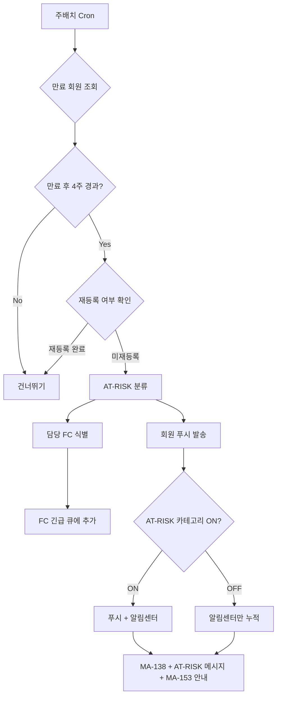
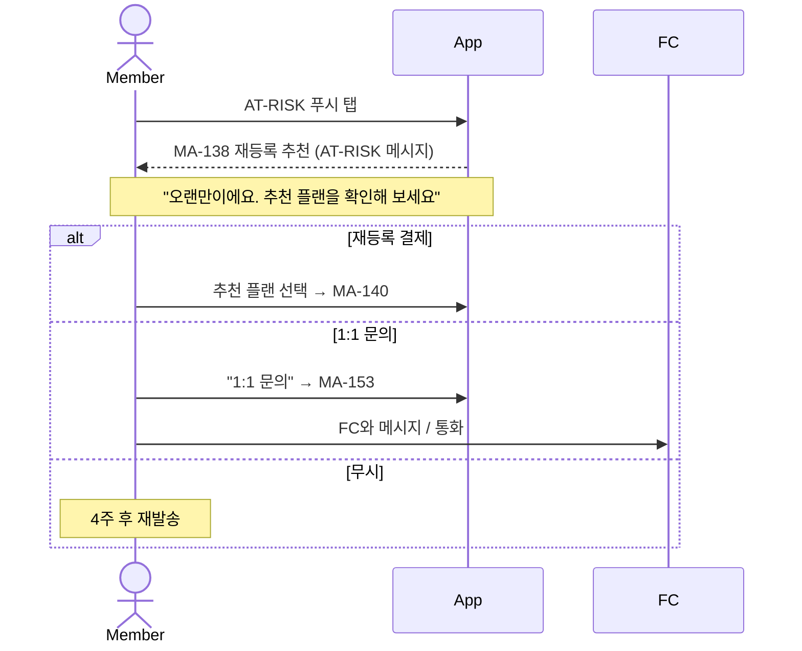

# A2. AT-RISK 케어 자동화

> 만료 후 4주 미재등록 회원을 자동 식별 → FC 케어 알림 + 회원 푸시 발송.

## 주배치 스케줄

| 요일 / 시간 | 작업 |
|---|---|
| 월요일 09:00 | 지난 주 AT-RISK 회원 식별 |
| 월요일 09:30 | FC 긴급 큐 갱신 |
| 월요일 10:00 | 회원 푸시 발송 |

## FC 케어 흐름

| 단계 | FC 동작 |
|---|---|
| 1 | MA-430 만료 예정 회원 진입 → AT-RISK 정렬 |
| 2 | 회원 카드 탭 → 회원 상세 (출석 이력 / 마지막 상담 / 잔여 등) |
| 3 | "재등록 상담" → MA-431 진입 → 전화 / 카톡 |
| 4 | 상담 결과 등록 (등록 / 미등록 / 보류) |
| 5 | 보류 시 후속 조치 일자 필수 입력 |

## 회원 화면 (AT-RISK 진입 시)

## 회원 OFF 처리 정책

회원이 MA-155에서 AT-RISK 카테고리 OFF한 경우:
- 푸시 발송 차단
- 알림센터(MA-150)에는 카드 노출 (회원이 직접 확인 가능)
- MA-138 직접 진입은 항상 가능
