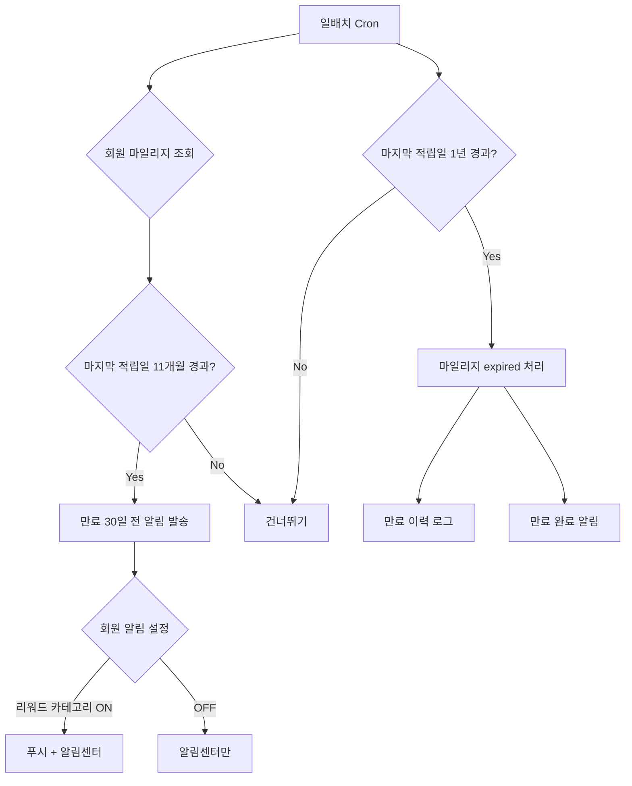
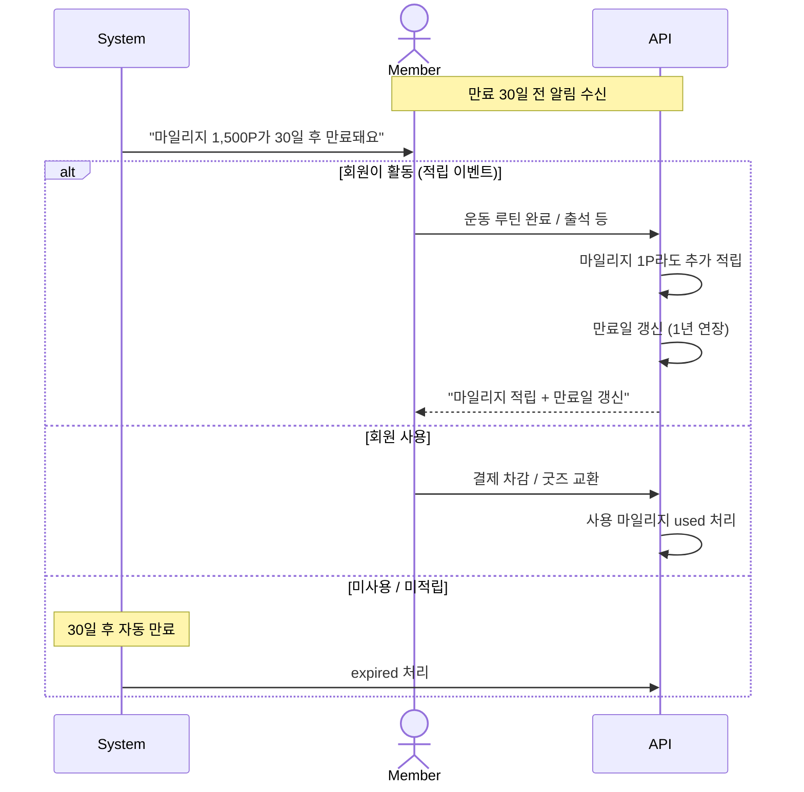

# A3. 마일리지 만료 자동화

> 마지막 적립일 1년 미사용 시 마일리지 자동 만료. 만료 30일 전 알림 발송.

## 만료 정책

| 단계 | 트리거 | 동작 |
|---|---|---|
| 만료 30일 전 | 마지막 적립 후 11개월 | 회원에게 안내 알림 |
| 만료 시점 | 마지막 적립 후 12개월 | 미사용 마일리지 expired 처리 |
| 만료 후 | - | MA-136 보유에서 차감 + 만료 이력 표시 |

## 만료일 갱신 (재적립 시)

## 알림 메시지 템플릿

| 단계 | 톤 | 메시지 |
|---|---|---|
| 만료 30일 전 | info | "마일리지 N,000P가 30일 후 만료돼요. 활용처를 확인해 보세요" |
| 만료 7일 전 | warning | "마일리지 N,000P가 곧 만료돼요" |
| 만료 완료 | neutral | "마일리지 N,000P가 만료되었어요" |
