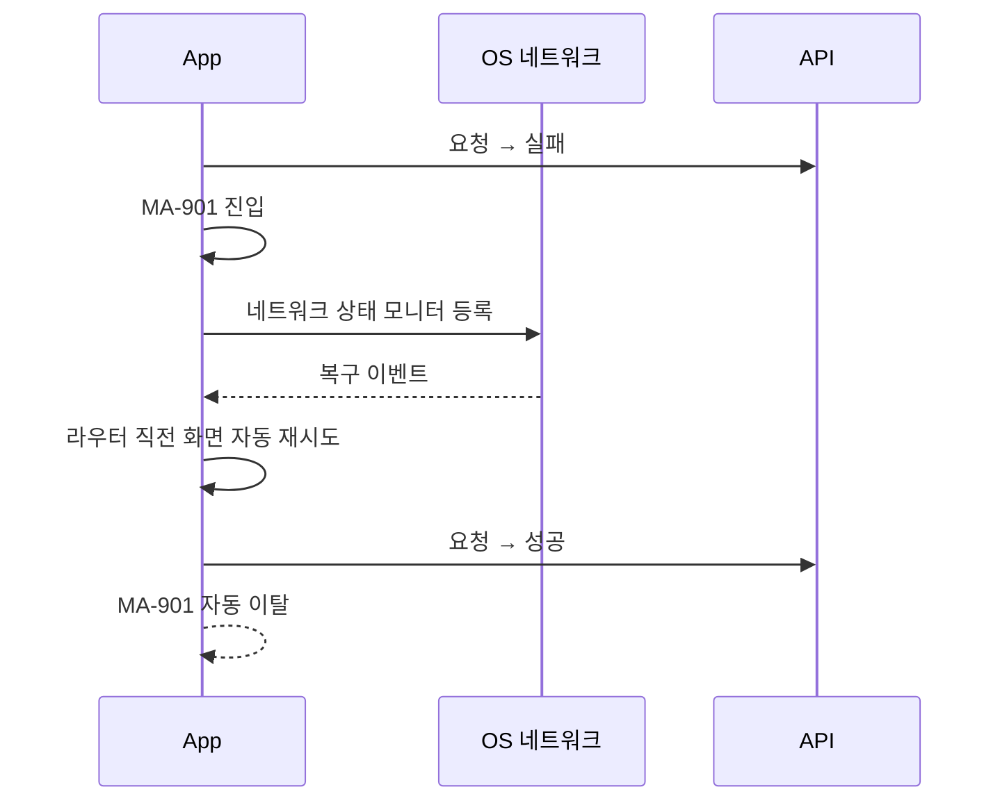

# E1. 네트워크 단절 예외

> 통신 단절 / 단말 오프라인 / fetch 실패 시 회원에게 명확한 안내 + 재시도 흐름.

```mermaid
flowchart TD
    Request[화면 진입 / API 호출] --> Network{네트워크 OK?}
    Network -->|Yes| Success[정상 진행]
    Network -->|No| ShowError[MA-901 네트워크 오류 화면]

    ShowError --> Cache{마지막 본 카드 캐시?}
    Cache -->|있음| ShowCache[캐시 카드 노출 + "최근 본 센터/강사"]
    Cache -->|없음| OnlyMessage[일러스트 + 안내 메시지만]

    ShowError --> Action{회원 액션}
    Action -->|다시 시도| Retry[직전 라우터 재시도]
    Action -->|설정 열기| OpenSettings[OS 설정 진입]
    Action -->|캐시 카드| ShowCache

    Retry --> Network
    Network -->|복구| AutoExit[MA-901 자동 이탈 + 원 화면 진입]
```

## 화면 구성 (MA-901)

| 영역 | 내용 |
|---|---|
| 일러스트 | 단절 / Wi-Fi off 모티프 |
| 헤드라인 | "네트워크 연결을 확인해 주세요" |
| 보조 텍스트 | "Wi-Fi 또는 모바일 데이터 상태를 확인해 주세요" |
| 주요 CTA | "다시 시도" |
| 보조 액션 | "설정 열기", "최근 본 센터 보기" (캐시) |
| 하단 | "네트워크가 복구되면 자동으로 새로고침됩니다" |

## 캐시 정책

| 캐시 대상 | 보존 기간 |
|---|---|
| 마지막 본 센터 카드 1세트 | 영구 (다음 정상 응답까지) |
| 마지막 본 강사 카드 1세트 | 영구 |
| 회원 본인 프로필 / 이용권 | 24시간 |
| 알림 카드 미읽음 | 24시간 |

## 자동 복구 흐름


