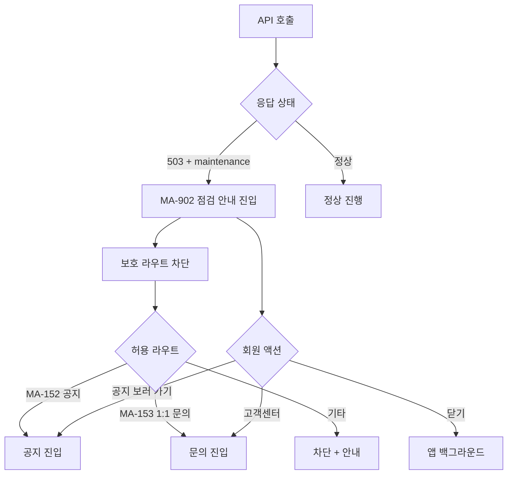
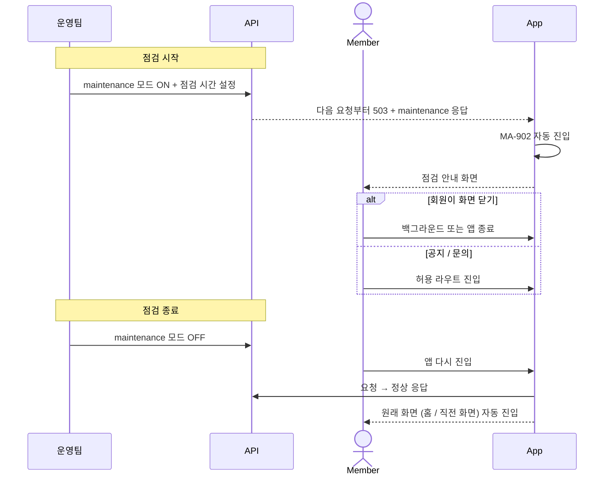

# E2. 서버 점검 예외

> 서버 점검 모드(503 + maintenance) 시 회원에게 점검 시간 안내 + 보호 라우트 차단 흐름.

## 화면 구성 (MA-902)

| 영역 | 내용 |
|---|---|
| 일러스트 | 수리 / 점검 모티프 |
| 헤드라인 | "시스템 점검 중이에요" |
| 점검 정보 박스 | 점검 시간 (시작 ~ 종료), 점검 사유 (1~2줄), 예상 종료 시각 |
| 주요 CTA | "공지 보러 가기" → MA-152 |
| 보조 액션 | "고객센터" → MA-153 |
| 하단 | "점검이 끝나면 자동으로 이용 가능해집니다" |

## 차단 / 허용 라우트

| 라우트 | 점검 모드 |
|---|---|
| MA-100 / MA-110 / MA-120~ / 결제 / 예약 / 메신저 | 차단 |
| MA-152 공지사항 | 허용 |
| MA-153 1:1 문의 | 허용 |
| MA-902 점검 안내 | 기본 |

## 점검 시작 / 종료 흐름

