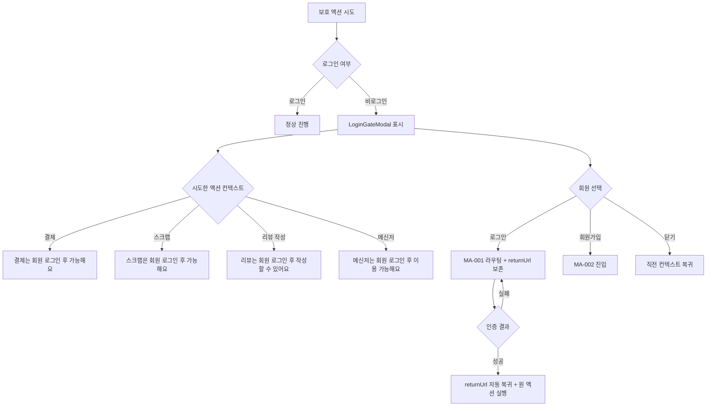
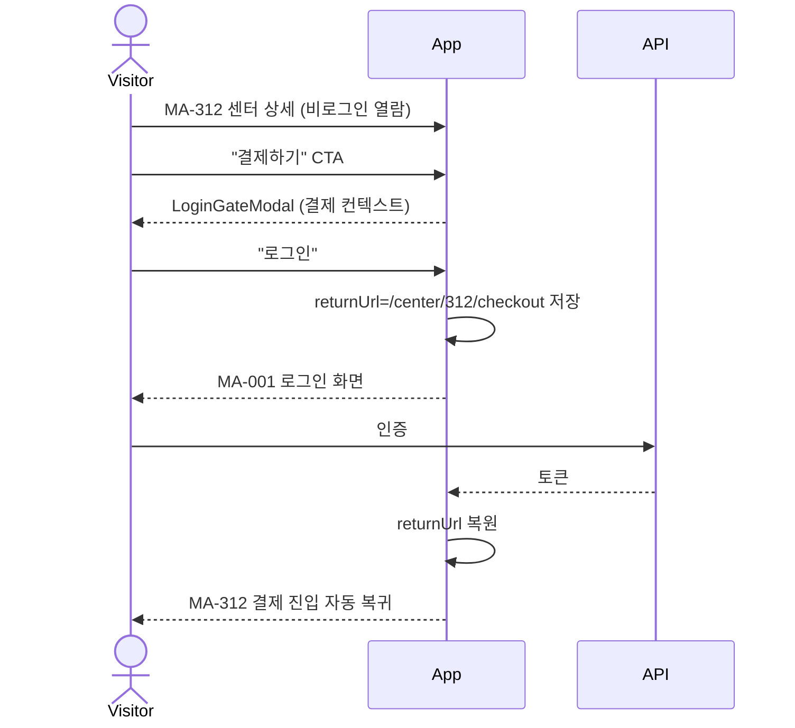

# E3. 권한 없음 / 비로그인 게이트

> 비로그인 회원이 보호 액션(결제 / 스크랩 / 리뷰 / 메신저 / 추천 코드 입력) 시도 시 LoginGateModal로 차단 + 로그인 유도.

## LoginGateModal 구성 (MFN-9C1)

| 영역 | 내용 |
|---|---|
| 일러스트 | 잠금 / 로그인 모티프 |
| 헤드라인 | "로그인이 필요한 기능이에요" |
| 보조 설명 | 컨텍스트별 동적 텍스트 |
| 듀얼 CTA | 로그인 (primary) + 회원가입 (보조) |
| 우상단 X | 닫기, 직전 컨텍스트 복귀 |

## 보호 액션 매트릭스

| 액션 | 진입 화면 | 게이트 노출 |
|---|---|---|
| 결제 | MA-140 / MA-141 / MA-400 | 필수 |
| 스크랩 | MA-330 (찜) | 필수 |
| 리뷰 작성 | MA-350 / MA-126 | 필수 |
| 메신저 | MA-340 / MA-341 | 필수 |
| 추천 코드 입력 | MA-501 친구 초대 | 필수 |
| 후기 도움됨 | MA-601 | 필수 |
| 신고 접수 | MA-603 | 필수 |

## returnUrl 보존 시나리오

## 회원앱 role 미스매치

직원 계정으로 회원 화면 진입 시도 시:
- `member` 전용 화면(MA-100/127/130 등) 접근 차단
- "직원 계정으로는 이 화면을 이용할 수 없습니다" 안내
- 직원 홈으로 라우팅
