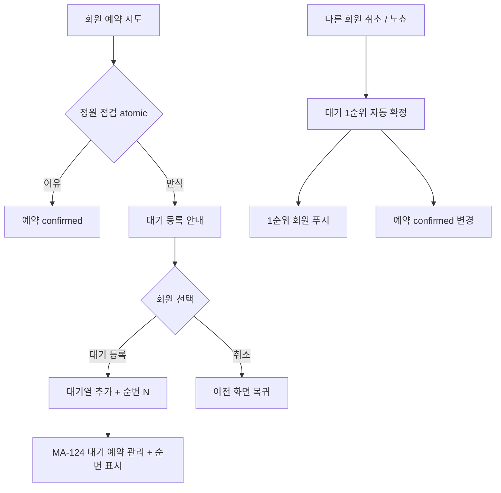
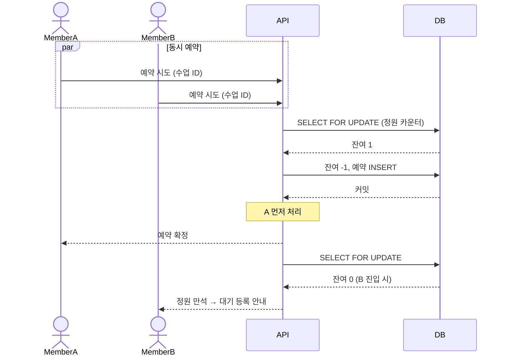
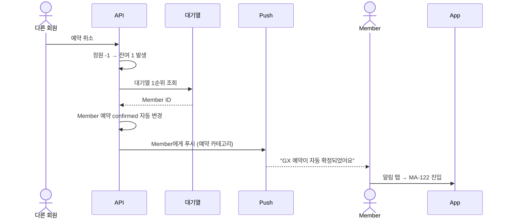

# E4. 정원 초과 / 대기 등록 예외

> 수업 정원 만석 시 예약 차단 + 대기 등록 유도. 동시 예약 충돌 atomic 처리.

## 동시 예약 충돌 처리

## 대기열 자동 확정 흐름

## 화면 표시

| 상태 | 표시 |
|---|---|
| 정원 여유 | "예약하기" 활성 (primary) |
| 정원 만석 | "예약하기" 비활성 + "대기 등록" 활성 (warning) |
| 대기 1순위 | MA-124 카드 강조 + "다음 자리 확보 시 자동 확정" 안내 |
| 자동 확정 | 푸시 + MA-122 카드 강조 + 토스트 |

## 노쇼 페널티 누적

| 누적 | 처리 |
|---|---|
| 1회 | 경고 알림만 |
| 3회 | 예약 제한 (1주 / 2주, 센터 설정) |
| 면제 | 강사 수동 면제 가능 |
