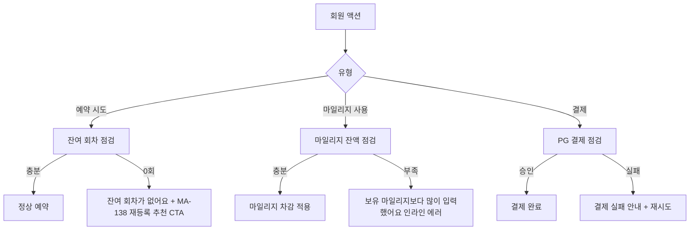
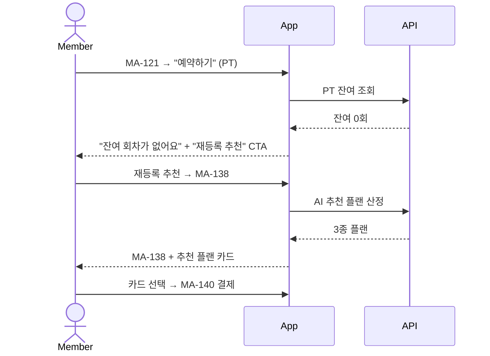
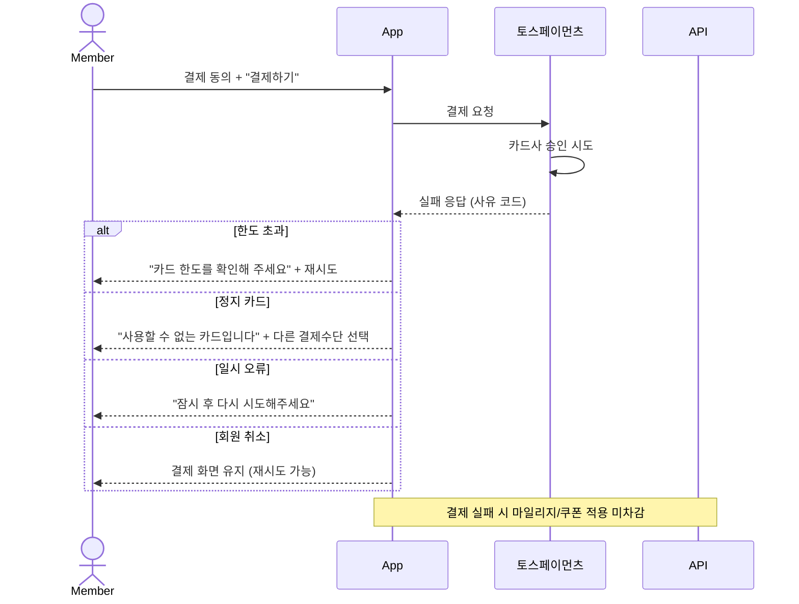

# E5. 잔여 회차 / 마일리지 / 결제 부족 예외

> PT/OT 잔여 회차 0 시 예약 차단, 마일리지 부족 시 결제 화면에서 안내, 결제 실패 시 재시도 흐름.

## 잔여 회차 0 / 부족

## 마일리지 부족 / 잘못된 입력

| 입력 상황 | 처리 |
|---|---|
| 보유 마일리지보다 많이 입력 | 입력 즉시 인라인 에러 + 자동 보정 (보유액으로 fallback) |
| 100P 단위 미만 입력 | "100P 단위로 입력해주세요" 안내 |
| 최소 결제액 미달로 인한 마일리지 차감 부족 | 결제 합계와 함께 안내 + 결제 CTA 비활성 |

## 결제 실패 시나리오

## 쿠폰 최소 결제액 미달

| 상황 | 처리 |
|---|---|
| 쿠폰 최소 결제액 30,000원, 합계 25,000원 | 쿠폰 카드 회색 + "5,000원 더 결제 시 적용" 안내 |
| 쿠폰 최소 결제액 충족 | 쿠폰 자동 적용 + 합계 즉시 갱신 |

## OT2 진입 시 OT1 미완료

| 상황 | 처리 |
|---|---|
| OT2 라디오 선택 + OT1 미완료 | "1차 OT를 먼저 진행해주세요" + OT1 예약 CTA (MA-121) |
| OT1 / OT2 모두 잔여 0 | "OT 추가권 구매가 필요해요" + MA-134 진입 CTA |
