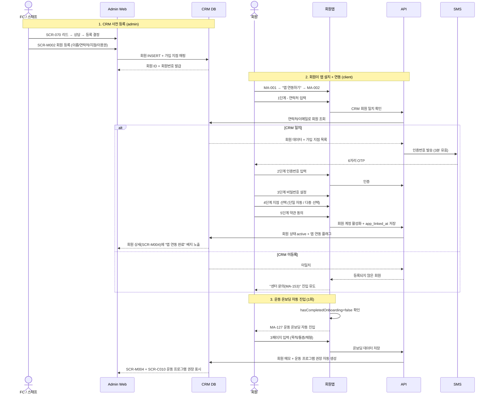

# C1. 회원가입 → CRM 연동

> 회원앱은 공개형 자체 회원 생성을 지원하지 않는다. CRM에 사전 등록된 회원만 SMS 인증 + 비밀번호 설정 + 지점 선택을 통해 앱 연동을 완료할 수 있다.

## 주요 화면

| 시스템 | 화면 |
|---|---|
| client | MA-001 로그인 / MA-002 앱 가입·연동 / MA-127 운동 온보딩 |
| admin | SCR-070 리드 관리 / SCR-M002 회원 등록 / SCR-M004 회원 상세 / SCR-061 직원 등록 |

## 연동 시퀀스

## 데이터 동기화

| 데이터 | 소유 | client 표시 | admin 표시 |
|---|---|---|---|
| 회원 기본 정보 (이름/연락처/이메일/성별/생년월일) | CRM (admin 소유) | MA-130 마이페이지 | SCR-M004 회원 상세 |
| 가입 지점 | CRM | MA-130 (변경 신청 진입) | SCR-M005 회원 이관 |
| 회원 등급 (BRONZE~VVIP) | 자동 산정 (누적 결제) | MA-500 / MA-130 배지 | SCR-M009 등급 관리 |
| 앱 연동 상태 (app_linked_at) | client → admin 동기화 | (내부) | SCR-M004 배지 |
| 운동 온보딩 입력값 | client → admin 동기화 | MA-127/128 | SCR-M004 메모 + SCR-C010 |

## R&R 분리

| 영역 | client | admin |
|---|---|---|
| 회원 생성 | ❌ (불가) | ✅ SCR-M002 |
| 앱 연동 (SMS 인증) | ✅ MA-002 | ❌ |
| 비밀번호 재설정 | ✅ MA-001 → MA-002 | ✅ SCR-061 직원 비밀번호 |
| 회원 정보 수정 | ✅ MA-130 (제한적) | ✅ SCR-M003 (전체) |
| 가입 지점 변경 | ❌ (신청만) | ✅ SCR-M005 회원 이관 |

## 예외 시나리오

| 상황 | 처리 |
|---|---|
| CRM 미등록 연락처 입력 | "등록되지 않은 회원" + MA-153 안내 |
| SMS 인증 5회 실패 | 10분 잠금 |
| 가입 지점 0개 | "센터 등록 먼저" 안내 |
| 회원이 admin에서 status=hold | 앱 로그인 차단 + "센터 문의" 안내 |
