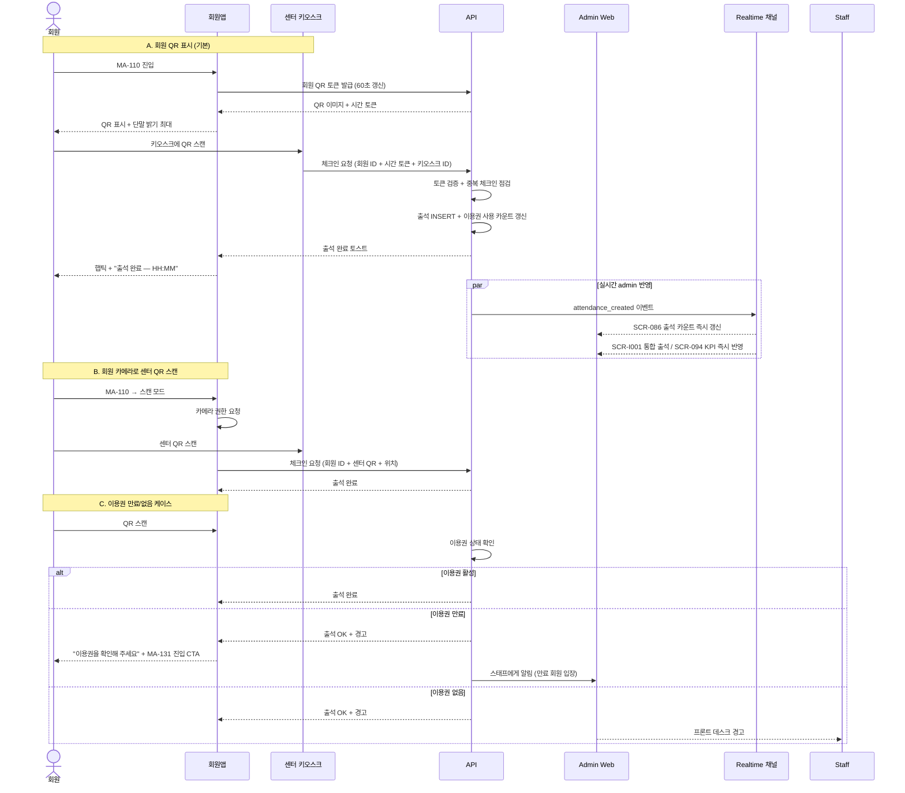

# C2. QR 입장 → 출석 동기화

> 회원이 회원앱(MA-110)에서 QR을 표시하거나 센터 QR을 스캔하면, admin 출석 관리(SCR-086 / SCR-I001 / SCR-C014)에 즉시 반영되어 출석 통계·이용권 차감·KPI에 반영된다.

## 주요 화면

| 시스템 | 화면 |
|---|---|
| client | MA-110 QR 입장 / MA-111 출석 이력 |
| admin | SCR-086 출석 관리(회원) / SCR-I001 통합 출석 / SCR-C014 출석 QR / SCR-094 KPI |

## 연동 시퀀스

## 데이터 동기화

| 데이터 | 발생 시점 | client 반영 | admin 반영 |
|---|---|---|---|
| 출석 레코드 (회원 ID, 일시, 키오스크) | 체크인 즉시 | MA-111 출석 이력 + MA-100 홈 카운트 | SCR-086 출석 관리 + SCR-I001 통합 / SCR-094 KPI |
| 이용권 사용 카운트 (일일/누적) | 체크인 즉시 | MA-131 이용권 잔여 | SCR-M004 회원 상세 |
| 노쇼 페널티 누적 | 별도 처리 | (회원 직접 조회 X) | SCR-C008 페널티 관리 |
| 키오스크 운영 현황 (체크인 수) | 체크인 즉시 | (해당 없음) | SCR-I008 키오스크 운영 현황 |

## R&R 분리

| 영역 | client | admin |
|---|---|---|
| QR 표시 / 스캔 | ✅ MA-110 | ❌ |
| 키오스크 설정 | ❌ | ✅ SCR-082 (계약 외) |
| 수동 출석 (스태프) | ❌ | ✅ SCR-520 (스태프 화면) |
| 출석 통계 / 분석 | ✅ MA-111 (본인) | ✅ SCR-086 / SCR-094 (전체) |
| 노쇼 페널티 부여 | ❌ | ✅ SCR-C008 |

## 정책 출처

- **출석 정책** (당일 중복 차단 / 이용권 없는 회원 경고): admin 본사 정책 세트
- **QR 토큰 갱신 주기 (60초)**: 회원앱 보안 정책 (앱 측 결정)
- **수동 출석 권한**: admin 권한 매트릭스 (스태프만)
