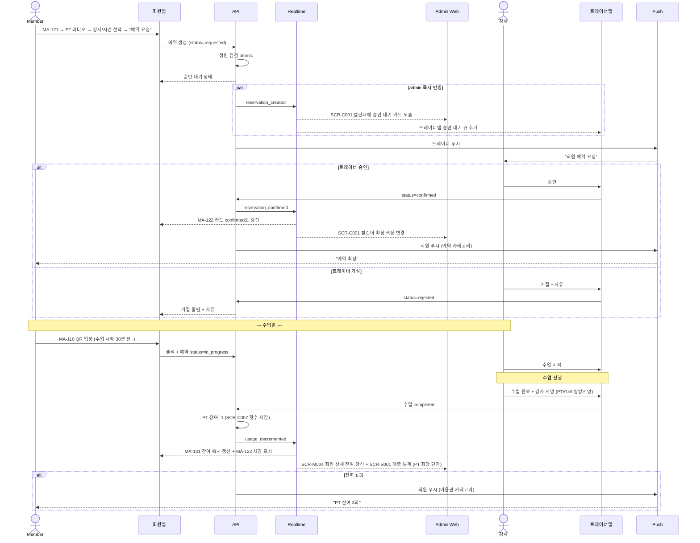
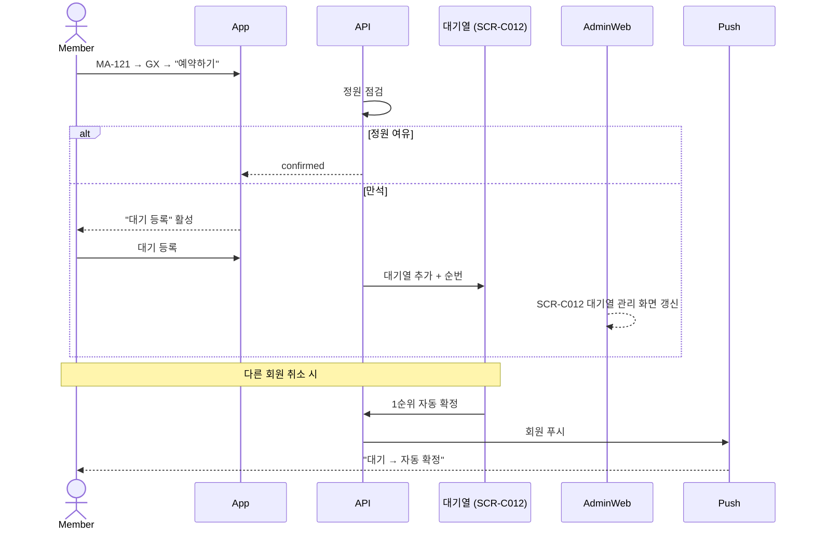

# C3. 예약 → 승인 → 수업 완료 → 차감

> 회원앱(MA-121)에서 PT/OT/GX/Golf 예약 → admin 캘린더(SCR-C001) 즉시 반영 → 강사 승인 → 수업 완료 시점에 PT/OT 잔여 횟수가 admin(SCR-C007)에서 차감 → 회원앱(MA-131) 즉시 갱신.

## 주요 화면

| 시스템 | 화면 |
|---|---|
| client | MA-120/121/122/124 예약 + MA-131 잔여 회차 |
| admin | SCR-C001 수업 캘린더 / SCR-C002 수업 관리 / SCR-C007 횟수 관리 / SCR-C012 대기열 / SCR-C006 강사 근무 |

## 연동 시퀀스 — PT 승인형 예약

## 연동 시퀀스 — GX 정원형 + 대기열

## 데이터 동기화

| 데이터 | 소유 | client 표시 | admin 표시 |
|---|---|---|---|
| 예약 (status / 시간 / 강사) | 양방향 | MA-122 / MA-131 | SCR-C001 / SCR-C002 |
| PT/OT 잔여 횟수 | admin (SCR-C007) | MA-131 + MA-122 | SCR-C007 + SCR-M004 |
| 대기열 순번 | admin (SCR-C012) | MA-124 | SCR-C012 |
| 강사 NPS / 별점 (수업 후 후기 집계) | admin 통계 | MA-125 강사 상세 | SCR-C006 강사 근무 |

## R&R 분리

| 영역 | client | admin |
|---|---|---|
| 회원 예약 / 취소 | ✅ MA-121 | ✅ SCR-C002 (스태프 대신 등록) |
| 트레이너 승인 / 거절 | ❌ | ✅ 트레이너앱 SCR-C002 또는 SCR-C006 |
| 정원 / 대기 정책 | ❌ | ✅ 본사 정책 세트 |
| 횟수 차감 시점 (`completed`) | ❌ (결과만 표시) | ✅ SCR-C007 |
| 노쇼 페널티 | ❌ (조회만) | ✅ SCR-C008 |

## 정책 출처

- **취소 마감 시간** (수업 N시간 전): admin 본사 정책 세트
- **노쇼 누적 페널티** (1회 경고 / 3회 제한): admin 본사 정책 세트
- **PT/OT 차감 시점** (`수업 완료`만): admin 비즈니스 규칙
- **OT 무료 1회 자동 부여**: admin 등록 정책
