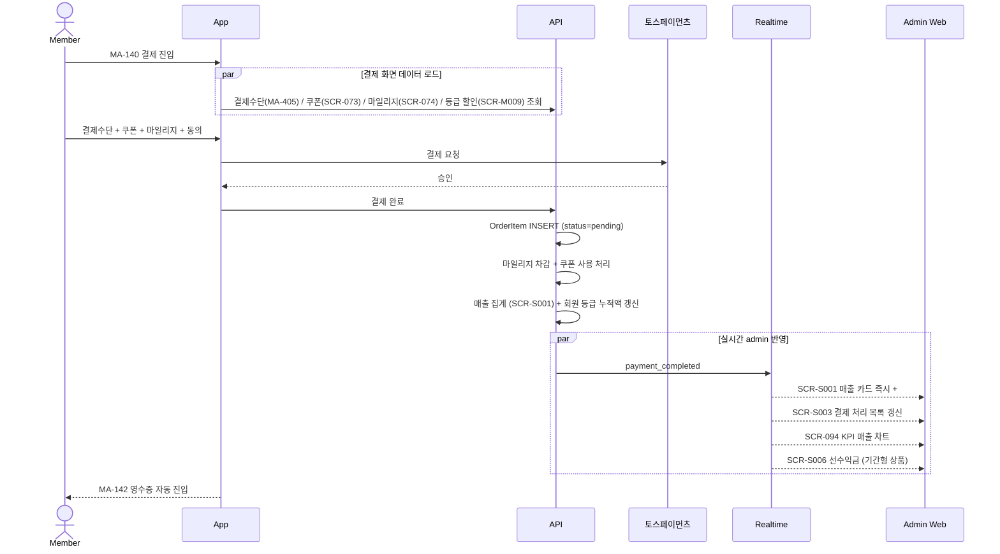
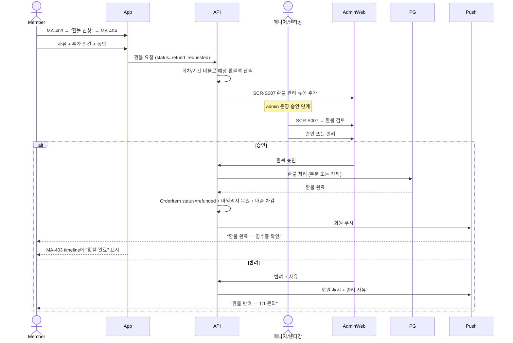
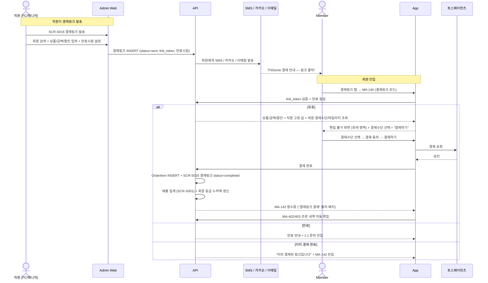

# C4. 결제 → admin 매출 집계 + 환불 승인 + 결제링크 발송

> 회원앱(MA-140)에서 결제하면 admin 매출 현황(SCR-S001/S003)에 즉시 집계되고, 회원이 환불 신청(MA-404)하면 admin 환불 관리(SCR-S007)에서 매니저/센터장이 승인한다. 추가로 직원이 admin SCR-S016에서 결제링크를 발송하면 회원이 MA-140 진입 → 편집 불가 모드로 결제 → MA-142 영수증 → MA-402/403 주문 자동 편입된다.

## 주요 화면

| 시스템 | 화면 |
|---|---|
| client | MA-134 / MA-138 / MA-140 / MA-141 / MA-142 / MA-401 / MA-403 / MA-404 / MA-405 |
| admin | SCR-S001 매출 현황 / SCR-S003 결제 처리 / SCR-S007 환불 관리 / SCR-S012 결제 취소 / SCR-S006 선수익금 / SCR-S016 결제링크 발송 |

## 연동 시퀀스 — 회원 결제

## 연동 시퀀스 — 환불 신청 + admin 승인

## 연동 시퀀스 — 관리자 발송 결제링크

## 결제링크 정책

| 항목 | 정책 |
|---|---|
| 편집 가능 항목 | 결제수단 선택 + 결제 동의 (only) |
| 편집 불가 항목 | 상품 / 금액 / 할인 / 쿠폰 / 마일리지 |
| 만료 시점 | 직원이 admin에서 설정 (기본 24시간) |
| 결제 완료 후 | 동일 링크 재진입 시 영수증으로 라우팅 |
| OrderItem 편입 | 회원 결제와 동일 4단계 timeline |
| 영수증 표기 | "결제링크 결제" 출처 배지 + 발송 직원 정보 |

## 데이터 동기화

| 데이터 | 발생 | client 표시 | admin 표시 |
|---|---|---|---|
| OrderItem (결제 → timeline) | 회원 결제 즉시 | MA-402 / MA-403 | SCR-S003 |
| 결제링크 (link_token / status) | admin 발송 → 회원 결제 | MA-140 진입 / MA-142 영수증 | SCR-S016 발송 이력 |
| 매출 집계 | 결제 즉시 | (조회 X) | SCR-S001 / SCR-094 KPI |
| 마일리지 차감 | 결제 즉시 | MA-136 | SCR-074 |
| 쿠폰 사용 | 결제 즉시 | MA-135 | SCR-073 |
| 환불 (status / 비율) | admin 승인 후 | MA-403 / MA-142 | SCR-S007 / SCR-S012 |
| 회원 누적 결제액 | 결제 즉시 | MA-500 등급 진척 | SCR-M009 등급 관리 |

## R&R 분리

| 영역 | client | admin |
|---|---|---|
| 결제 | ✅ MA-140 | ✅ SCR-S003 (수기 결제) |
| 환불 신청 | ✅ MA-404 | ❌ |
| 환불 승인 | ❌ | ✅ SCR-S007 (매니저/센터장) |
| 결제수단 관리 | ✅ MA-405 | ❌ |
| 매출 집계 / 통계 | ❌ | ✅ SCR-S001 / S004 / S005 |
| 부분 환불 비율 산정 | ❌ (예상액 표시) | ✅ SCR-S007 (확정) |
| 결제링크 발송 | ❌ | ✅ SCR-S016 (직원이 회원에게 발송) |
| 결제링크 진입 / 결제 | ✅ MA-140 (편집 불가 모드) | ❌ |
| 결제링크 만료 / 취소 | ❌ | ✅ SCR-S016 |

## 정책 출처

- **환불 비율** (회차형 잔여 비율 / 기간형 7일 100% / 30일 70% / 30일+ 30%): admin 본사 환불 정책
- **결제수단 종류** (카드 / 카카오페이 / 네이버페이): admin 결제 정책
- **마일리지 사용 단위** (100P): admin 마일리지 정책 (SCR-074)
