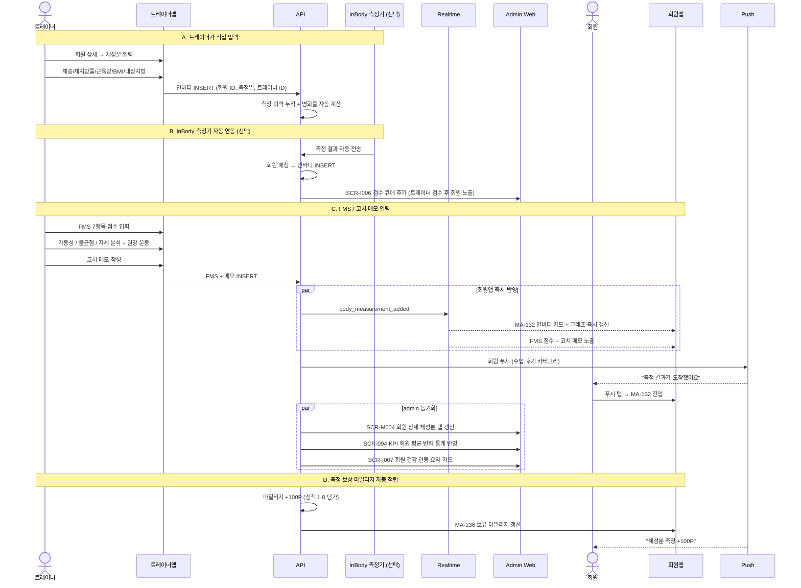

# C5. 체성분 / FMS 입력 → 회원 즉시 조회

> 트레이너가 트레이너앱(SCR-M006/I006 미러)에서 회원 체성분·FMS·코치 메모를 입력하면, 회원앱(MA-132)에 즉시 반영되어 회원이 변화 그래프와 안내 메모를 확인한다.

## 주요 화면

| 시스템 | 화면 |
|---|---|
| client | MA-132 체성분/FMS / MA-100 홈 알림 카드 |
| admin | SCR-M006 체성분 관리 / SCR-I006 통합 체성분 / SCR-I007 회원 건강 연동 / SCR-M004 회원 상세 (체성분 탭) |
| trainer 앱 | 트레이너 모드 회원 상세 / 체성분 입력 화면 (admin 도메인 미러) |

## 연동 시퀀스

## 데이터 동기화

| 데이터 | 입력 경로 | client 표시 | admin 표시 |
|---|---|---|---|
| 인바디 측정 (체중/체지방/근육/BMI) | 트레이너앱 또는 InBody 자동 | MA-132 카드 + 그래프 | SCR-M006 / SCR-I006 |
| FMS 7항목 점수 | 트레이너앱 (OT2 시) | MA-132 FMS 섹션 | SCR-M004 회원 상세 |
| 코치 메모 / 권장 운동 | 트레이너앱 | MA-132 코치 메모 | SCR-M004 |
| 측정 보상 마일리지 | 자동 적립 | MA-136 | SCR-074 마일리지 관리 |
| 회원 건강 연동 (Health Connect) | 외부 연동 (계약 외) | MA-132 통합 (선택) | SCR-I007 |

## R&R 분리

| 영역 | client | admin / trainer 앱 |
|---|---|---|
| 측정 입력 | ❌ (조회만) | ✅ 트레이너앱 |
| InBody 자동 연동 | ❌ | ✅ admin (계약 외 #16) |
| FMS 점수 / 메모 | ❌ (조회) | ✅ 트레이너 (OT2 시) |
| 변화 그래프 산정 | ❌ (결과만) | ✅ admin 자동 계산 |
| KPI 통계 (회원 평균 변화) | ❌ | ✅ SCR-094 |

## 정책 출처

- **측정 보상 마일리지** (100P): admin 본사 정책 세트 (정책 1.8)
- **다음 측정 권장일** (4주 후 자동): admin 자동화 (SCR-072)
- **InBody 자동 연동 정확도** (트레이너 검수 후 회원 노출): admin 운영 정책
