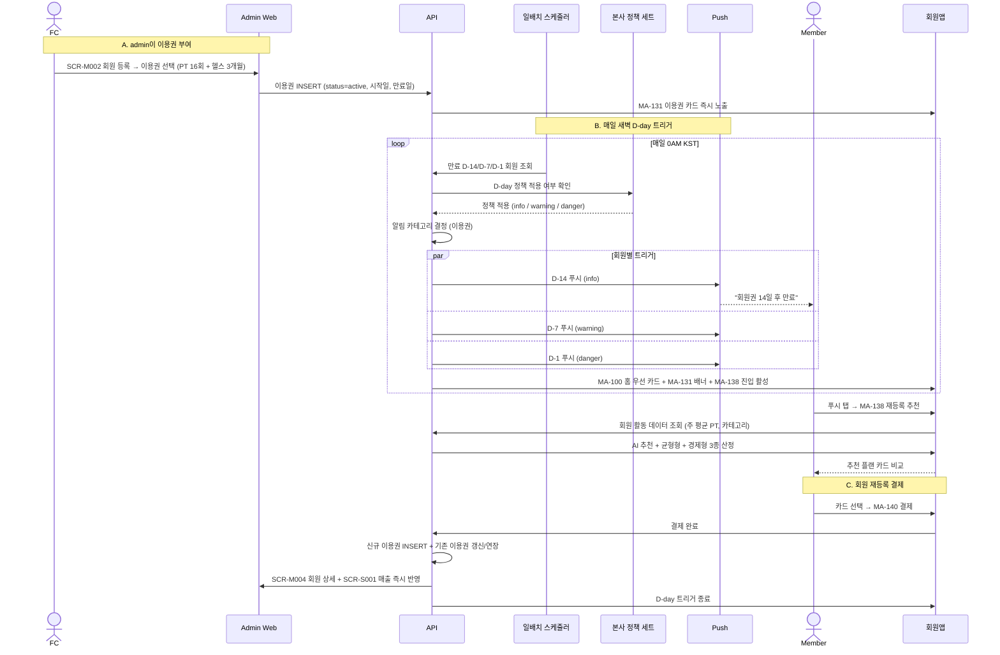
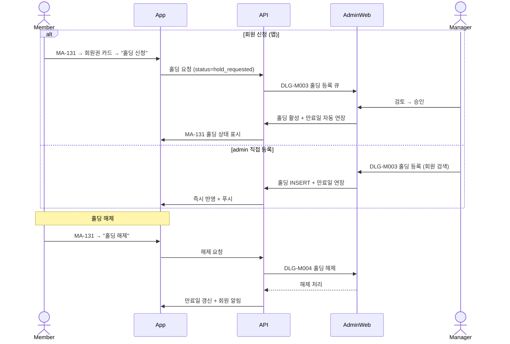

# C6. 이용권 D-day 트리거 + 홀딩/만료 자동화

> admin이 회원에게 이용권을 부여 → 매일 새벽 일배치가 만료 D-14/D-7/D-1 트리거를 발동 → 회원앱(MA-138)에 추천 플랜 + 푸시 노출. 회원이 홀딩/연장/재등록 시 admin이 즉시 반영한다.

## 주요 화면

| 시스템 | 화면 |
|---|---|
| client | MA-131 이용권/잔여 / MA-138 재등록 추천 / MA-150 알림 |
| admin | SCR-P001~003 상품/등록/상세 / SCR-M004 회원 상세(이용권 탭) / DLG-M003/M004 홀딩 등록·해제 / SCR-072 자동 알림 / SCR-099 리포트 |
| 자동화 | A1 D-day 트리거 / A2 AT-RISK 케어 (docs/client/다이어그램/40_자동화) |

## 연동 시퀀스 — 이용권 부여 → D-day 자동화

## 연동 시퀀스 — 홀딩 등록·해제

## 데이터 동기화

| 데이터 | 소유 | client 표시 | admin 표시 |
|---|---|---|---|
| 이용권 (종류 / 시작 / 만료 / 잔여) | admin | MA-131 | SCR-M004 + SCR-P001~003 |
| 락커 / 부가옵션 (운동복/수건/사우나) | admin | MA-131 카드 5종 | SCR-M004 + SCR-080 센터 설정 |
| 홀딩 상태 + 자동 만료 연장 | admin | MA-131 홀딩 칩 | DLG-M003/M004 |
| D-day 트리거 결과 (push 발송 이력) | admin | MA-150 카드 | SCR-072 자동 알림 운영 현황 |
| AT-RISK 분류 | admin | MA-138 메시지 | SCR-099 리포트 + FC 큐 |

## R&R 분리

| 영역 | client | admin |
|---|---|---|
| 이용권 부여 / 변경 | ❌ | ✅ SCR-M002 / SCR-M003 |
| D-day 트리거 정책 | ❌ (결과 표시) | ✅ 본사 정책 세트 |
| 홀딩 신청 | ✅ MA-131 | ✅ DLG-M003 (직접) |
| 홀딩 승인 | ❌ | ✅ DLG-M003 (매니저) |
| AT-RISK 케어 알림 | ❌ (수신만) | ✅ SCR-072 + FC 큐 |
| 재등록 결제 | ✅ MA-138 → MA-140 | ✅ SCR-S003 (수기) |

## 정책 출처

- **D-14 / D-7 / D-1 트리거 시점**: admin 본사 정책 세트 (변경 가능)
- **AT-RISK 기준** (만료 후 4주 미재등록): admin 운영 정책
- **홀딩 가능 기간** (최소 7일 ~ 최대 30일): 센터 설정 (SCR-080)
- **AI 추천 산정 알고리즘**: admin (활동 데이터 가중치)
