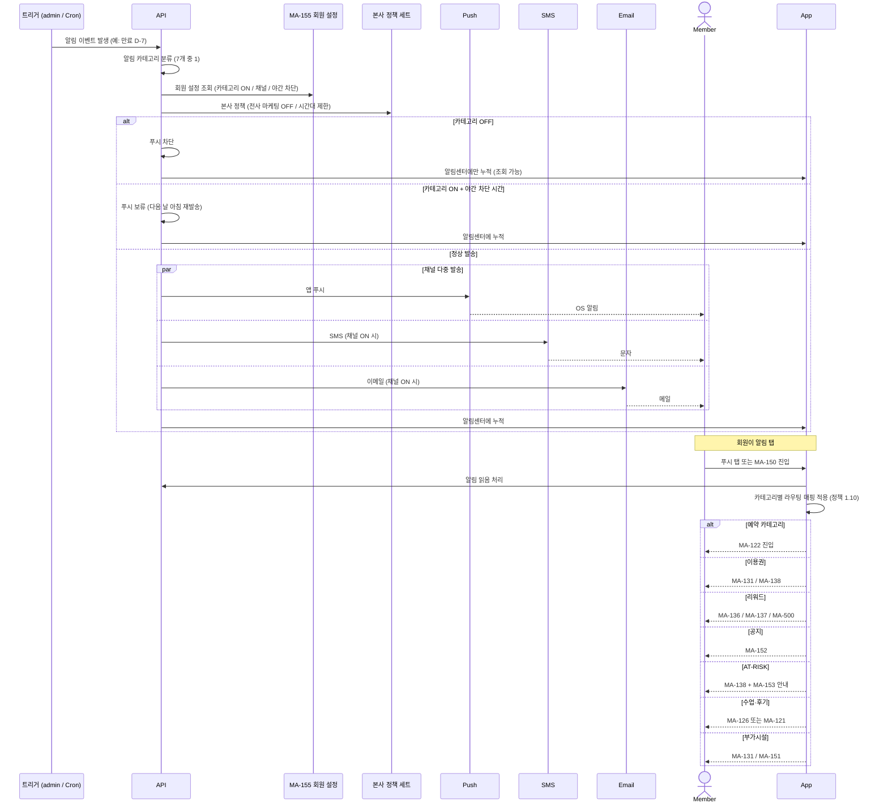

# C7. 알림 발송 → 정책 세트 → 라우팅

> admin이 자동 알림(SCR-072) / 캠페인(SCR-076) / 공지(SCR-085) / SMS·카카오(SCR-078)를 발송하면, 회원앱(MA-150)이 7개 카테고리별로 분류·라우팅한다. 회원의 카테고리 ON/OFF + 채널 + 야간 차단 설정에 따라 발송 결정된다.

## 주요 화면

| 시스템 | 화면 |
|---|---|
| client | MA-150 알림센터 / MA-155 설정 (알림 ON/OFF + 채널) |
| admin | SCR-072 자동 알림 (13종 엔진) / SCR-076 캠페인 / SCR-077 리퍼럴 / SCR-085 공지사항 / SCR-078 SMS·카카오 / SCR-073 쿠폰 / SCR-074 마일리지 |

## 연동 시퀀스 — 알림 발송 결정 흐름

## 알림 트리거 ↔ admin 화면 매핑

| 카테고리 | 트리거 출처 (admin) | 회원앱 라우팅 |
|---|---|---|
| 예약 | SCR-C001/C002 + 자동 알림 (예약 확정/변경/노쇼 임박) | MA-122 |
| 이용권 | SCR-072 자동 알림 + D-day 트리거 + 본사 정책 세트 | MA-131 / MA-138 |
| 리워드 | SCR-073 쿠폰 / SCR-074 마일리지 / SCR-077 리퍼럴 / SCR-M009 등급 | MA-136 / MA-137 / MA-500 |
| 공지 | SCR-085 공지사항 관리 + SCR-076 캠페인 | MA-152 |
| AT-RISK 케어 | SCR-099 리포트 + FC 자동 알림 (4주 미방문) | MA-138 / MA-153 |
| 수업·후기 | SCR-C002 + SCR-C013 후기 요청 자동화 | MA-126 / MA-121 |
| 부가시설 | SCR-080 센터 설정 + 락커/사우나 만료 자동 | MA-131 / MA-151 |

## admin 발송 채널

| 채널 | admin 화면 | 회원앱 ON/OFF |
|---|---|---|
| 앱 푸시 | (FCM 인프라) | MA-155 카테고리별 |
| SMS / LMS / MMS | SCR-078 SMS 카카오 발송 + SCR-071 메시지 발송 | MA-155 카테고리별 |
| 카카오 알림톡 | 동일 | MA-155 카테고리별 |
| 이메일 | SCR-072 자동 알림 | MA-155 카테고리별 |

## 데이터 동기화

| 데이터 | 소유 | client 표시 | admin 표시 |
|---|---|---|---|
| 회원 알림 설정 (카테고리 × 채널) | client → admin 동기화 | MA-155 | SCR-M004 회원 상세 (조회) |
| 발송 이력 (성공 / 실패 / 차단) | admin | (조회 X) | SCR-072 자동 알림 운영 현황 / SCR-078 발송 이력 |
| 알림센터 카드 (미읽음 / 읽음 / 보관) | client | MA-150 | (해당 없음) |

## R&R 분리

| 영역 | client | admin |
|---|---|---|
| 알림 트리거 발생 | ❌ | ✅ SCR-072 / SCR-076 / SCR-085 |
| 회원 카테고리 ON/OFF | ✅ MA-155 | ✅ SCR-M004 (조회) |
| 채널 발송 결정 | API (회원 설정 + 정책 조합) | API |
| 메시지 단가 / 비용 계산 | ❌ | ✅ SCR-078 / SCR-071 |
| 캠페인 A/B 테스트 | ❌ | ✅ SCR-079 (기획서 신규) |

## 정책 출처

- **알림 카테고리 7종**: 회원앱 정책 1.10
- **야간 차단 시간 (22:00~07:00)**: 회원 설정 (MA-155)
- **AT-RISK OFF 시 푸시 차단 + 알림센터 노출**: 회원앱 정책
- **단가 / 발송 한도**: admin 본사 정책 (SCR-078)
