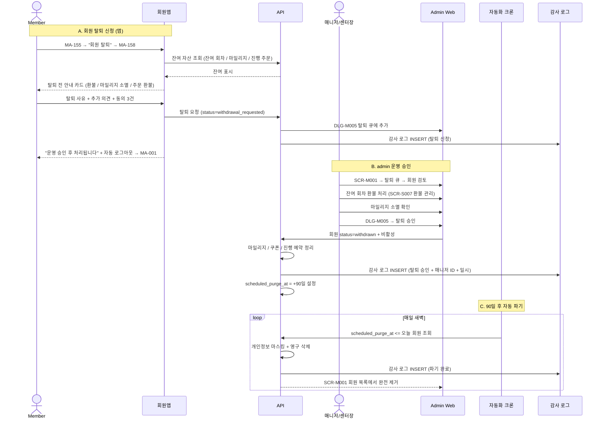
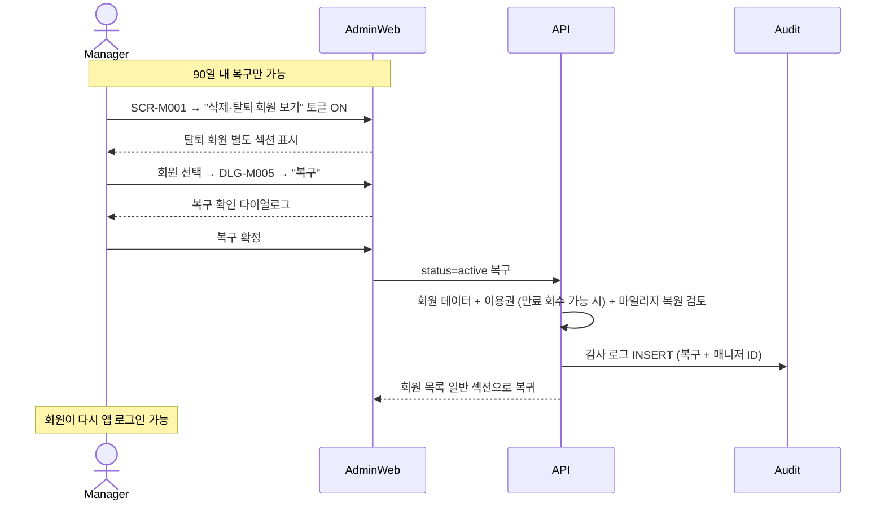

# C8. 회원 탈퇴 → admin 운영 승인 → 90일 파기

> 회원이 회원앱(MA-158)에서 탈퇴 신청 → admin 회원 상세(DLG-M005)에서 운영 승인 → 즉시 비활성 + 90일 후 자동 파기. 90일 내 회원 복구(Undelete)도 가능.

## 주요 화면

| 시스템 | 화면 |
|---|---|
| client | MA-158 회원 탈퇴 / MA-001 (탈퇴 후 라우팅) |
| admin | DLG-M005 탈퇴 처리 다이얼로그 / SCR-M001 회원 목록 (삭제·탈퇴 회원 보기 토글) / SCR-097 감사 로그 |
| 자동화 | NFR-06 회원 탈퇴 90일 파기 (admin 자동화 크론) |

## 연동 시퀀스

## 연동 시퀀스 — 회원 복구 (Undelete)

## 데이터 동기화

| 데이터 | 시점 | client 영향 | admin 영향 |
|---|---|---|---|
| 탈퇴 신청 | 회원 즉시 | 자동 로그아웃 + MA-001 | DLG-M005 큐 |
| 탈퇴 승인 | admin 매니저 | 로그인 차단 | SCR-M001 비활성 |
| 잔여 환불 | 매니저 처리 | 영수증에 환불 표시 | SCR-S007 환불 |
| 90일 파기 | 자동 크론 | (이미 차단) | SCR-M001 완전 제거 + 감사 로그 |
| 복구 | 매니저 90일 내 | 다시 로그인 가능 | 회원 active 복구 |

## R&R 분리

| 영역 | client | admin |
|---|---|---|
| 탈퇴 신청 | ✅ MA-158 | ❌ |
| 잔여 환불 처리 | ❌ | ✅ SCR-S007 |
| 탈퇴 승인 | ❌ | ✅ DLG-M005 (매니저/센터장) |
| 90일 파기 자동화 | ❌ | ✅ NFR-06 크론 |
| 회원 복구 | ❌ | ✅ DLG-M005 + 90일 내만 |
| 감사 로그 | ❌ (조회 X) | ✅ SCR-097 (append-only) |

## 정책 출처

- **탈퇴 신청 → 즉시 삭제 X / 운영 승인 후 처리**: admin 운영 정책
- **90일 파기 정책 (NFR-06)**: 본사 / 법적 보존 기간
- **복구 가능 기간**: 90일 내 (admin 운영 정책)
- **감사 로그 append-only**: admin 정책 (SCR-097)
