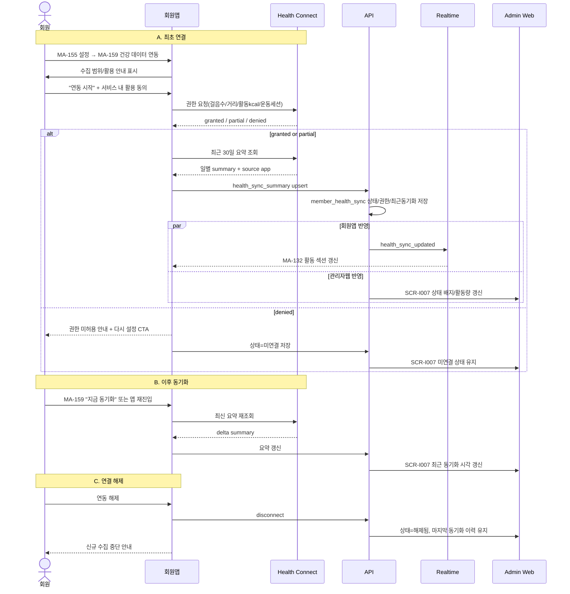

# C9. 건강 데이터 연동 → 회원/관리자 건강 요약 동기화

> 회원이 회원앱(MA-159)에서 `Health Connect`를 연결하면 최근 활동 요약이 회원앱(MA-132)과 관리자웹(SCR-I007)에 함께 반영된다.

## 주요 화면

| 시스템 | 화면 |
|---|---|
| client | MA-155 설정 / MA-159 건강 데이터 연동 / MA-132 체성분·건강 활동 |
| admin | SCR-I007 회원 건강 연동 요약 / SCR-M004 회원 상세 |

## 연동 시퀀스

## 데이터 동기화

| 데이터 | 입력 경로 | client 표시 | admin 표시 |
|---|---|---|---|
| 걸음수 | Health Connect | MA-132 활동 카드 | SCR-I007 최근 7일 활동량 |
| 이동 거리 | Health Connect | MA-159 상태 상세 | SCR-I007 활동 비교 보조값 |
| 활동 kcal | Health Connect | MA-132 활동 카드 | SCR-I007 활동량 카드 |
| 운동 세션 | Health Connect | MA-132 운동일수 | SCR-I007 운동일수 / 최근 동기화 |
| 권한 상태 | 회원앱 설정 | MA-159 상태 배지 | SCR-I007 연동 상태 배지 |

## R&R 분리

| 영역 | client | admin |
|---|---|---|
| 연동 시작 / 권한 요청 | ✅ 회원앱 | ❌ |
| 데이터 최소수집 범위 안내 | ✅ 회원앱 | ✅ 정책 소유 |
| 활동 요약 저장 | ✅ 업로드 | ✅ 저장/조회 |
| 상담용 건강 요약 활용 | ❌ | ✅ SCR-I007 |
| 연결 해제 / 재연결 | ✅ 회원앱 | 조회만 |

## 정책 출처

- **지원 플랫폼**: Android 하이브리드 앱만 지원
- **수집 범위**: 걸음수 / 이동 거리 / 활동 kcal / 운동 세션
- **비수집 범위**: 심박수 / 수면 / 의료 데이터
- **동기화 지연 기준**: 최근 72시간 미수신 시 지연 상태
