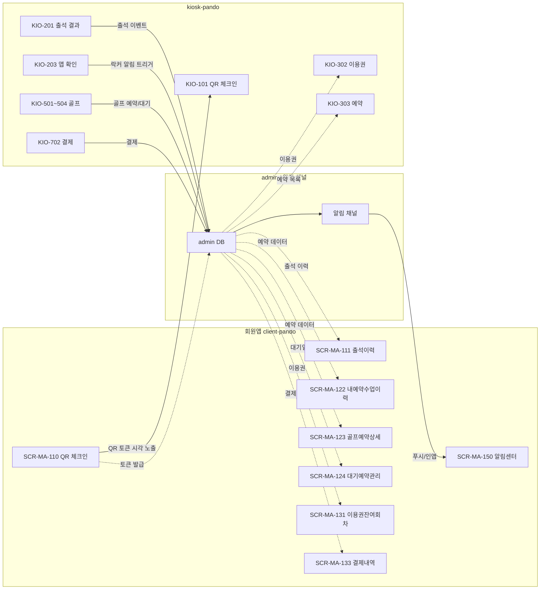
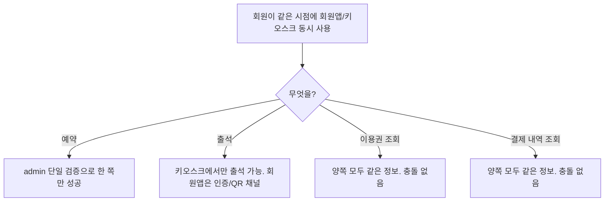

# 회원앱 ↔ kiosk 전체 채널 흐름

> 작성일: 2026-05-04
> 회원앱 시점에서 키오스크와 만나는 모든 흐름

## 1. 채널 관계

## 2. 채널 책임

| 책임 | 회원앱(client) | 키오스크(kiosk) | admin |
|---|---|---|---|
| 데이터 원천 | ❌ 캐시 | ❌ 캐시 | ✅ 단일 |
| QR 토큰 발급 | ✅ 시각 노출 | ❌ | ✅ 토큰 발급/검증 |
| 출석 입력 | ❌ (인증 채널만) | ✅ 단말 | ❌ |
| 예약 입력 | ✅ 셀프 | ✅ 셀프 | ✅ 운영자 |
| 알림 수신 | ✅ 푸시/인앱 | ❌ | ✅ 발송 |
| 이력 표시 | ✅ 회원 시점 | ❌ (조회만) | ✅ 운영 시점 |

## 3. 회원이 두 채널을 동시에 쓰는 경우

## 4. 직접 통신 vs admin 경유

| 흐름 | 방식 | 이유 |
|---|---|---|
| 회원앱 QR → 키오스크 카메라 | 직접 시각 노출 | 화면 표시만 |
| 키오스크 → 회원앱 락커 알림 | admin 알림 채널 경유 | 회원앱 푸시 토큰 관리는 admin |
| 키오스크 → 회원앱 골프 알림 | admin 알림 채널 경유 | 동일 |
| 회원앱 데이터 ↔ 키오스크 데이터 | admin DB 단일 원천 | 일관성 |

회원앱과 키오스크 사이 직접 네트워크 통신은 없다.

## 관련 산출물

- 71~75 (개별 시나리오)
- ../../KIOSK-연동매트릭스.md
- ../../../kiosk/다이어그램/70_client_연동/70_client_qr_알림.md
