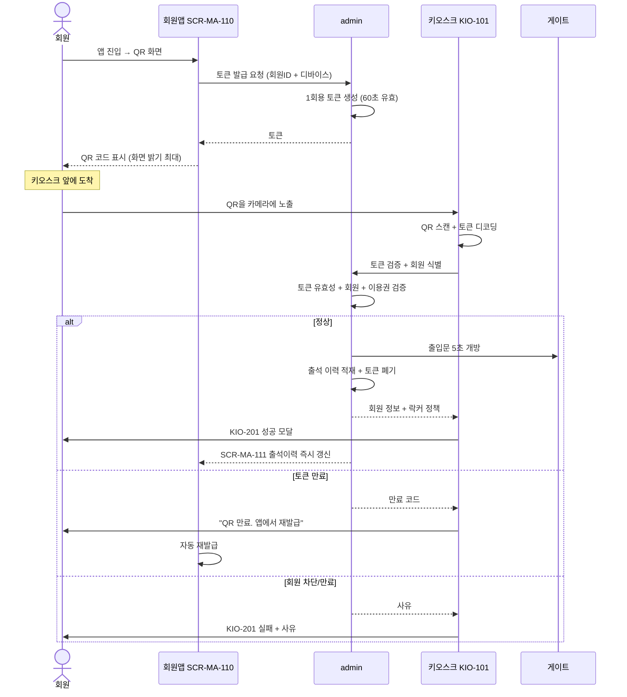
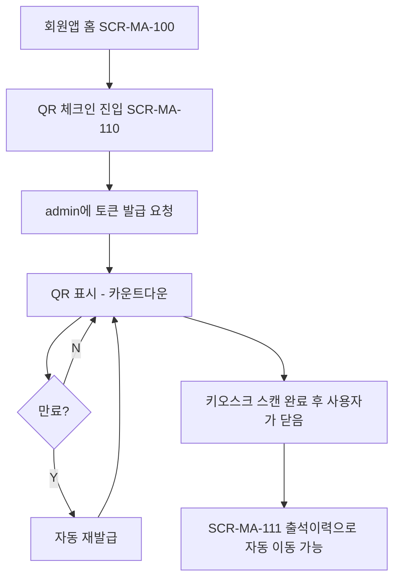

# SCR-MA-110 QR 발급 → KIO-101 스캔

> 작성일: 2026-05-04
> 회원앱이 발급한 QR 토큰이 키오스크 카메라로 스캔되어 출석 처리되는 흐름

## 1. 시퀀스

## 2. 회원앱 측 요건

| 항목 | 회원앱 처리 |
|---|---|
| QR 토큰 형식 | admin이 발급한 1회용 토큰 그대로 표시 |
| 유효 시간 | 60초 권장 |
| 자동 재발급 | 만료 직전 자동 갱신 또는 사용자 액션 시 갱신 |
| 화면 밝기 | QR 표시 동안 최대 밝기 권장 |
| 푸시 진입 | 푸시 알림 클릭 시 SCR-MA-110으로 빠른 진입 |
| 앱 미실행 시 | 위젯 또는 단축아이콘 권장 |

## 3. 보안

- QR 토큰에 회원 PII 직접 포함하지 않음 (서버 토큰 ↔ 회원 매핑만)
- 1회용 또는 짧은 유효시간으로 도난 위험 최소화
- 토큰 위변조는 admin 검증 단계에서 거부

## 4. 회원앱 측 화면 흐름

## 관련 산출물

- ../../화면설계서/D12-회원앱/SCR-MA-110-QR체크인/키오스크-연동.md
- ../../../kiosk/화면설계서/A1-메인및출석/KIO-101-QR체크인/00-기본화면.md
- ../../../kiosk/다이어그램/30_시나리오_시퀀스/X02_QR_체크인.md
