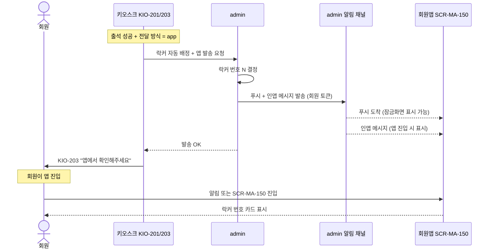
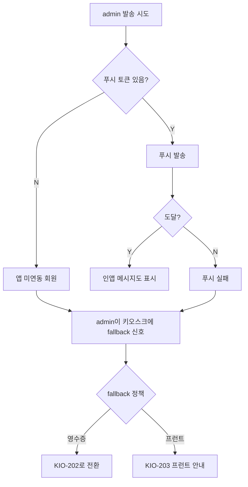

# 키오스크 락커 번호 → 회원앱 수신

> 작성일: 2026-05-04
> KIO-203 (락커 앱 발송) → SCR-MA-150 (알림센터) 흐름

## 1. 시퀀스

## 2. 회원앱 알림 카드 형식

| 필드 | 표시 내용 |
|---|---|
| 제목 | "오늘 락커 번호" |
| 본문 (대형) | 락커 번호 (큰 글자) |
| 위치 안내 | 존(zone) / 위치 정보 |
| 유효 시간 | 출석 시각 + 운영시간 |
| 우선순위 | 푸시 + 인앱 동시 |
| 자동 만료 | 영업 종료 시 만료 표시 |
| 배지 | "키오스크 출석" 라벨 (옵션) |

## 3. 발송 실패 분기

## 4. 회원앱 측 보강 항목

| 항목 | 사유 |
|---|---|
| 락커 알림 카드 형식 | 키오스크 발송 메시지 처리용 |
| 자동 만료/정리 | 영업 종료 시각 후 카드 회색 처리 |
| 푸시 미허용 회원 처리 | 인앱 메시지로 대체, 다음 앱 진입 시 표시 |
| 알림 클릭 → 락커 카드 강조 | 진입 즉시 가장 위에 표시 |
| 출처 라벨(옵션) | "키오스크 출석" 라벨 |

## 5. 같은 회원의 락커 알림이 중복으로 오는 경우

키오스크 출석은 10분 내 중복 방지가 적용되므로 같은 날 같은 회원에게 락커 알림이 여러 개 발송되는 상황은 정상적으로는 없다. 다음 시나리오만 가능:
- 새 락커 배정 (이전 락커 회수 후)
- admin 운영자가 수동 재배정

이 경우 새 알림은 기존 카드를 덮어쓰는 게 아니라 **신규 카드로 추가**한다.

## 관련 산출물

- ../../화면설계서/D12-회원앱/SCR-MA-150-알림센터/키오스크-연동.md
- ../../../kiosk/화면설계서/A2-결과및락커전달/KIO-203-앱확인/00-기본화면.md
- ../../../kiosk/다이어그램/30_시나리오_시퀀스/X05_락커번호_앱발송.md
