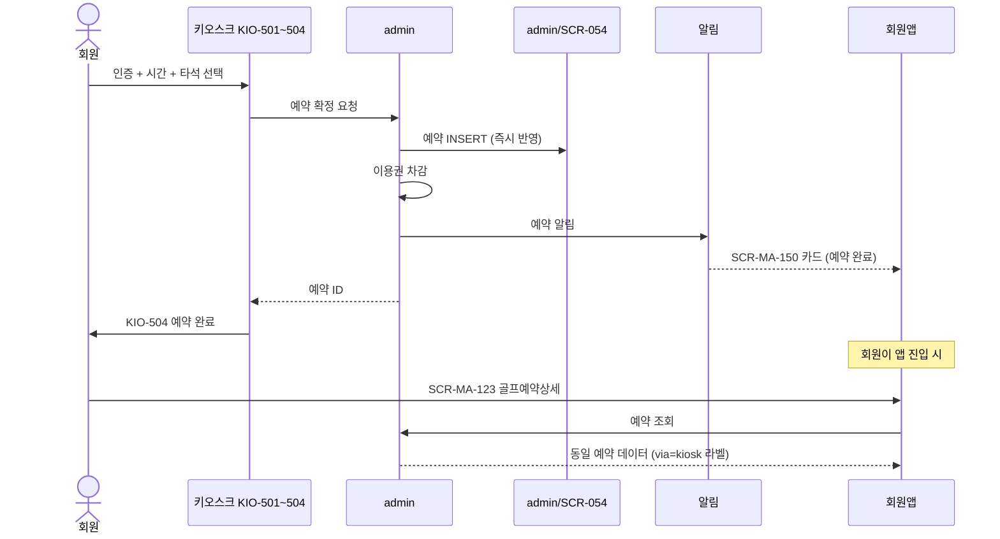
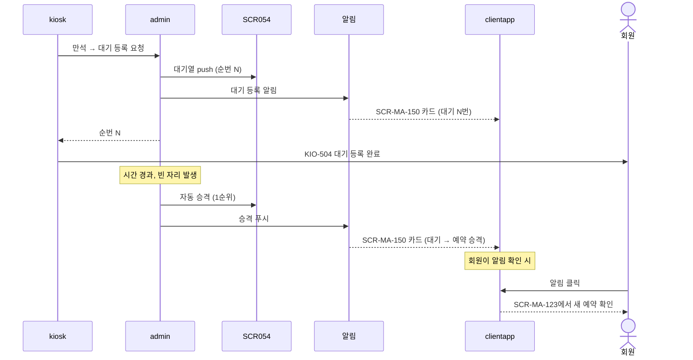
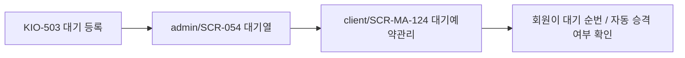

# 키오스크 골프 예약 → 회원앱 알림

> 작성일: 2026-05-04
> KIO-501~504 → SCR-MA-150 알림 → SCR-MA-123 동기화

## 1. 즉시 예약 시퀀스



## 2. 대기 등록 + 자동 승격 시퀀스



## 3. 회원앱 알림 카드 형식

| 종류 | 카드 표시 |
|---|---|
| 예약 완료 (키오스크 발) | "골프 타석 예약이 확정되었습니다" + 일시/타석 |
| 대기 등록 완료 | "대기 N번으로 등록되었습니다" |
| 자동 승격 | "대기에서 예약으로 승격되었습니다" + 일시/타석 |
| 운영자 사유 취소 | "예약이 취소되었습니다" + 사유 |

모든 카드에 `출처=키오스크` 라벨 옵션.

## 4. 회원앱 SCR-MA-123에서 키오스크 예약 표시

```mermaid
flowchart TD
    A[SCR-MA-123 예약 상세 진입] --> B[admin 조회]
    B --> C{예약 출처}
    C -->|via=kiosk| D[메타에 "키오스크 예약" 라벨 표시]
    C -->|via=app| E[메타에 "앱 예약" 라벨 표시]
    C -->|via=admin| F[메타에 "운영자 예약" 라벨 표시]
    D --> G[취소/변경 가능]
    E --> G
    F --> G
```

키오스크에서 한 예약도 회원앱에서 동일하게 취소/변경 가능하다 (단일 데이터 원천).

## 5. 회원앱 SCR-MA-124 대기 예약 관리



회원이 키오스크에서 대기 등록 후 회원앱에서 대기 상태를 모니터링할 수 있어야 한다.

## 관련 산출물

- ../../화면설계서/D12-회원앱/SCR-MA-123-골프예약상세/키오스크-연동.md
- ../../화면설계서/D12-회원앱/SCR-MA-150-알림센터/키오스크-연동.md
- ../../../kiosk/다이어그램/30_시나리오_시퀀스/X07_골프예약_타석선택.md
- ../../../kiosk/다이어그램/30_시나리오_시퀀스/X08_골프예약_대기등록.md
