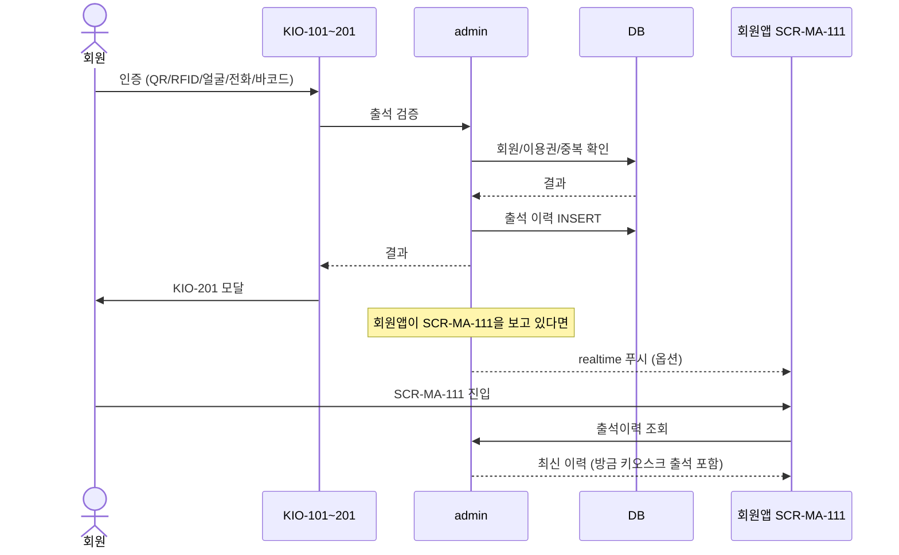
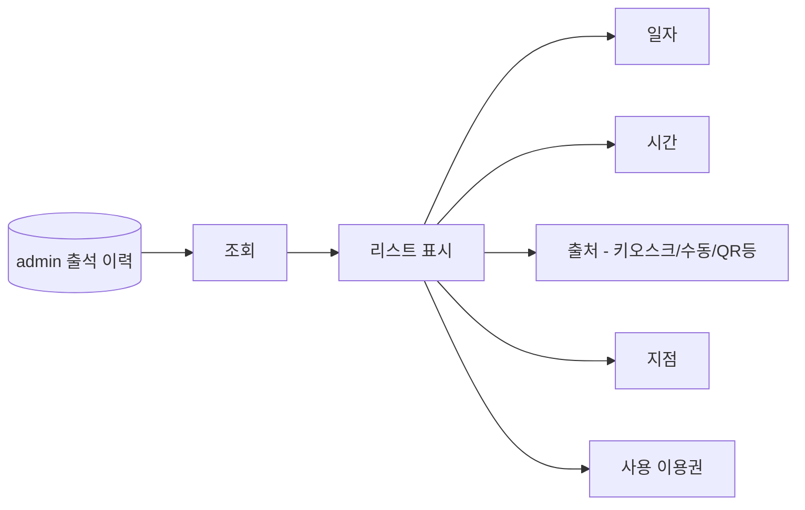

# 키오스크 출석 → 회원앱 출석이력 반영

> 작성일: 2026-05-04
> KIO-201 출석 → admin → SCR-MA-111 출석이력 즉시 반영

## 1. 시퀀스

## 2. SCR-MA-111 출석이력 표시

| 컬럼 | 키오스크 출석에서의 값 |
|---|---|
| 일자 | 키오스크 처리 시각의 날짜 |
| 시간 | 출석 시각 |
| 출처 | 인증 수단별 (`QR` / `RFID` / `얼굴인식` / `전화번호` / `바코드`) |
| 지점 | 단말 소속 지점 |
| 사용 이용권 | 회원 보유 이용권 |
| 단말 라벨 (옵션) | `via=kiosk` |

## 3. 출석 이력 동기화 SLA

| 단계 | 시간 |
|---|---|
| 키오스크 → admin INSERT | 즉시 (실시간) |
| admin → 회원앱 노출 | 다음 조회 시 즉시 표시 |
| realtime 푸시 (옵션) | 1~3초 |

회원이 키오스크 앞에서 출석 후 바로 회원앱을 열어도 즉시 반영되어 있어야 한다.

## 4. 회원앱 측 보강 항목

| 항목 | 사유 |
|---|---|
| 출처 라벨 | 어떤 인증 수단으로 출석했는지 표시 |
| 키오스크 출석 강조(옵션) | 가장 최근 키오스크 출석을 상단에 강조 |
| 실시간 갱신 | 회원이 SCR-MA-111을 열고 있을 때 키오스크 출석 발생 시 즉시 갱신 |

## 관련 산출물

- ../../화면설계서/D12-회원앱/SCR-MA-111-출석이력 (해당 화면)
- ../../../kiosk/화면설계서/A2-결과및락커전달/KIO-201-출석결과/00-기본화면.md
- ../../../kiosk/다이어그램/20_상태전이도/21_출석_상태전이.md
