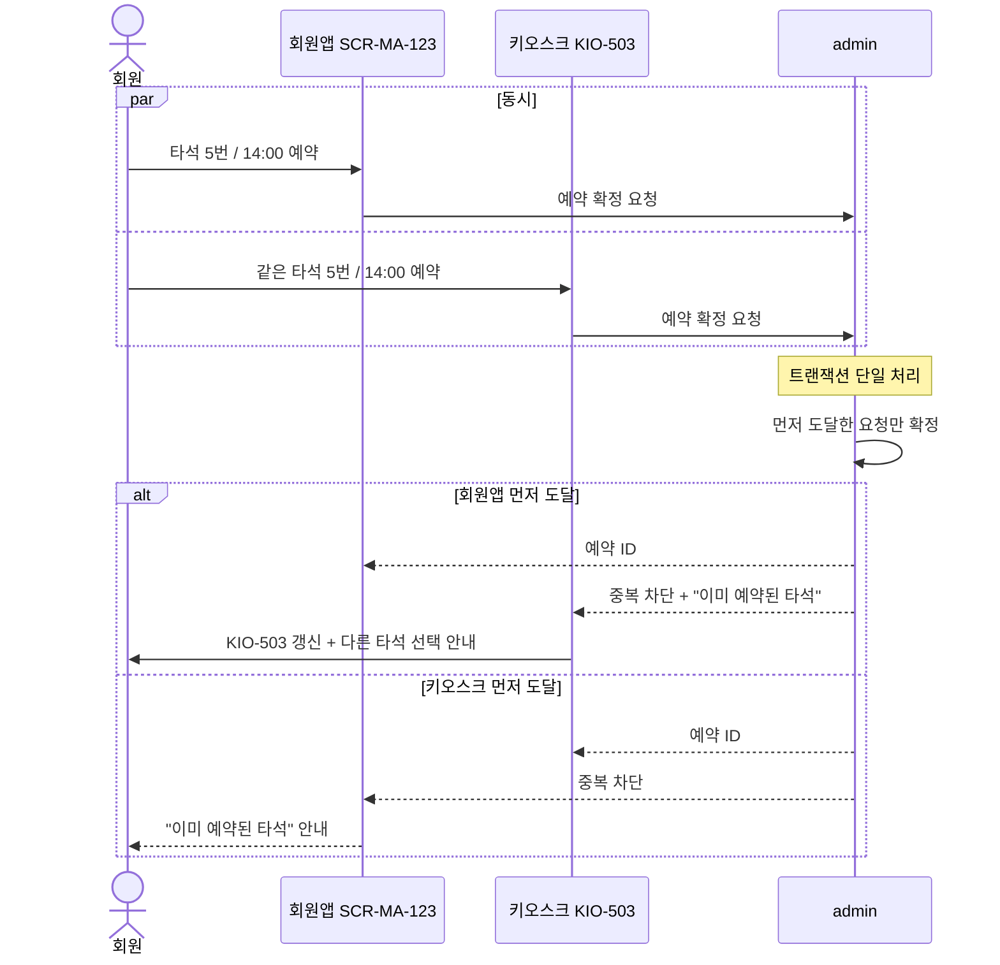
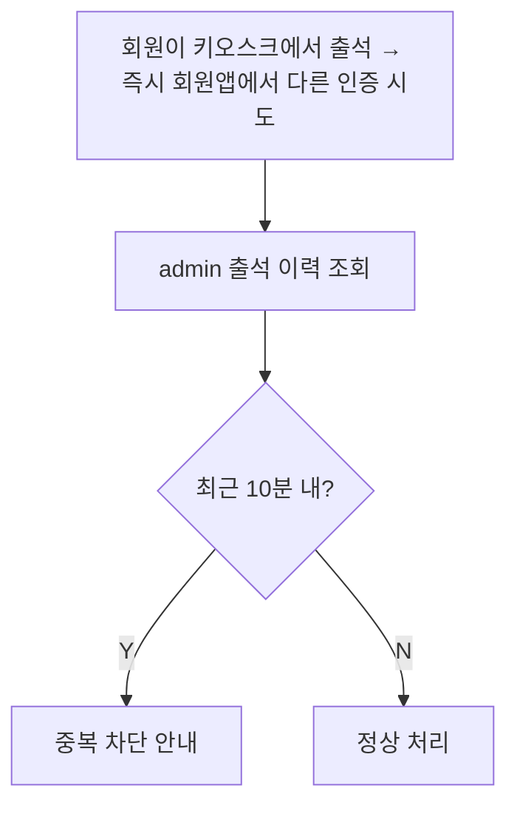
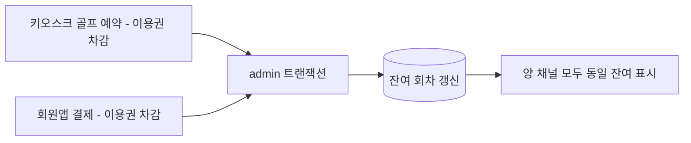
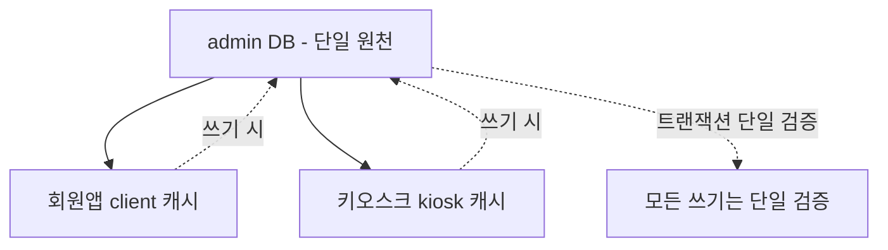

# 채널 충돌 방지 (회원앱 vs 키오스크)

> 작성일: 2026-05-04
> 같은 회원이 회원앱과 키오스크에서 동시에 시도할 때 admin 단일 검증으로 일관성 보장

## 1. 충돌 가능 시나리오

| 시나리오 | 발생 가능? | 처리 |
|---|---|---|
| 같은 시간/타석 골프 예약 | ✅ 가능 | admin 단일 검증, 선착순 |
| 같은 회원 출석 (10분 내 중복) | ✅ 가능 | 키오스크 중복 차단 |
| 같은 이용권 다중 차감 | ✅ 가능 | admin 트랜잭션으로 차단 |
| 같은 락커 동시 배정 | ❌ | 락커는 키오스크에서만 배정 |
| 결제 동시 처리 | 거의 없음 | 매점은 키오스크에서만 |

## 2. 골프 예약 동시 시도

## 3. 출석 중복 방지 (10분)

회원앱은 직접 출석 입력을 하지 않지만, QR 토큰 발급 후 키오스크 두 번 스캔 시도 같은 경우 두 번째는 중복으로 차단된다.

## 4. 이용권 차감 일관성

같은 이용권을 두 채널에서 동시에 차감 시도해도 admin 트랜잭션 단일 처리로 잔여가 마이너스가 되지 않는다.

## 5. 사용자 경험 측면 — 차단된 채널의 처리

| 차단 채널 | 안내 문구 |
|---|---|
| 회원앱 차단 | "이미 다른 곳에서 처리되었습니다. 잠시 후 새로고침해주세요." |
| 키오스크 차단 | "이미 예약된 타석입니다. 다른 타석을 선택해주세요." |

회원이 자신이 다른 채널에서 동시에 한 행동임을 알 수 있도록 안내 문구를 명확히 한다.

## 6. 단일 원천 원칙 재확인

## 관련 산출물

- ../../KIOSK-연동매트릭스.md § 8 (동기화 원칙)
- ../../../kiosk/KIOSK-기획연계정의서.md § 5 (동기화 원칙)
- 73_kiosk골프예약_앱알림.md (예약 흐름)
