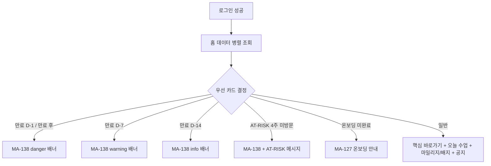
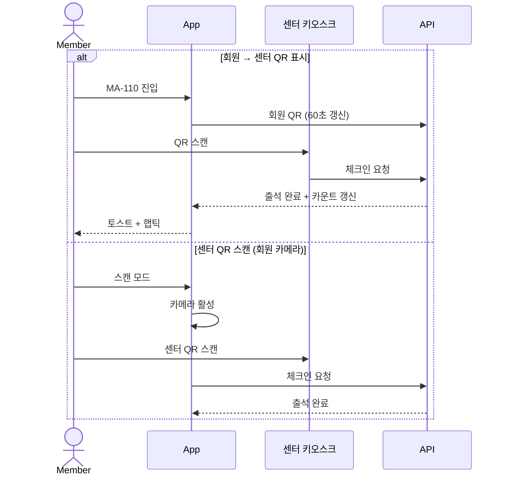
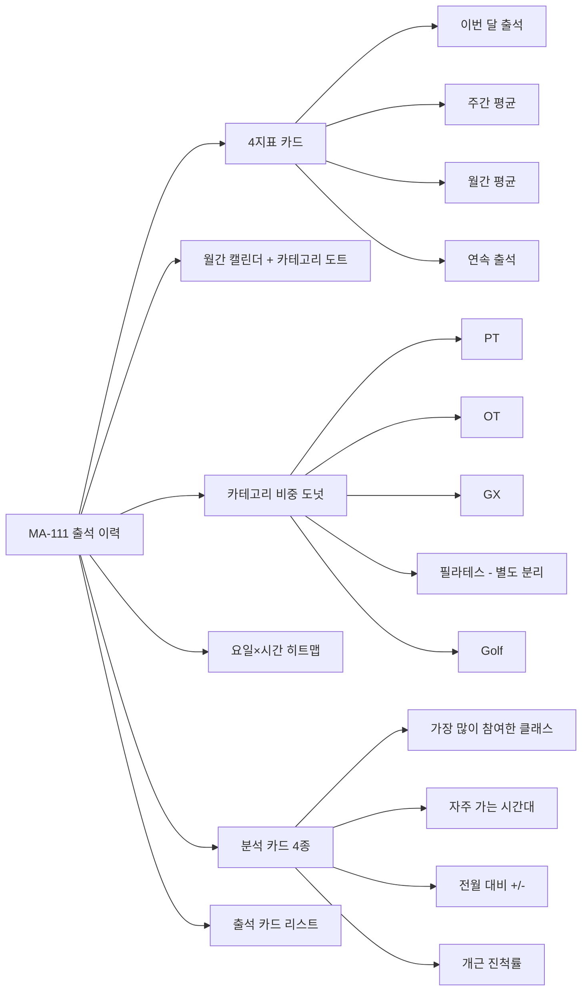
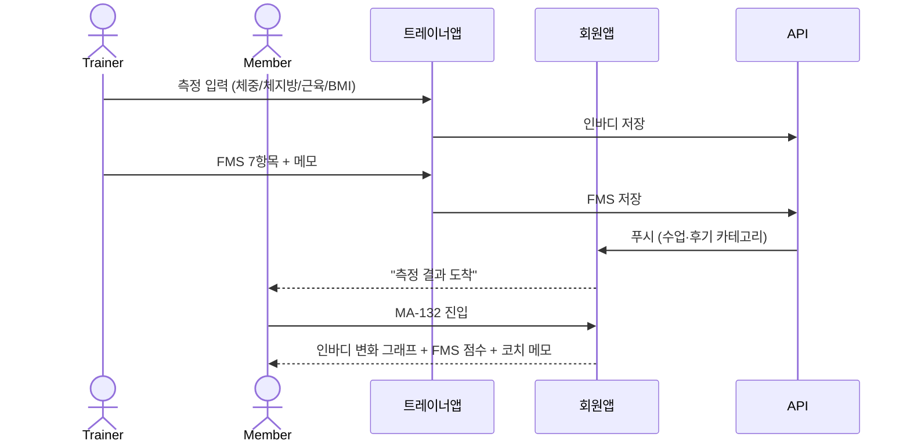
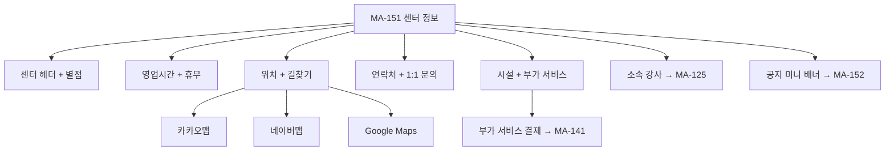

# H. 홈 / 체크인 / 출석 / 체성분 / 센터 정보 흐름

> 화면설계서 참조: H1 홈진입 우선카드 / H2 체크인 QR / H3 출석이력 분석 / H4 체성분 FMS / H5 센터정보 허브.

## H1. 홈 진입 + 우선 카드

## H2. QR 체크인

## H3. 출석 이력 분석

## H4. 체성분 / FMS 흐름

## H5. 센터 정보 허브

