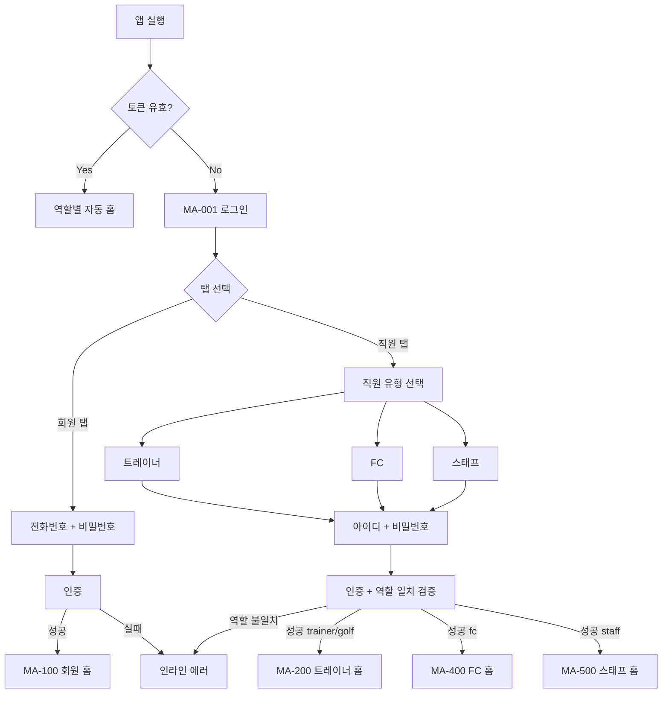
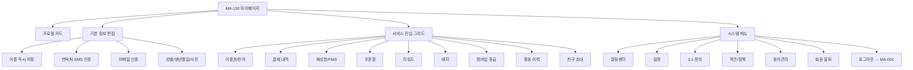

# M. 인증 / 가입 / 마이페이지 흐름

> 화면설계서 참조: M1 로그인 분기 / M2 앱가입 5단계 / M3 마이페이지 허브.

## M1. 로그인 → 역할 분기

## M2. 앱 가입 5단계

각 단계별 검증:
- 1: CRM 일치 확인 → 미등록 시 MA-153 안내
- 2: 6자리 OTP, 3분 유효, 5회 실패 시 10분 잠금
- 3: 8~16자 + 영문 + 숫자 + 특수문자
- 4: 단일 자동 / 다중 회원 선택
- 5: 필수 약관 모두 동의 시 활성

## M3. 마이페이지 허브

