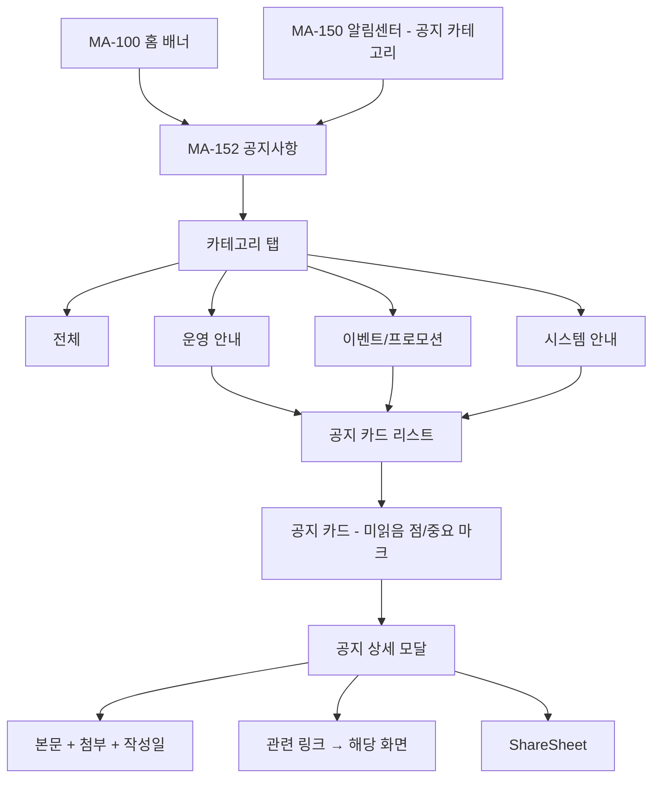
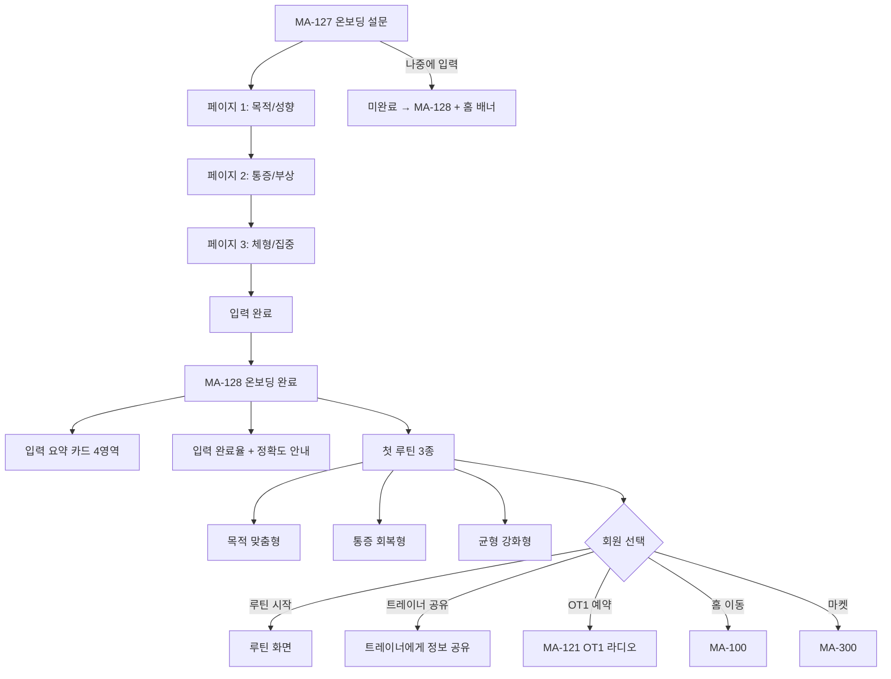
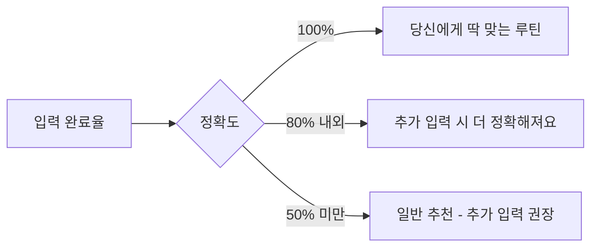

# N / O. 공지 / 온보딩 흐름

> 화면설계서 참조: N1 공지 분류 노출 / O1 온보딩 완료 플로우.

## N1. 공지 분류 노출

## O1. 온보딩 완료 플로우

## 첫 루틴 정확도

## 운동 온보딩 vs 환영 온보딩

| 구분 | MA-127/128 운동 온보딩 | MA-900 환영 슬라이드 |
|---|---|---|
| 목적 | 운동 정보 입력 | 앱 핵심 가치 안내 |
| 진입 | MA-002 연동 직후 자동 | 운동 온보딩 완료 후 |
| 슬라이드 | 3페이지 입력 | 4 슬라이드 안내 |
| 노출 | 1회 + 미완료 시 재안내 | 1회 + 설정에서 다시 보기 |
