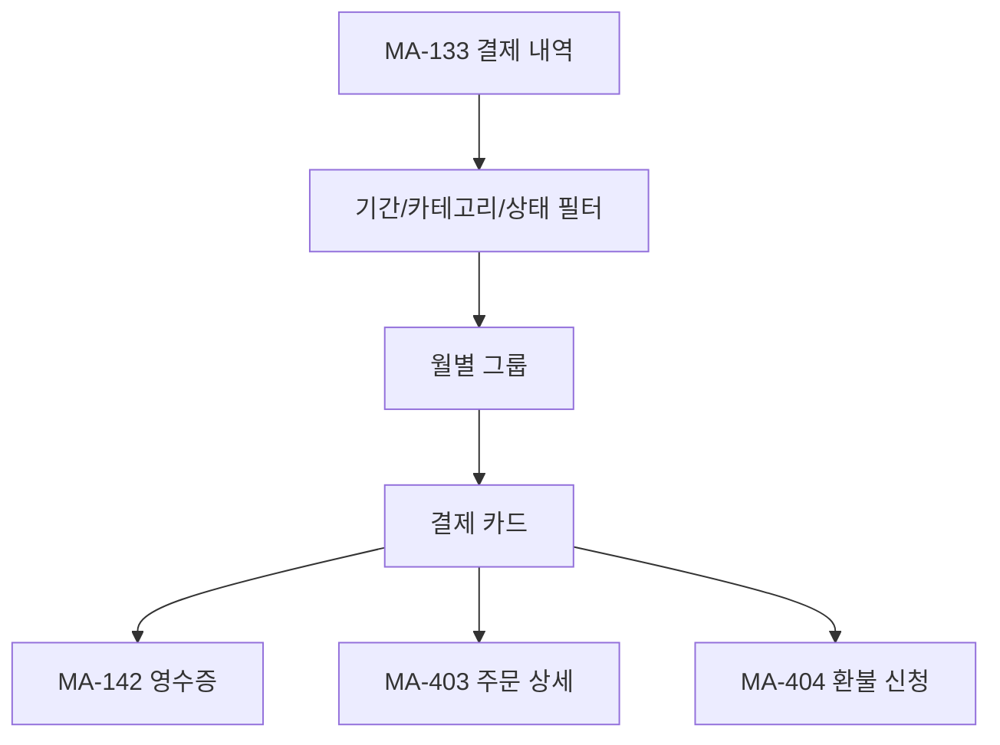
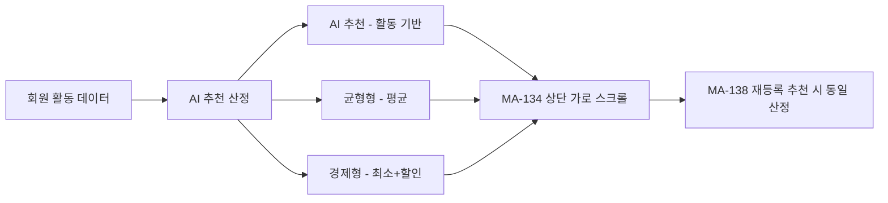
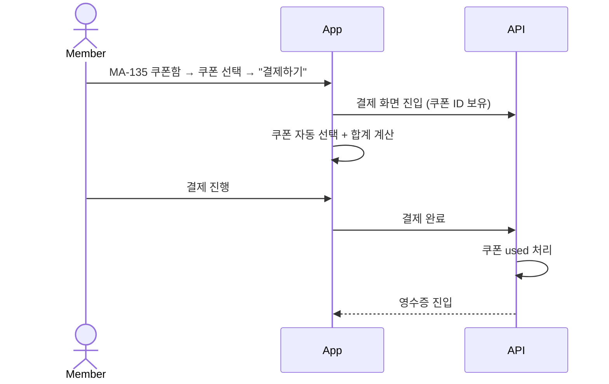
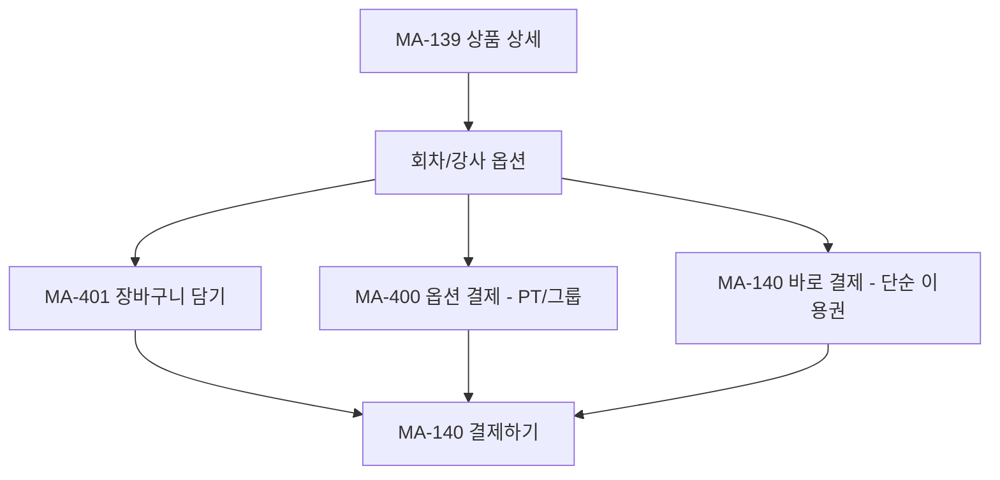
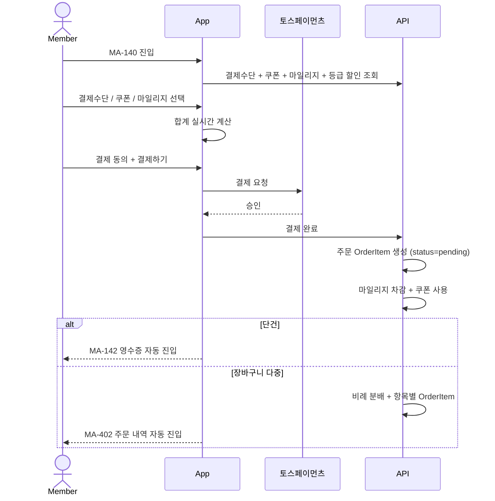
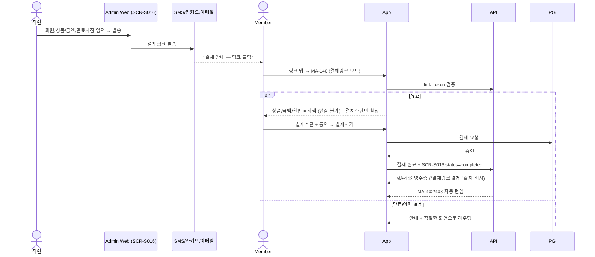
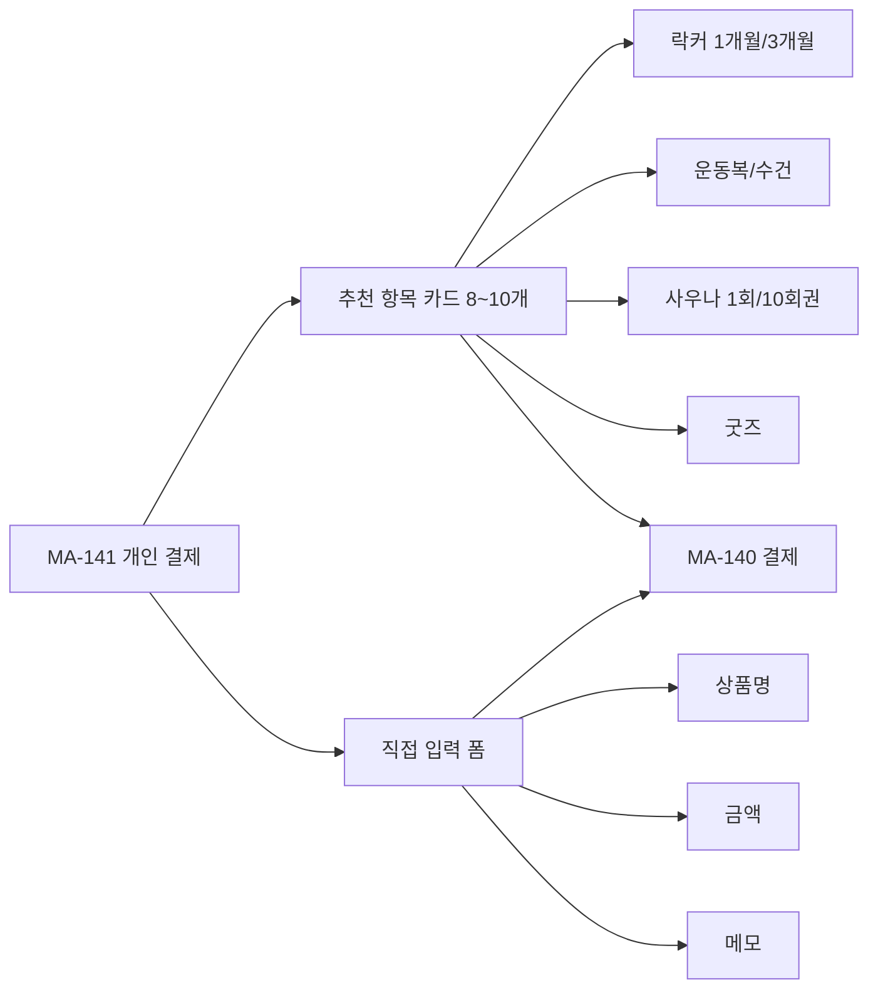
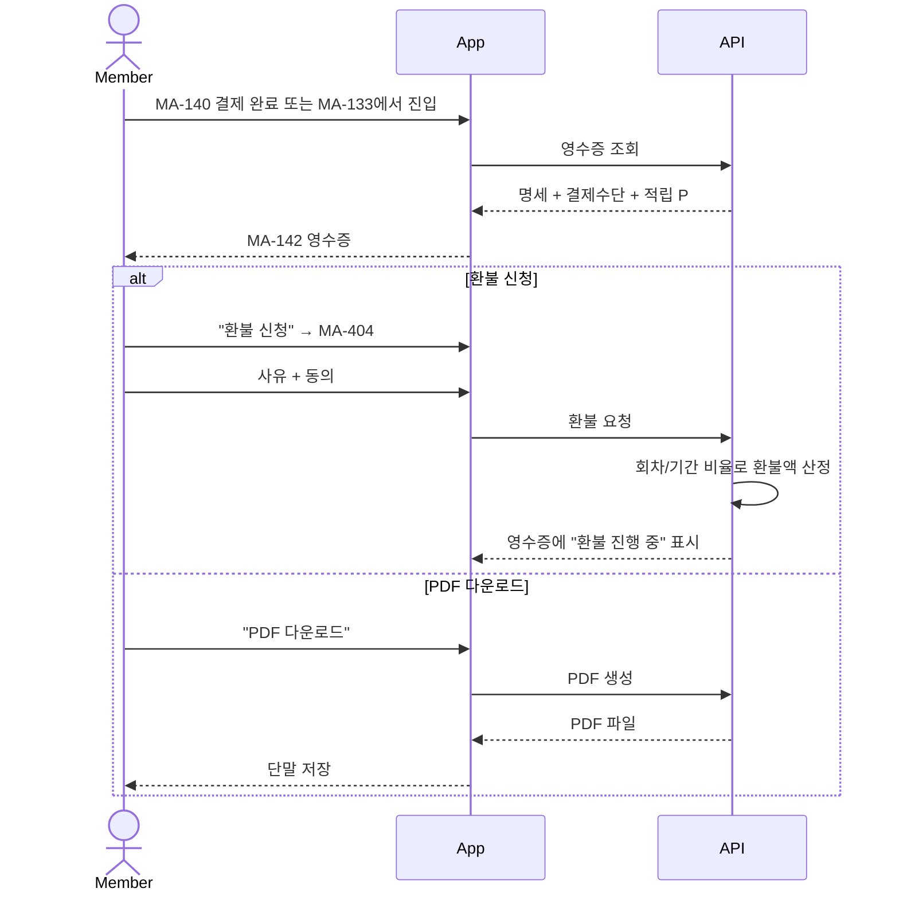

# P. 결제 / 상품 / 쿠폰 / 영수증 흐름

> 화면설계서 참조: P1 결제이력 / P2 상품스토어 AI 추천 / P3 쿠폰 사용 / P4 상품 상세 결제 / P5 결제 플로우 / P6 개인 결제 / P7 영수증 조회.

## P1. 결제 이력 조회 (MA-133)

## P2. 상품 스토어 AI 추천 산정

## P3. 쿠폰 사용 흐름

## P4. 상품 상세 → 결제

## P5. 결제 플로우 (단건/장바구니/재등록)

## P5b. 관리자 발송 결제링크 (admin SCR-S016 → MA-140 재사용)

**편집 가능/불가 매트릭스**

| 항목 | 일반 결제 (MA-140) | 결제링크 모드 (MA-140) |
|---|---|---|
| 상품 / 금액 / 할인 | 자유 | 직원 고정 (편집 불가, 회색) |
| 쿠폰 | 자유 | 불가 |
| 마일리지 | 자유 | 불가 |
| 결제수단 | 자유 | 자유 |
| 결제 동의 | 필수 | 필수 |

## P6. 개인 결제 (락커/사우나/굿즈)

## P7. 영수증 조회 / 환불

