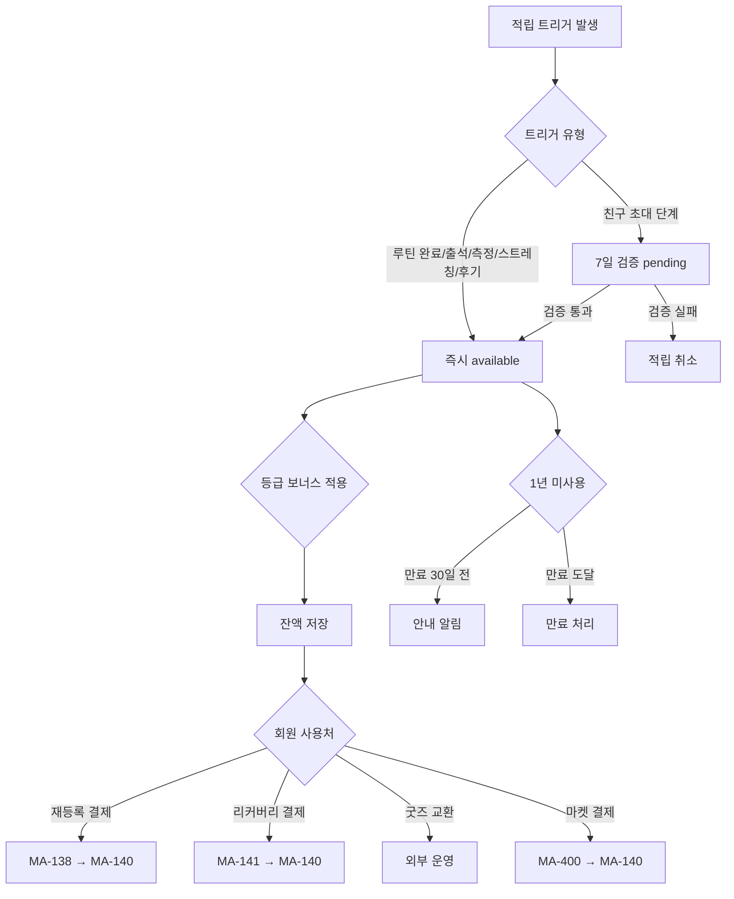
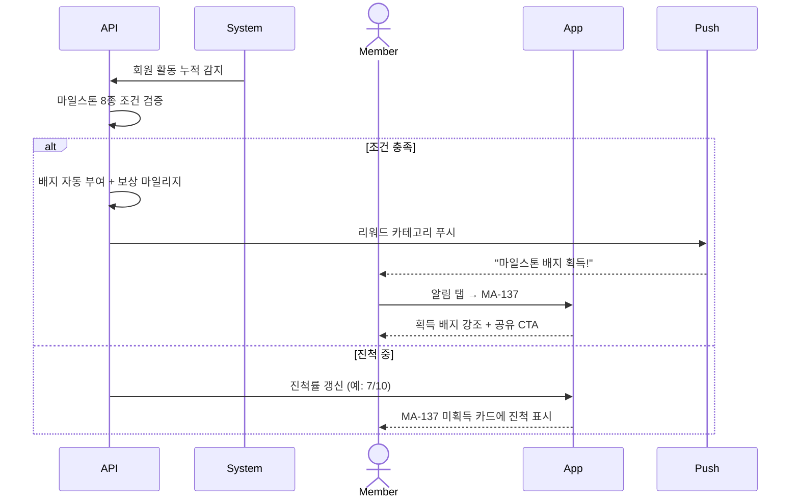

# RW. 마일리지 / 배지 흐름

> 화면설계서 참조: RW1 마일리지 적립/사용 / RW2 배지 획득.

## RW1. 마일리지 적립 → 사용

## RW2. 배지 자동 부여

## 배지 카테고리

| 카테고리 | 예시 |
|---|---|
| 출석 | 첫 출석 / 10회 / 100회 / 1년 |
| 수업 | 첫 PT 완주 / PT 50회 / GX 100회 |
| 측정 | 첫 인바디 / FMS 향상 |
| 리워드 | 마일리지 1만/10만 / 쿠폰 사용 |
| 친구 | 첫 추천 / 친구 5명 |
| 마일스톤 (활동 기반) | 8종 — 첫 PT 완주 / 10회 연속 출석 / 첫 후기 / 한 달 개근 / 누적 결제 200만원 / 친구 초대 마스터 / 얼리버드 / 마라토너 |

## 등급별 적립 보너스

| 등급 | 보너스 |
|---|---|
| BRONZE | 0% |
| SILVER | +5% |
| GOLD | +10% |
| VIP | +15% |
| VVIP | +20% |
