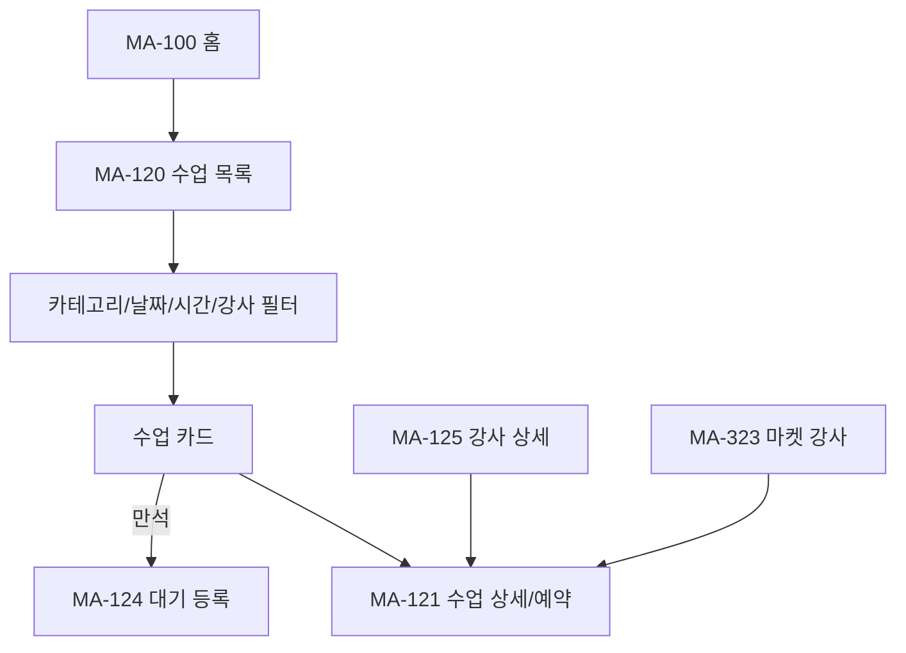
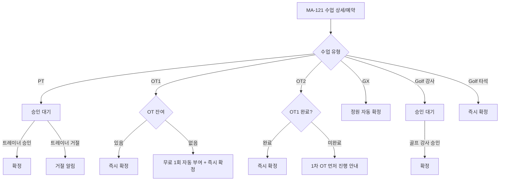
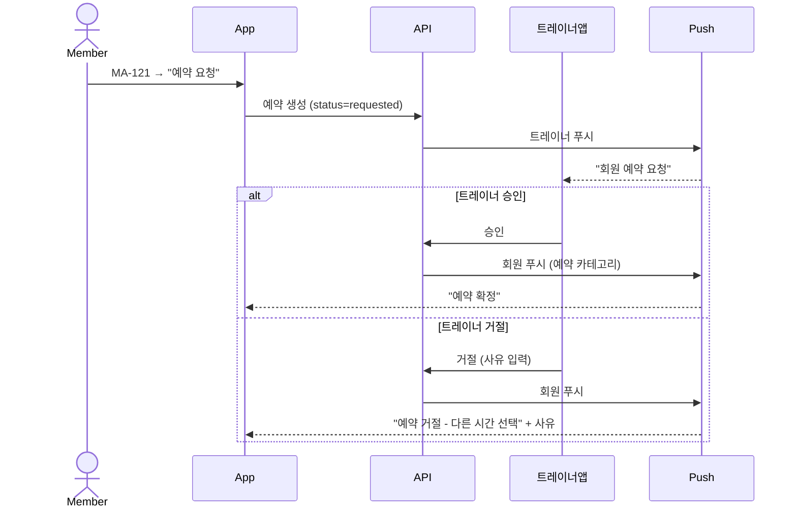
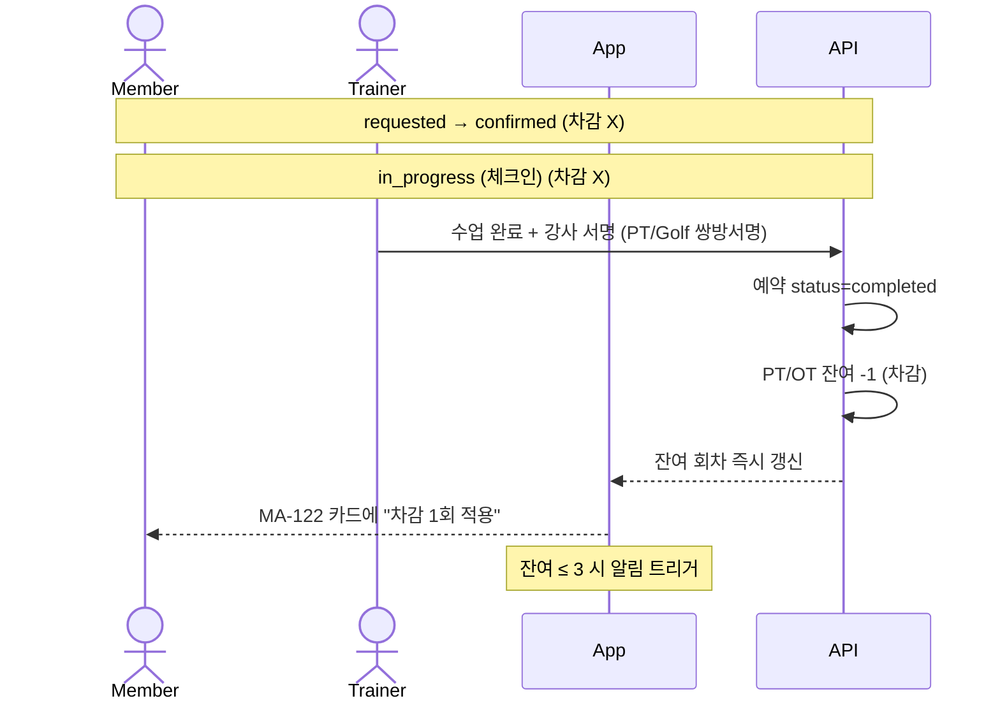

# R. 예약 / 분기 / 차감 흐름

> 화면설계서 참조: R1 예약 탐색 / R2 PT/OT 분기 / R3 예약 승인 대기 / R4 PT차감 시점.

## R1. 예약 탐색

```mermaid
graph TD
    MA100[MA-100 홈] --> MA120[MA-120 수업 목록]
    MA120 --> Filter[카테고리/날짜/시간/강사 필터]
    Filter --> Card[수업 카드]
    Card --> MA121[MA-121 수업 상세/예약]
    Card -->|만석| MA124[MA-124 대기 등록]

    MA125[MA-125 강사 상세] --> MA121
    MA323[MA-323 마켓 강사] --> MA121
```

## R2. PT / OT1 / OT2 분기

```mermaid
flowchart TD
    MA121[MA-121 수업 상세/예약] --> Type{수업 유형}
    Type -->|PT| PT[승인 대기]
    Type -->|OT1| OT1Check{OT 잔여}
    Type -->|OT2| OT2Check{OT1 완료?}
    Type -->|GX| GX[정원 자동 확정]
    Type -->|Golf 강사| GolfT[승인 대기]
    Type -->|Golf 타석| GolfS[즉시 확정]

    OT1Check -->|있음| OT1Confirm[즉시 확정]
    OT1Check -->|없음| OT1Free[무료 1회 자동 부여 + 즉시 확정]

    OT2Check -->|완료| OT2Confirm[즉시 확정]
    OT2Check -->|미완료| OT2Block["1차 OT 먼저 진행 안내"]

    PT -->|트레이너 승인| PTConfirm[확정]
    PT -->|트레이너 거절| PTReject[거절 알림]

    GolfT -->|골프 강사 승인| GTConfirm[확정]
```

## R3. 예약 승인 대기 시퀀스

```mermaid
sequenceDiagram
    actor Member
    participant App
    participant API
    participant TApp as 트레이너앱
    participant Push

    Member->>App: MA-121 → "예약 요청"
    App->>API: 예약 생성 (status=requested)
    API->>Push: 트레이너 푸시
    Push-->>TApp: "회원 예약 요청"

    alt 트레이너 승인
        TApp->>API: 승인
        API->>Push: 회원 푸시 (예약 카테고리)
        Push-->>App: "예약 확정"
    else 트레이너 거절
        TApp->>API: 거절 (사유 입력)
        API->>Push: 회원 푸시
        Push-->>App: "예약 거절 - 다른 시간 선택" + 사유
    end
```

## R4. PT 차감 시점

```mermaid
sequenceDiagram
    actor Member
    actor Trainer
    participant App
    participant API

    Note over Member,API: requested → confirmed (차감 X)
    Note over Member,API: in_progress (체크인) (차감 X)

    Trainer->>API: 수업 완료 + 강사 서명 (PT/Golf 쌍방서명)
    API->>API: 예약 status=completed
    API->>API: PT/OT 잔여 -1 (차감)
    API-->>App: 잔여 회차 즉시 갱신
    App-->>Member: MA-122 카드에 "차감 1회 적용"

    Note over App: 잔여 ≤ 3 시 알림 트리거
```
