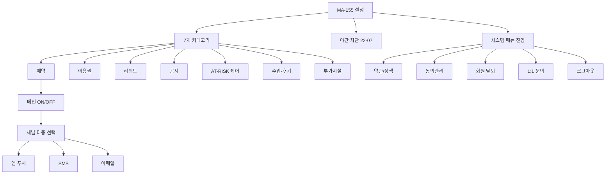
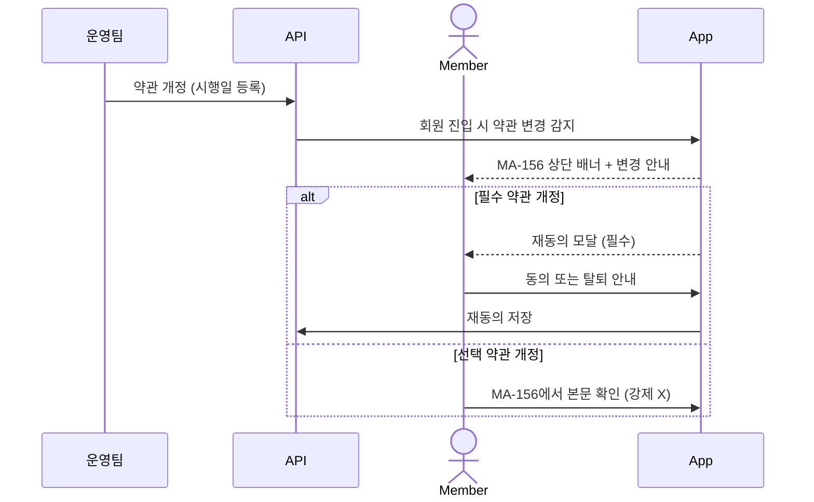
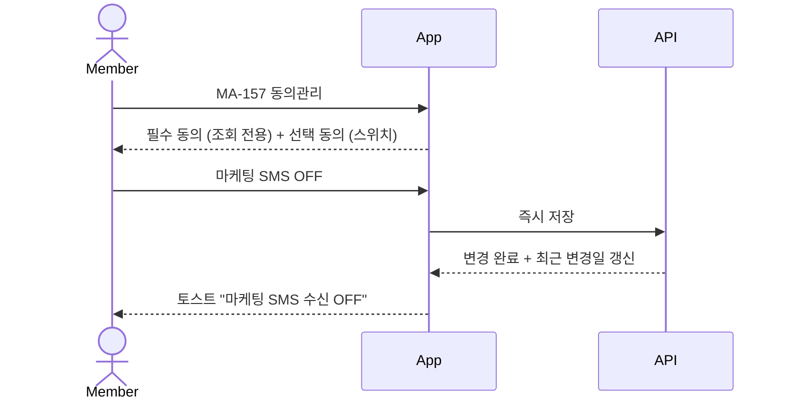

# S. 설정 / 약관 / 동의 / 탈퇴 / 알림 흐름

> 화면설계서 참조: S1 알림설정 매트릭스 / S2 약관 변경 재동의 / S3 동의 변경 저장 / S4 회원 탈퇴.

## S1. 알림 설정 매트릭스 (카테고리 × 채널)



## S2. 약관 변경 → 재동의



## S3. 동의 관리 변경



## S4. 회원 탈퇴

```mermaid
flowchart TD
    MA155[MA-155 설정] --> MA158[MA-158 회원 탈퇴]
    MA158 --> Notice[탈퇴 전 안내 카드]
    Notice --> N1[잔여 회차 + 환불 안내]
    Notice --> N2[보유 마일리지 즉시 소멸 안내]
    Notice --> N3[진행 중 주문 환불 안내]

    MA158 --> Reason[사유 단일 선택]
    MA158 --> Memo[추가 의견]
    MA158 --> Agree[동의 3개 체크]

    Agree --> CTA{탈퇴 신청 활성?}
    CTA -->|모두 체크| Active[탈퇴 신청 CTA 활성]
    CTA -->|미체크| Disabled[비활성]

    Active --> Confirm[ConfirmDialog 위험 톤]
    Confirm -->|확인| Submit[탈퇴 요청 접수]
    Confirm -->|취소| Back[이전 화면]

    Submit --> Result[처리 결과 화면]
    Result --> Logout[자동 로그아웃 → MA-001]

    Note over Submit: 즉시 삭제 X / 운영 승인 후 처리
```
