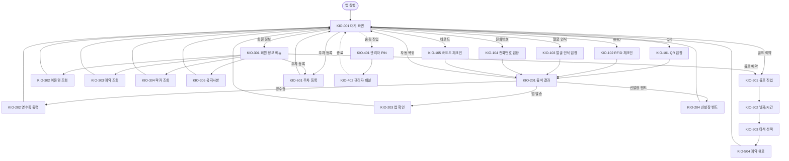

# 키오스크 사이트맵

> 작성일: 2026-05-04
> 화면 그룹 A1~A7 / KIO-001~702

## 전체 사이트맵

## 화면 그룹 요약

| 그룹 | 화면 수 | 진입 경로 |
|---|---|---|
| A1 메인/출석 | 6 (KIO-001, 101~105) | 앱 실행 → KIO-001 |
| A2 결과/락커 | 4 (KIO-201~204) | 출석 성공 후 |
| A3 회원 정보 | 5 (KIO-301~305) | KIO-001 → 회원 정보 카드 |
| A4 골프 예약 | 4 (KIO-501~504) | KIO-001/301 → 골프 카드 |
| A5 주차 등록 | 1 (KIO-601) | KIO-001/301 → 주차 카드 |
| A6 관리자 | 2 (KIO-401, 402) | 숨김 진입 |
