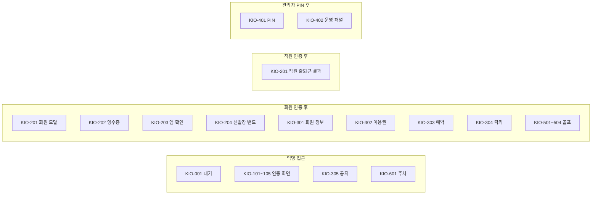
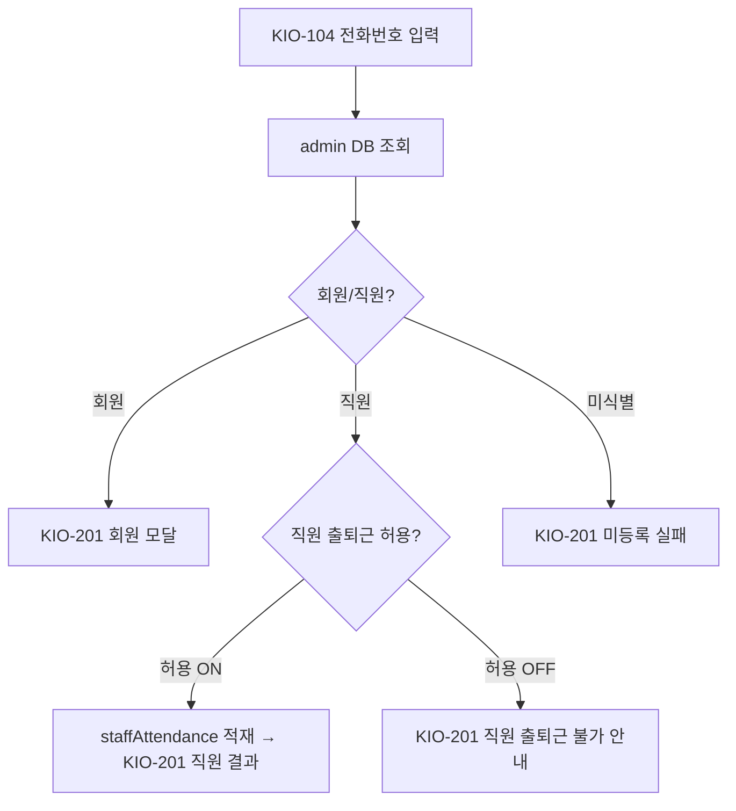

# 키오스크 권한 매트릭스

> 작성일: 2026-05-04
> 키오스크 단말은 무인 상태로 동작. 역할 분기는 인증 결과와 단말 PIN으로 결정된다.

## 역할 정의

| 역할 | 인증 방식 | 비고 |
|---|---|---|
| 익명 | 없음 | 인증 전 사용자 |
| 회원 | QR / RFID / 얼굴 / 전화번호 / 바코드 | admin DB 회원 매칭 시 |
| 직원 | 같은 입력 화면, 인증 결과로 자동 분기 | 직원 출퇴근 허용 OFF면 차단 |
| 관리자 | 숨김 진입 + 단말 PIN | admin/SCR-081 정책 |

## 역할별 화면 접근 권한

## 액션 단위 권한 매트릭스

| 액션 | 익명 | 회원 | 직원 | 관리자 |
|---|:---:|:---:|:---:|:---:|
| 대기 화면 보기 | O | O | O | O |
| QR/RFID/얼굴/전화/바코드 인증 | O | — | — | — |
| 출석 처리 | — | O | — | — |
| 직원 출퇴근 적재 | — | — | O | — |
| 락커 번호 확인(영수증/앱/밴드) | — | O | — | — |
| 이용권/예약/락커 조회 | — | O | — | — |
| 공지 조회 | O | O | O | O |
| 골프 예약 (이용권 검증 후) | — | O | — | — |
| 주차 등록 진입 | O | O | O | O |
| 관리자 패널 진입 | — | — | — | O |
| 원격 문 열기 | — | — | — | O |
| 설정 새로고침 / 연결 테스트 | — | — | — | O |
| TTS 점검 | — | — | — | O |

## 직원 출퇴근 차단 분기

## 관련 산출물

- 키오스크 README.md § 권한/역할 적용 원칙
- admin/SCR-081-권한설정 (단말 PIN 정책)
- admin/SCR-063-직원근태관리 (직원 출퇴근 정책)
