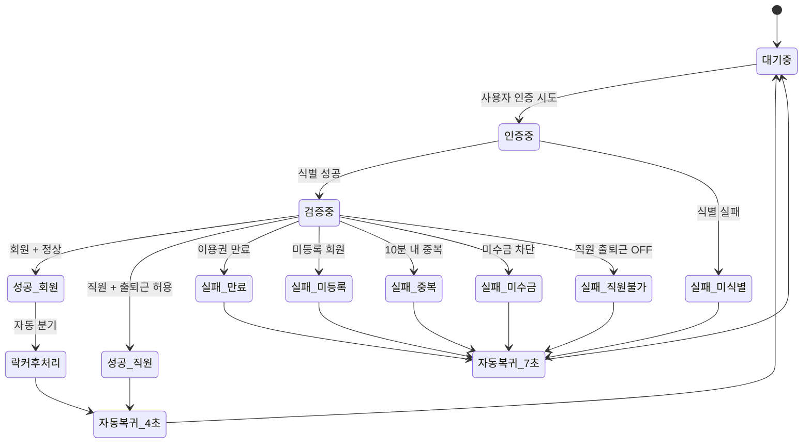

# 출석 상태 전이도

> 작성일: 2026-05-04
> 관련 화면: KIO-001, KIO-101~105, KIO-201

## 전체 상태

## 상태별 처리

| 상태 | 키오스크 화면 | admin 적재 | 자동 복귀 |
|---|---|---|---|
| 대기중 | KIO-001 / KIO-101~105 | — | — |
| 인증중 | KIO-101~105 | — | — |
| 검증중 | (전환 사이) | — | — |
| 성공_회원 | KIO-201 회원 모달 + 출입문 5초 개방 + 성공 TTS | 출석 이력 + 락커 후처리 | 4초 |
| 성공_직원 | KIO-201 직원 결과 | staffAttendance | 4초 |
| 실패_만료 | KIO-201 실패 + 프런트 안내 | 운영 로그 | 7초 |
| 실패_미등록 | KIO-201 실패 + 재시도 안내 | 운영 로그 | 7초 |
| 실패_중복 | KIO-201 실패 + 잠시 후 재시도 | 운영 로그 | 7초 |
| 실패_미수금 | KIO-201 경고 또는 차단 | 운영 로그 | 7초 |
| 실패_직원불가 | KIO-201 직원 출퇴근 불가 | 운영 로그 | 7초 |

## 타이머 정책

| 항목 | 기본값 | 설정 위치 |
|---|---|---|
| 중복 체크인 방지 | 10분 | admin/SCR-082 |
| 출입문 개방 시간 | 5초 | admin/SCR-082 |
| 성공 모달 자동 복귀 | 4초 | admin/SCR-082 |
| 실패 화면 자동 복귀 | 7초 | admin/SCR-082 |

## 관련 산출물

- KIO-201 출석 결과 화면설계서
- admin/SCR-I001-통합출석관리 정책
