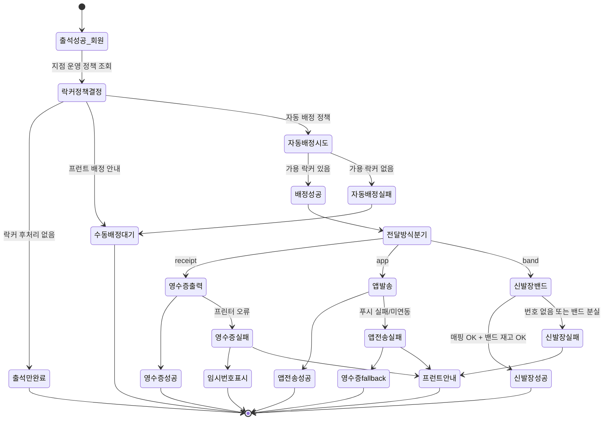

# 락커 후처리 상태 전이도

> 작성일: 2026-05-04
> 관련 화면: KIO-201, KIO-202, KIO-203, KIO-204

## 전체 상태

## 분기 결정 입력

| 입력 | 출처 | 영향 |
|---|---|---|
| 락커 후처리 정책 | admin/SCR-I002 | 출석만/수동/자동 |
| 자동 배정 존 | admin/SCR-050-락커관리 | 기본 A, B |
| 락커 번호 전달 방식 | admin/SCR-I002 | receipt / app / band |
| 전달 실패 fallback | admin/SCR-I002 | 영수증/프런트/없음 |
| 회원 앱 연동 여부 | client/SCR-MA-001 가입 연동 | app 방식 사용 가능 여부 |
| 밴드 재고 | admin/SCR-052-밴드카드관리 | band 방식 가용 여부 |

## 화면 매핑

| 상태 | 화면 |
|---|---|
| 출석만완료 / 수동배정대기 | KIO-201 모달 후 자동 복귀 |
| 영수증출력/성공/실패 | KIO-202 |
| 앱발송/전송성공/실패 | KIO-203 |
| 신발장밴드/성공/실패 | KIO-204 |

## 관련 산출물

- 키오스크 운영기획서 § 5.1 ATT-04~05
- KIO-201, KIO-202, KIO-203, KIO-204 화면설계서
- admin/SCR-050-락커관리 키오스크-연동.md
- admin/SCR-052-밴드카드관리 키오스크-연동.md
