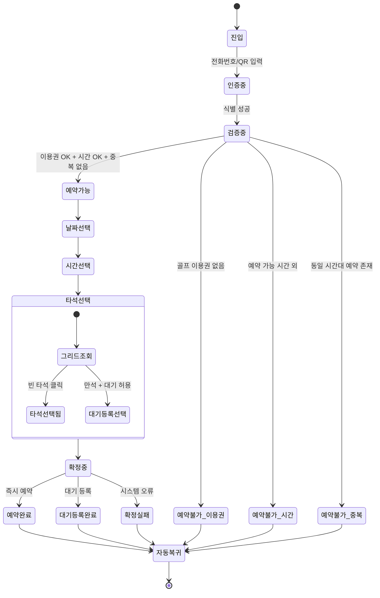
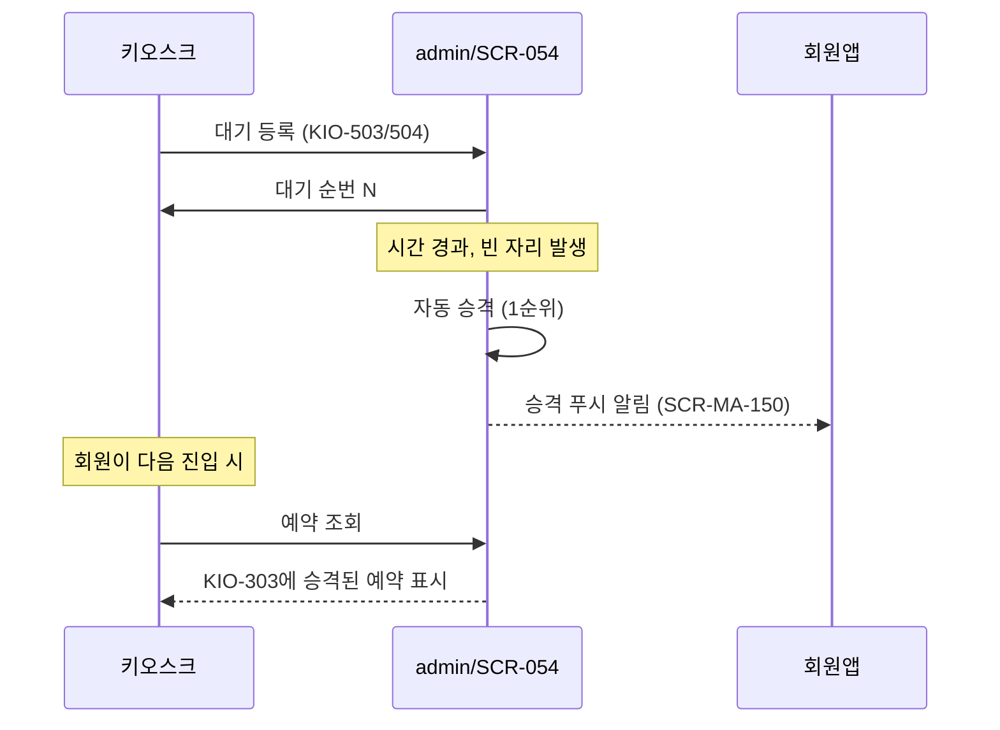

# 골프 예약 상태 전이도

> 작성일: 2026-05-04
> 관련 화면: KIO-501, KIO-502, KIO-503, KIO-504

## 전체 상태

## 대기열 자동 승격 (admin 자동 처리)

## 화면 매핑

| 상태 | 화면 |
|---|---|
| 진입/인증중/검증중/예약불가_* | KIO-501 |
| 날짜선택/시간선택 | KIO-502 |
| 타석선택/대기등록선택 | KIO-503 |
| 예약완료/대기등록완료/확정실패 | KIO-504 |

## 채널 일관성

같은 회원이 회원앱과 키오스크에서 동시 시도해도 admin 단일 검증으로 결과가 일관된다.

| 상황 | 처리 |
|---|---|
| 회원앱 + 키오스크 동시 같은 슬롯 | 선착순, 다른 한 쪽은 `예약불가_중복` |
| 다른 회원이 같은 타석 동시 | 선착순 |
| 회원앱 예약 후 키오스크 취소 | 정상 (동일 데이터) |

## 관련 산출물

- 키오스크 기능명세서 골프타석예약.md
- KIO-501~504 화면설계서
- admin/SCR-054-골프타석관리 키오스크-연동.md
- client/SCR-MA-123-골프예약상세 키오스크-연동.md
