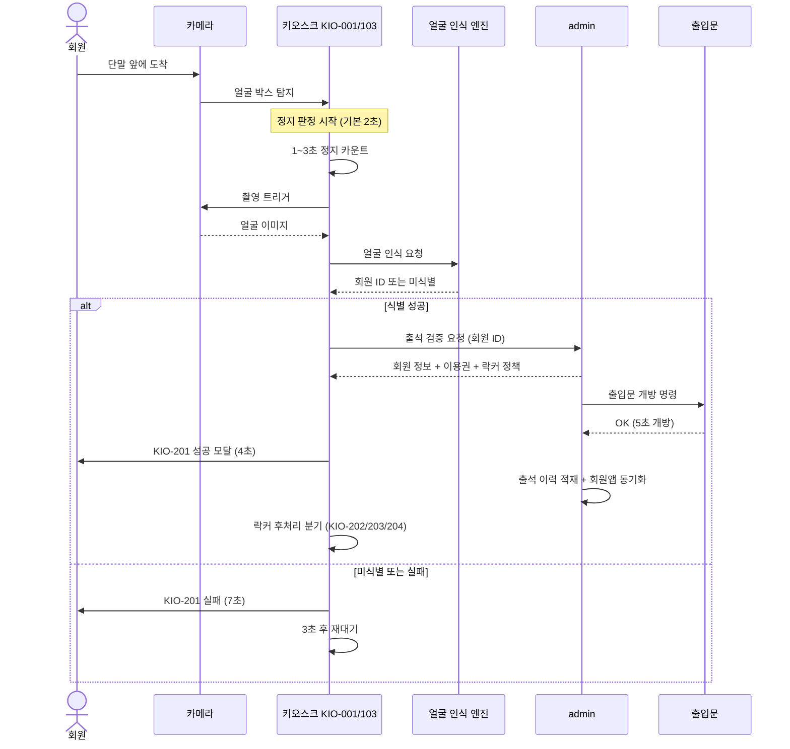
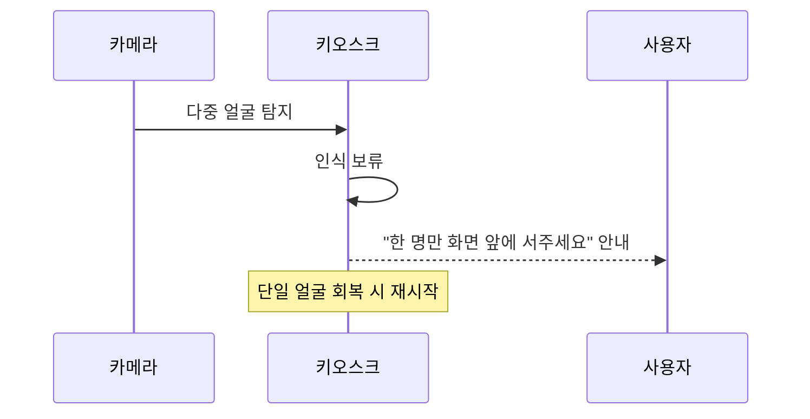

# X01 얼굴 인식 출석 시퀀스

> 작성일: 2026-05-04
> 관련 화면: KIO-001, KIO-103, KIO-201

## 시퀀스

## 다중 얼굴 감지 시

## 핵심 타이머

| 단계 | 시간 |
|---|---|
| 정지 판정 | 1~3초 (기본 2초, admin SCR-I002) |
| 인식 실패 후 재대기 | 3초 |
| 출입문 개방 | 5초 |
| 성공 모달 자동 복귀 | 4초 |
| 실패 화면 자동 복귀 | 7초 |

## 관련 산출물

- KIO-103 화면설계서
- 키오스크 기능명세서 출석및입장관리.md (ATT-01)
