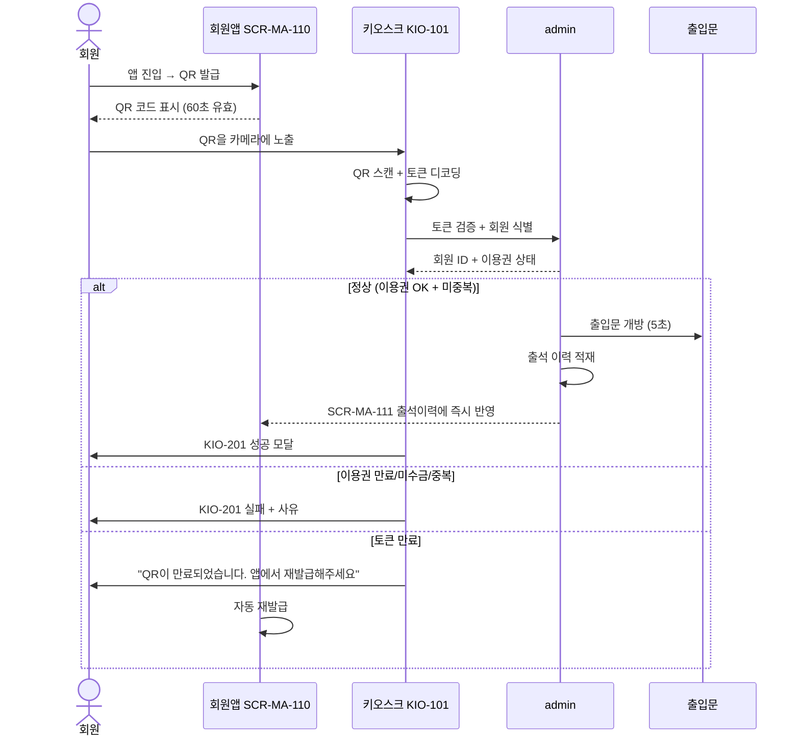

# X02 QR 체크인 시퀀스

> 작성일: 2026-05-04
> 관련 화면: KIO-001, KIO-101, KIO-201, client/SCR-MA-110

## 시퀀스 (회원앱 발급 QR)

## 보안 메모

- QR 토큰에 회원 PII 직접 포함하지 않음 (서버 토큰 ↔ 회원 매핑만)
- 1회용 또는 짧은 유효시간 (60초 권장)
- 위변조 토큰은 서버 검증 단계에서 거부

## 관련 산출물

- KIO-101 화면설계서
- client/SCR-MA-110-QR체크인 키오스크-연동.md
- 키오스크 기능명세서 출석및입장관리.md (ATT-02-01)
