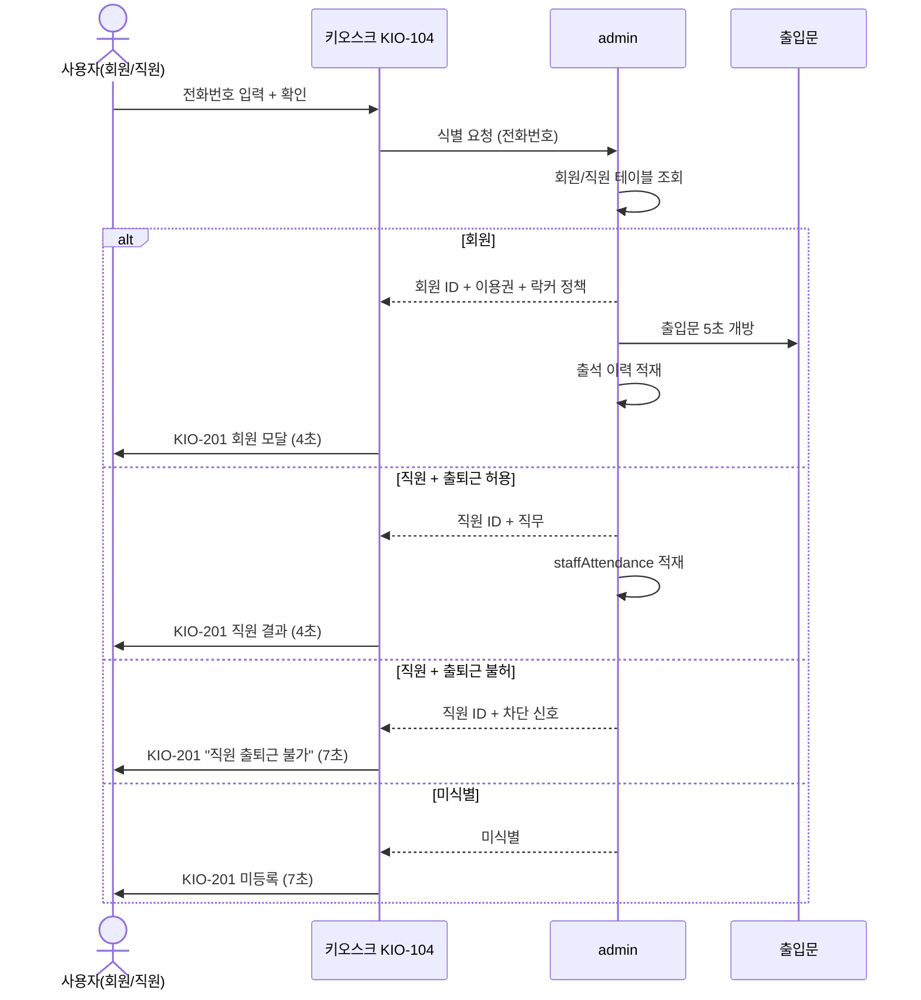

# X03 전화번호 출석 — 회원/직원 자동 분기

> 작성일: 2026-05-04
> 관련 화면: KIO-104, KIO-201

## 시퀀스

## 분기 로직 핵심

| 입력 | 1차 조회 | 2차 검증 | 결과 |
|---|---|---|---|
| 전화번호 | 회원 매칭? | 이용권/미수금/중복 | 회원 분기 |
| 전화번호 | 직원 매칭? | `staffAttendance` 허용? | 직원 분기 |
| 전화번호 | 어디에도 없음 | — | 미식별 |

회원과 직원이 같은 번호를 쓸 일은 없다는 전제. 충돌 시 회원 우선.

## 관련 산출물

- KIO-104 화면설계서
- 키오스크 기능명세서 출석및입장관리.md (ATT-02-04)
- admin/SCR-063-직원근태관리
