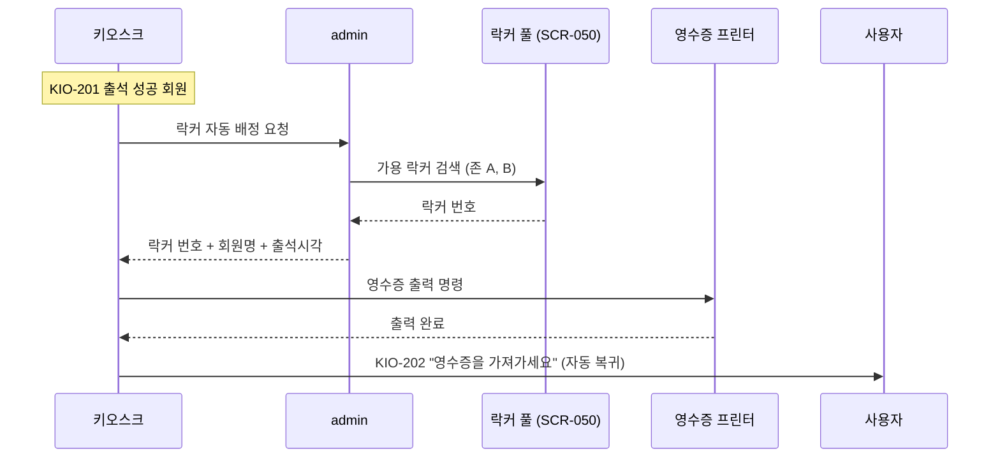
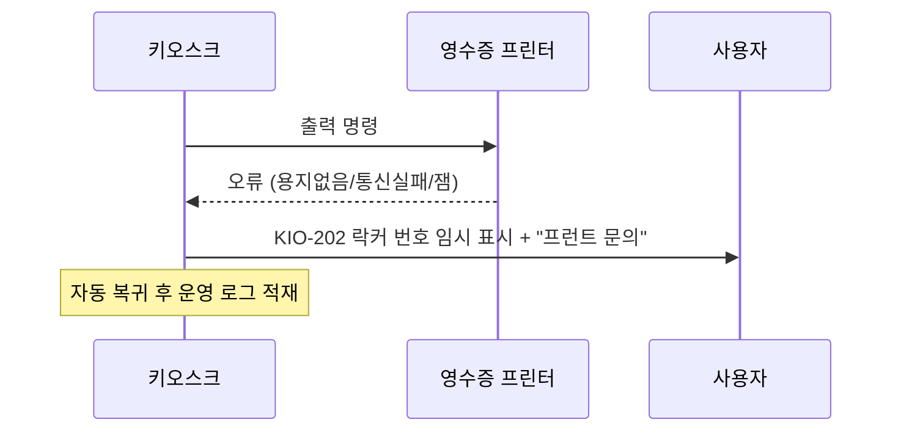

# X04 락커 번호 — 영수증 출력 시퀀스

> 작성일: 2026-05-04
> 관련 화면: KIO-201 → KIO-202

## 시퀀스 (정상 흐름)

## 시퀀스 (출력 실패 fallback)

## 영수증 내용 (권장)

| 항목 | 표기 |
|---|---|
| 회원명 | 마스킹 또는 이름만 |
| 출석 시각 | YYYY-MM-DD HH:mm |
| 락커 번호 | 큰 숫자 |
| 안내 문구 | "체육관 이용 후 락커를 비워주세요" 등 |

영수증에 과도한 PII를 포함하지 않는다.

## 관련 산출물

- KIO-202 화면설계서
- 키오스크 기능명세서 출석및입장관리.md (ATT-05-01)
- admin/SCR-050-락커관리 키오스크-연동.md
