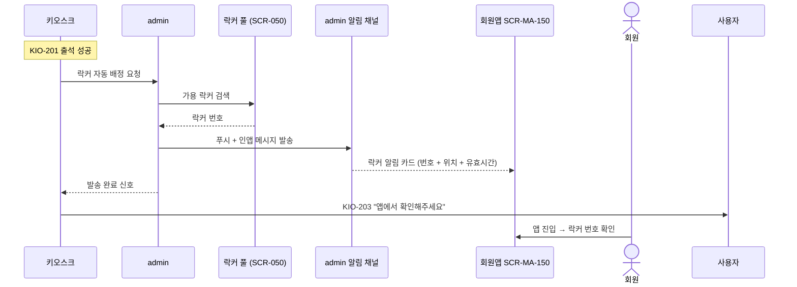
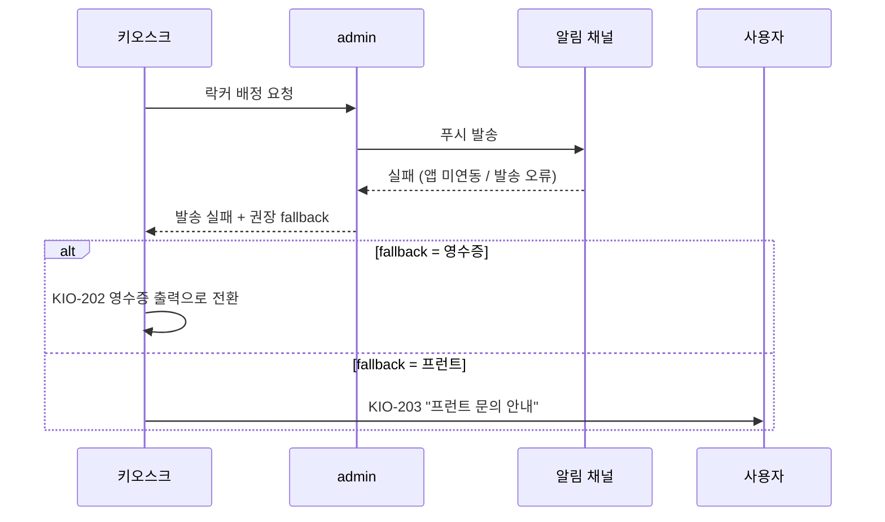

# X05 락커 번호 — 회원앱 발송 시퀀스

> 작성일: 2026-05-04
> 관련 화면: KIO-201 → KIO-203, client/SCR-MA-150

## 시퀀스 (정상 흐름)

## 시퀀스 (전송 실패 fallback)

## 분기 입력

| 입력 | 출처 | 영향 |
|---|---|---|
| 회원 앱 연동 여부 | client/SCR-MA-002 가입 연동 | 앱 발송 가능 여부 |
| 푸시 토큰 유효성 | admin 알림 채널 | 발송 가능 여부 |
| fallback 정책 | admin/SCR-082 | 실패 시 어디로 |

## 회원앱 측 알림 카드 형식

| 항목 | 내용 |
|---|---|
| 제목 | "오늘 락커 번호" |
| 본문 | 락커 번호 (큰 숫자) |
| 위치 안내 | 존(zone) |
| 유효 시간 | 출석 시각 + 운영시간 |
| 자동 만료 | 영업 종료 시 |

## 관련 산출물

- KIO-203 화면설계서
- 키오스크 기능명세서 출석및입장관리.md (ATT-04-04)
- client/SCR-MA-150-알림센터 키오스크-연동.md
