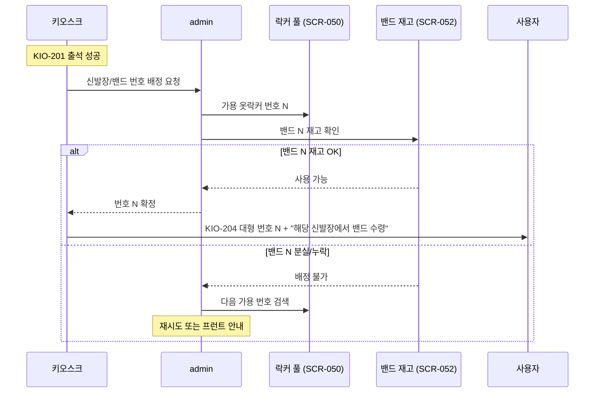
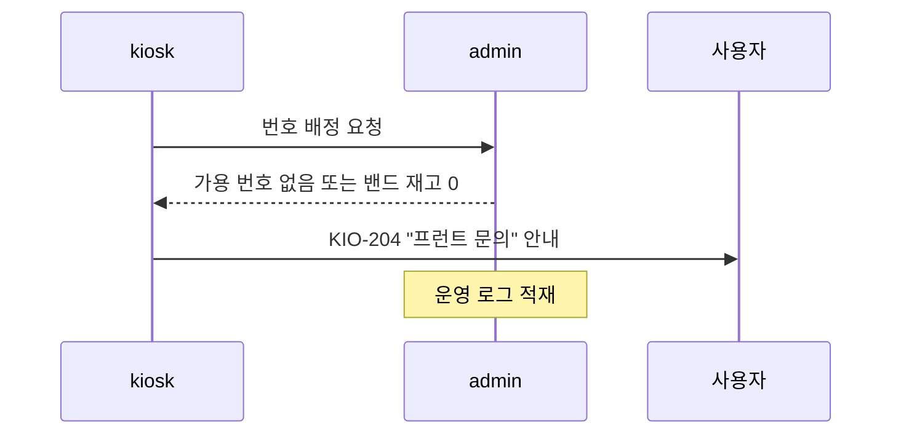

# X06 락커 번호 — 신발장 밴드 수령 시퀀스

> 작성일: 2026-05-04
> 관련 화면: KIO-201 → KIO-204

## 전제 조건

- 센터 운영 정책: `신발장 번호 = 밴드 번호 = 옷락커 번호` 1:1 매핑
- 밴드 재고/분실/반납은 admin/SCR-052에서 추적

## 시퀀스 (정상)

## 시퀀스 (예외)

## 운영 원칙

- 동일번호 정책 토글 ON 인 센터에서만 이 방식을 활성화한다.
- 밴드 분실 시 해당 번호는 즉시 배정 불가로 전환되어야 한다 (SCR-052 정책).
- 회수/정상화 시 admin에서 재배정 가능 상태로 복원한다.

## 관련 산출물

- KIO-204 화면설계서
- 키오스크 기능명세서 출석및입장관리.md (ATT-05-03)
- admin/SCR-050-락커관리 키오스크-연동.md
- admin/SCR-052-밴드카드관리 키오스크-연동.md
