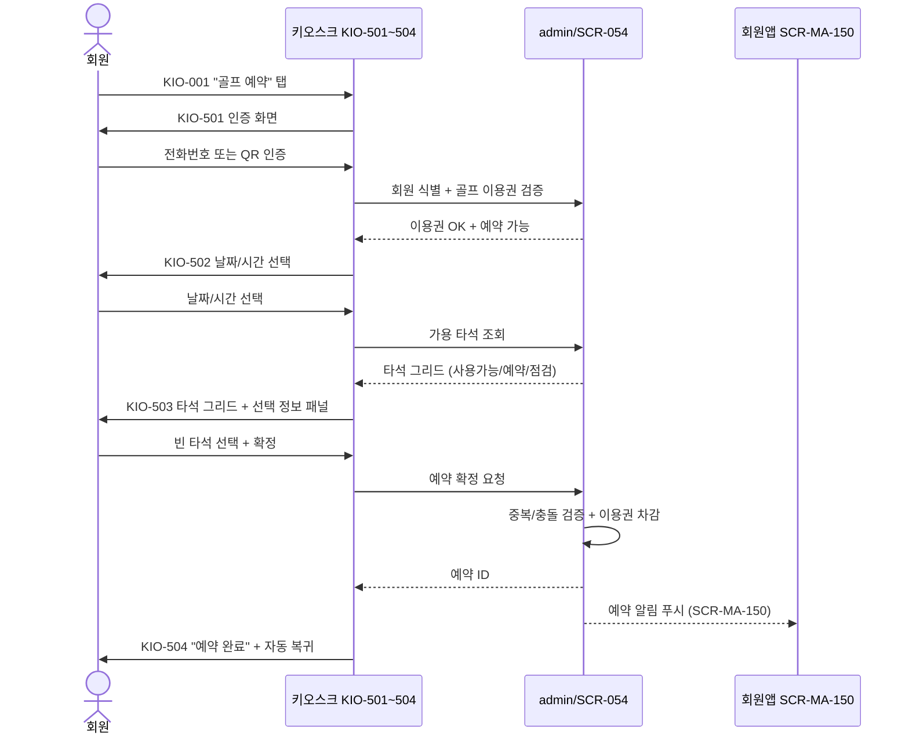

# X07 골프 예약 — 타석 선택 시퀀스

> 작성일: 2026-05-04
> 관련 화면: KIO-501 → KIO-502 → KIO-503 → KIO-504

## 시퀀스 (즉시 예약 성공)

## 검증 실패 시 분기

| 시점 | 실패 사유 | 키오스크 처리 |
|---|---|---|
| 인증 후 (KIO-501) | 골프 이용권 없음 | "프런트 문의" + 자동 복귀 |
| 인증 후 (KIO-501) | 동일 시간대 중복 | 중복 안내 |
| 타석 선택 후 (KIO-503) | 동시 점유로 선착순 패배 | "다른 타석을 선택해주세요" + KIO-503 갱신 |

## 관련 산출물

- KIO-501~504 화면설계서
- 키오스크 기능명세서 골프타석예약.md (GLF-01~03)
- admin/SCR-054-골프타석관리 키오스크-연동.md
- admin 다이어그램 X31_회원앱_골프예약_타석선택_대기전환
