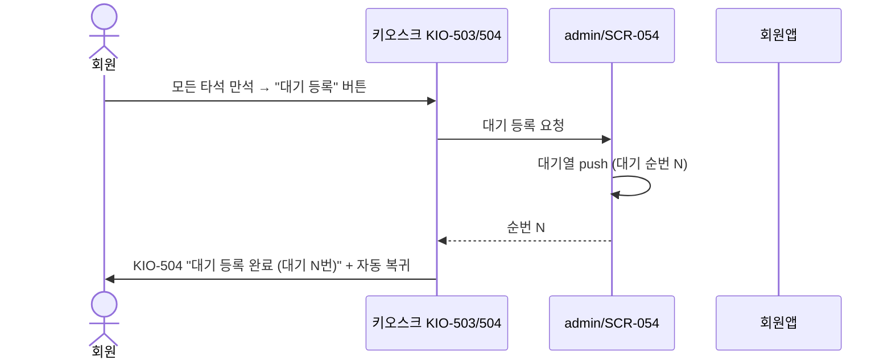
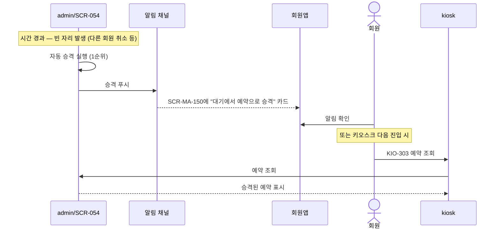

# X08 골프 예약 — 대기 등록 + 자동 승격 시퀀스

> 작성일: 2026-05-04
> 관련 화면: KIO-503 → KIO-504, 이후 client/SCR-MA-150

## 시퀀스 (만석 → 대기 등록)

## 시퀀스 (자동 승격)

## 자동 승격 정책 출처

자동 승격은 **admin 정책**이다. 키오스크는 결과만 표시하며 자체 대기열을 관리하지 않는다.

| 정책 항목 | 위치 |
|---|---|
| 자동 승격 활성/비활성 | admin/SCR-054 |
| 승격 우선순위 룰 | admin/SCR-054 |
| 승격 시 알림 채널 | admin 알림 채널 |
| 키오스크 채널 라벨 (옵션) | 예약 메타 `via=kiosk` |

## 관련 산출물

- KIO-503, KIO-504 화면설계서
- 키오스크 기능명세서 골프타석예약.md (GLF-03, GLF-04)
- admin/SCR-054-골프타석관리 키오스크-연동.md
- client/SCR-MA-124-대기예약관리
- client/SCR-MA-150-알림센터 키오스크-연동.md
