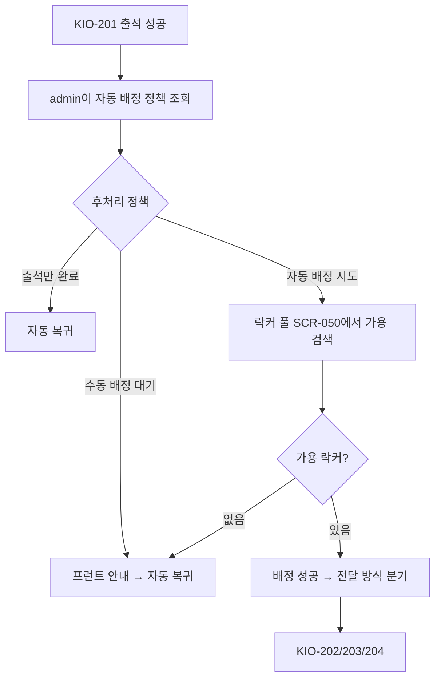
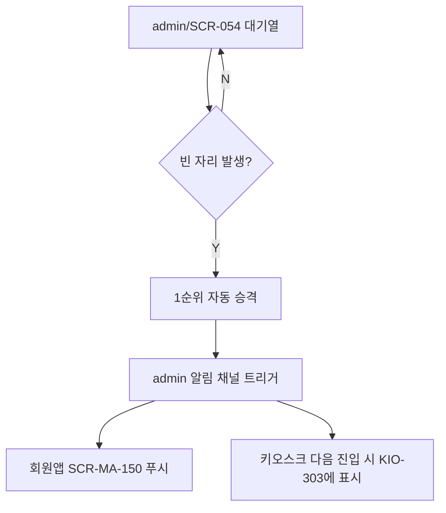
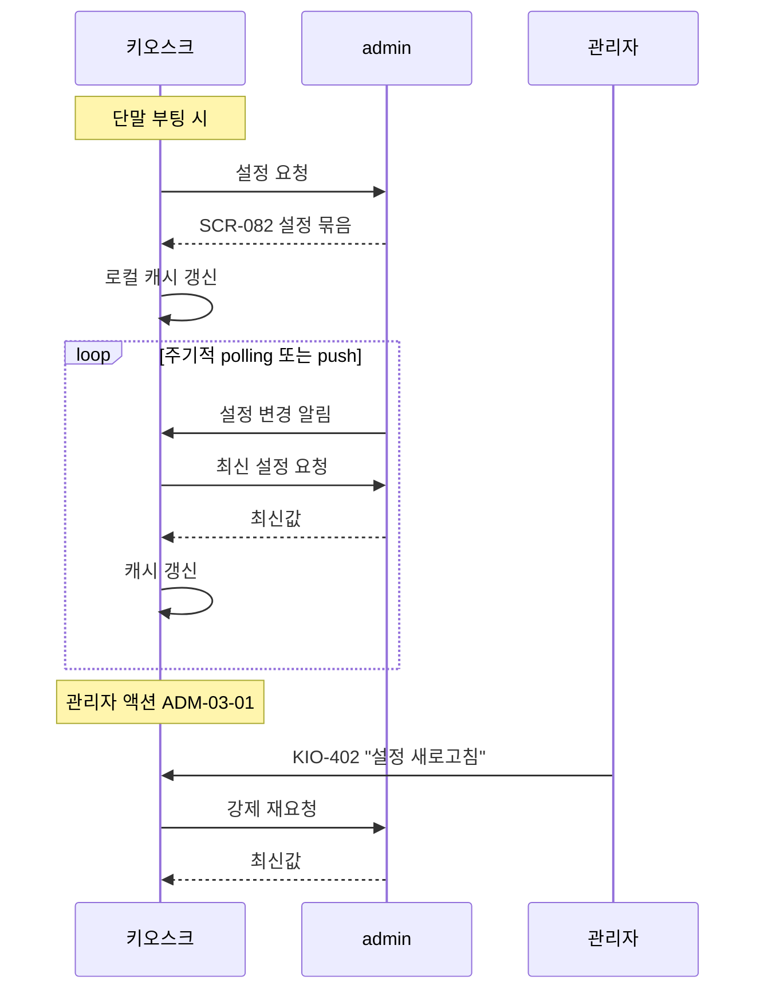
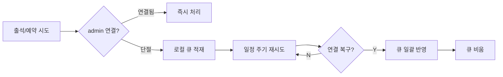

# 키오스크 자동화 동작

> 작성일: 2026-05-04
> 자동 복귀, 자동 배정, 자동 승격, 자동 갱신 등 시스템 자동 처리

## 1. 자동 복귀 타이머

```mermaid
flowchart LR
    subgraph 결과화면
        S[성공 모달] -->|4초| H[KIO-001 대기 화면]
        F[실패 화면] -->|7초| H
        L[락커 후처리 모달] -->|4초| H
        IL[정보 화면<br/>(KIO-302/303/304/305)] -->|타이머| H
        G[골프 결과 KIO-504] -->|타이머| H
        P[주차 안내 KIO-601] -->|타이머| H
        AP[관리자 종료] --> H
    end
```

| 항목 | 기본값 | 설정 위치 |
|---|---|---|
| 성공 모달 | 4초 | admin/SCR-082 |
| 실패 화면 | 7초 | admin/SCR-082 |
| 회원 정보 화면 자동 복귀 | 60초 | admin/SCR-082 |
| 공지 자동 복귀 | 60초 | admin/SCR-082 |
| 골프 결과 자동 복귀 | 30초 | admin/SCR-082 |
| 주차 안내 자동 복귀 | 15초 | admin/SCR-082 |

자동 복귀 타이머는 회원 인증 정보를 폐기하고 KIO-001로 돌아간다.

## 2. 락커 자동 배정



| 정책 항목 | 출처 |
|---|---|
| 자동 배정 존 (기본 A, B) | admin/SCR-050 또는 SCR-082 |
| 우선순위 (등급/이력) | admin/SCR-050 정책 |
| 배정 실패 fallback | 수동 배정 대기 |

## 3. 골프 대기 자동 승격



자동 승격은 admin 측 작업이며 키오스크는 결과만 노출한다.

## 4. 설정 자동 갱신



| 갱신 트리거 | 빈도 |
|---|---|
| 단말 부팅 | 1회 |
| 주기 polling | 5분 또는 admin push |
| 관리자 강제 갱신 | 즉시 |

## 5. 오프라인 큐



복구 즉시 admin 원천에 반영하고 큐를 비운다. 키오스크는 영구 저장소를 두지 않는다.

## 관련 산출물

- 키오스크 기능명세서 설정및외부연동.md
- 운영기획서 § 5.6
