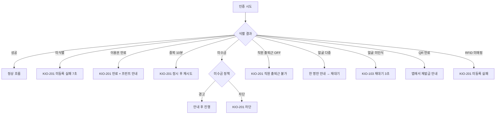
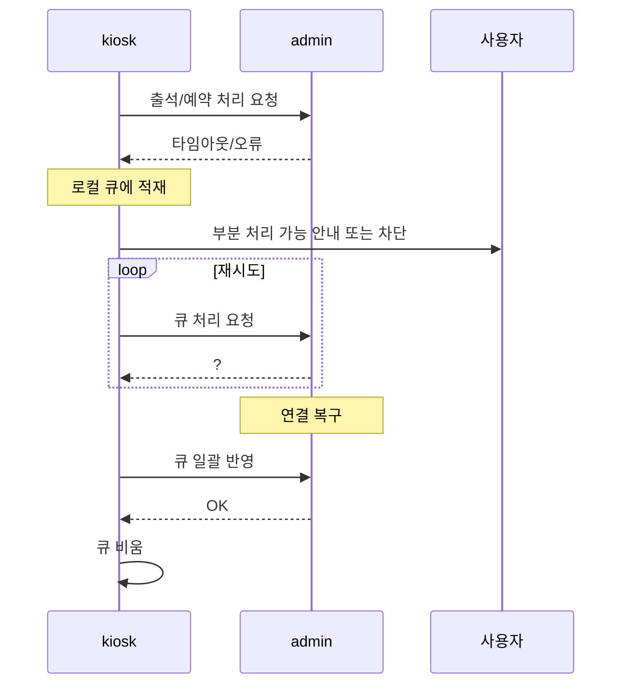

# 키오스크 에러/예외 흐름

> 작성일: 2026-05-04
> 인증 실패, 장비 오프라인, 데이터 오류 등 예외 분기

## 1. 인증 실패 분기



## 2. 장비 오프라인/오류

```mermaid
flowchart TD
    subgraph 장비
        C[카메라]
        P[영수증 프린터]
        R[RFID 리더기]
        G[출입문 게이트]
        T[TTS 엔진]
    end

    C -->|차단/오류| C1[KIO-001 캠 영역 안내 + 얼굴 메뉴 숨김]
    P -->|오류| P1[KIO-202 임시 번호 표시 + 프런트 안내]
    R -->|오류| R1[KIO-001 RFID 메뉴 숨김 또는 안내]
    G -->|오류| G1[출석 기록은 적재 + "프런트 문의"]
    T -->|오류| T1[음성 안내 생략 (시각만)]
```

장비 미연결 상태에서도 화면 흐름이 어색하지 않게 처리한다 (운영기획서 § 5.6 SET-05-02).

## 3. admin 연결 단절



## 4. 락커 후처리 예외

| 분기 | 예외 | 처리 |
|---|---|---|
| 영수증 출력 | 프린터 오류 | KIO-202에 임시 번호 표시 + 프런트 |
| 앱 발송 | 앱 미연동 | fallback (영수증 또는 프런트) |
| 앱 발송 | 푸시 실패 | fallback |
| 신발장 밴드 | 밴드 분실 | 다음 가용 번호 또는 프런트 |
| 신발장 밴드 | 가용 번호 없음 | 프런트 안내 |
| 자동 배정 | 가용 락커 없음 | 수동 배정 대기 |

## 5. 골프 예약 예외

| 시점 | 예외 | 처리 |
|---|---|---|
| 인증 | 골프 이용권 없음 | KIO-501 차단 + 프런트 |
| 인증 | 동일 시간대 중복 | 중복 안내 |
| 타석 선택 | 동시 점유 패배 | KIO-503 갱신 + 다른 타석 선택 |
| 확정 | 시스템 오류 | 재시도 또는 프런트 |

## 6. 운영 로그 적재

모든 예외는 admin 운영 로그로 적재되며 본사/지점 운영자가 admin/SCR-I008-키오스크운영현황에서 확인할 수 있다.

| 로그 종류 | 적재 위치 |
|---|---|
| 출석 실패 | 출석 운영 로그 |
| 장비 오류 | 단말 상태 로그 |
| admin 연결 단절 | 단말 상태 로그 |
| 자동 배정 실패 | 락커 운영 로그 |
| 예약 충돌 | 골프 운영 로그 |
| 관리자 액션 | 감사 로그 |

## 관련 산출물

- 키오스크 운영기획서 § 5.6 (SET-05)
- admin/SCR-I008-키오스크운영현황 키오스크-연동.md
