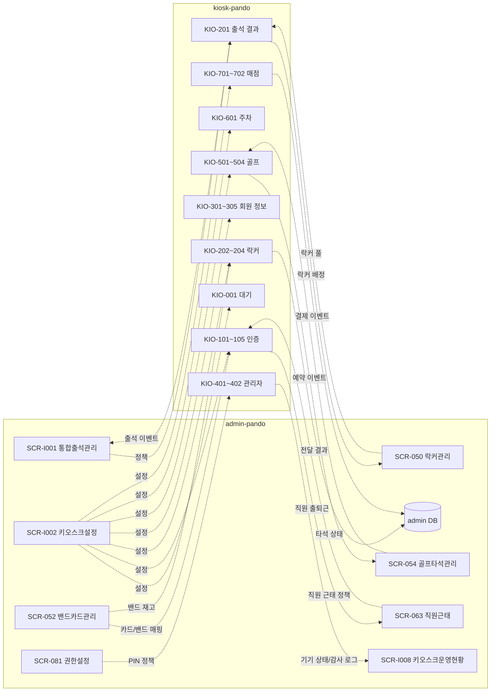
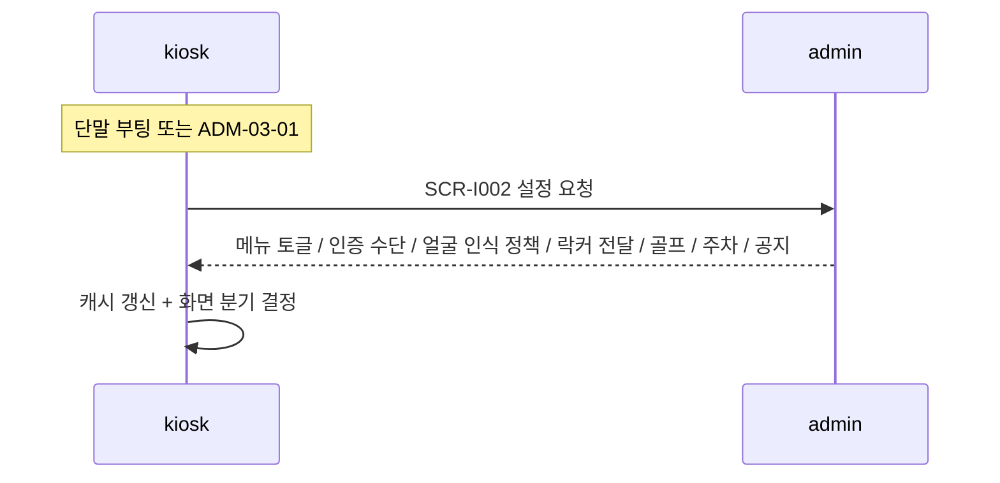
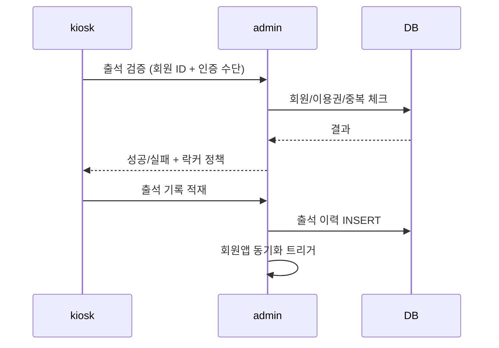
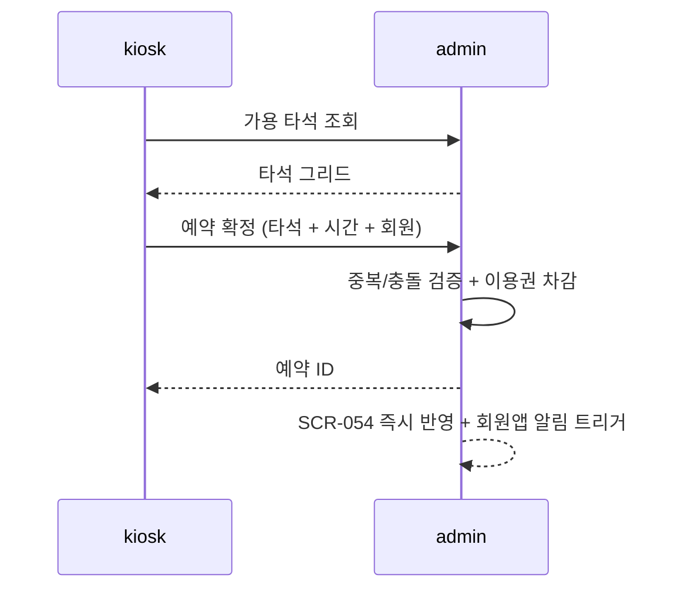
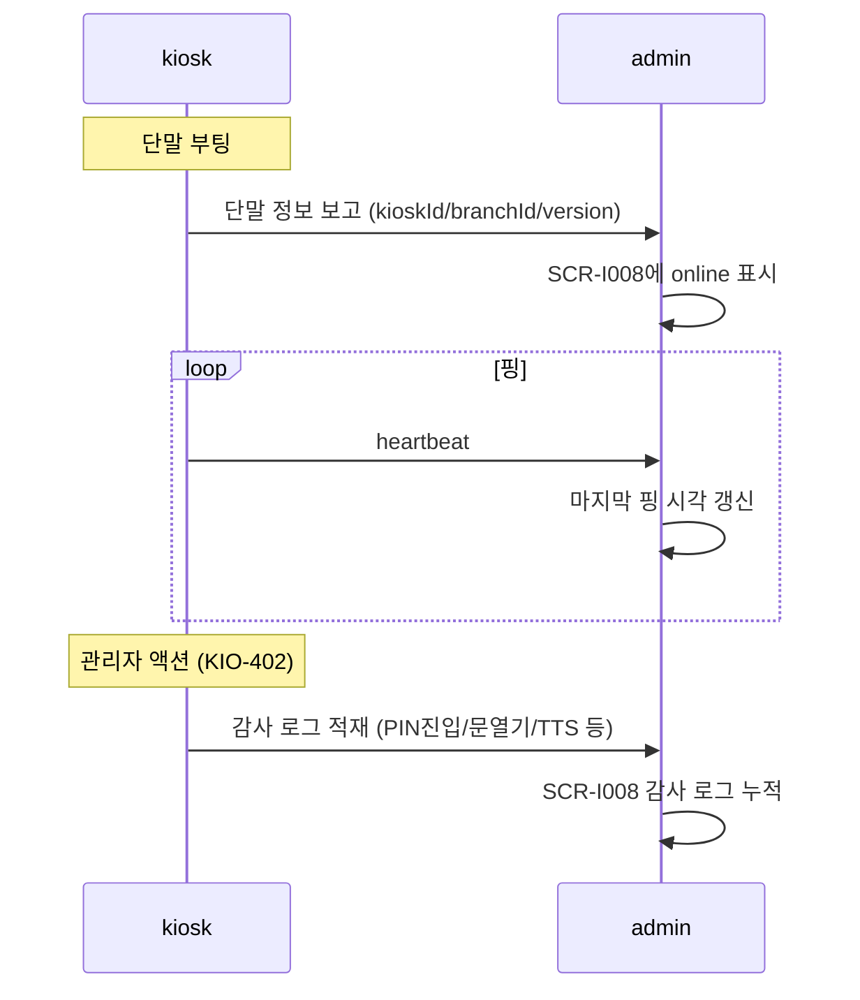

# 키오스크 ↔ admin 연동 다이어그램

> 작성일: 2026-05-04
> kiosk-pando 시점에서 admin과 주고받는 데이터/이벤트 흐름

## 1. 전체 데이터 흐름

## 2. 시퀀스 — 정책 수신

## 3. 시퀀스 — 출석 이벤트

## 4. 시퀀스 — 골프 예약 이벤트

## 5. 시퀀스 — 관리자 패널 보고

## 6. 데이터 일관성 원칙

1. **단일 원천**: 회원/이용권/예약/락커/카드 매핑은 admin DB만 사용. 키오스크는 캐시.
2. **정책 우선**: 출석/락커/골프 운영 규칙은 admin 정책 우선. 키오스크는 표시/입력만.
3. **이벤트는 admin에 적재**: 키오스크에서 발생한 이벤트는 모두 admin 운영 로그로.
4. **신규 설정 키 합의**: 키오스크가 요구하는 신규 설정은 admin/SCR-I002에 명시 후 수신.
5. **오프라인 큐**: 단절 시 로컬 큐, 복구 즉시 admin 반영.

## 관련 산출물

- admin/KIOSK-연동매트릭스.md
- admin/화면설계서/D11-통합운영/SCR-I001-통합출석관리/키오스크-연동.md
- admin/화면설계서/D11-통합운영/SCR-I002-키오스크설정/키오스크-연동.md
- admin/화면설계서/D11-통합운영/SCR-I008-키오스크운영현황/키오스크-연동.md
- admin/화면설계서/D06-시설관리/SCR-050-락커관리/키오스크-연동.md
- admin/화면설계서/D06-시설관리/SCR-052-밴드카드관리/키오스크-연동.md
- admin/화면설계서/D06-시설관리/SCR-054-골프타석관리/키오스크-연동.md
