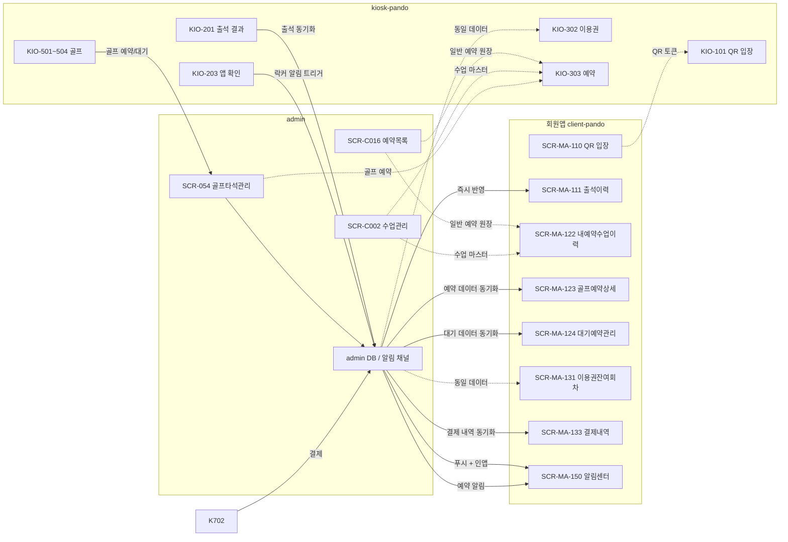
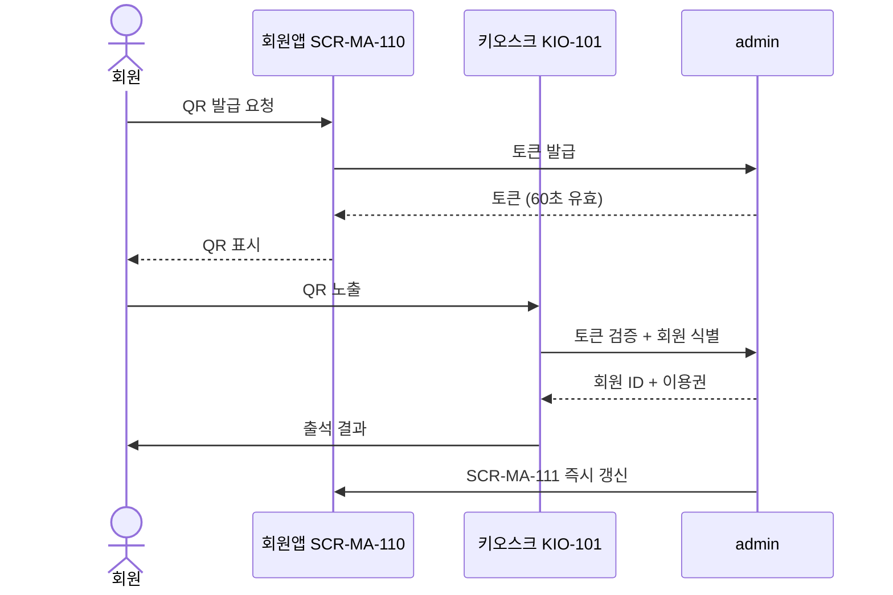
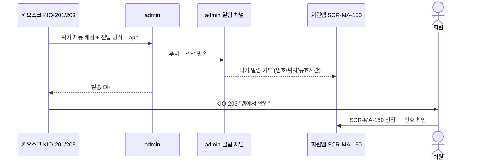
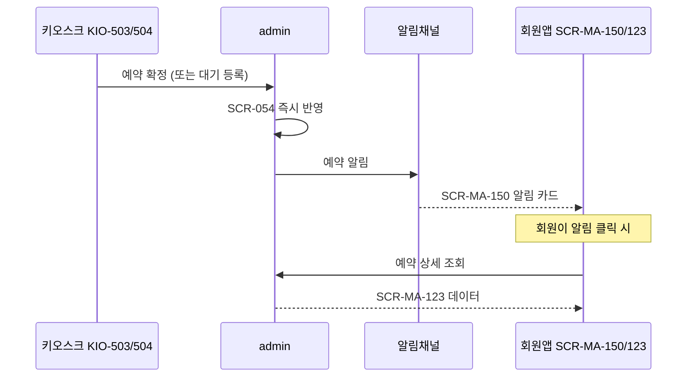
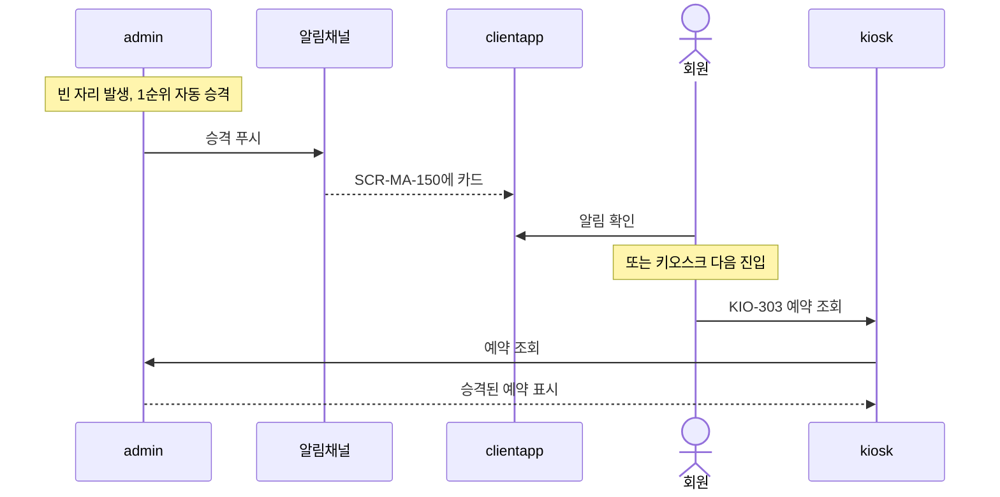
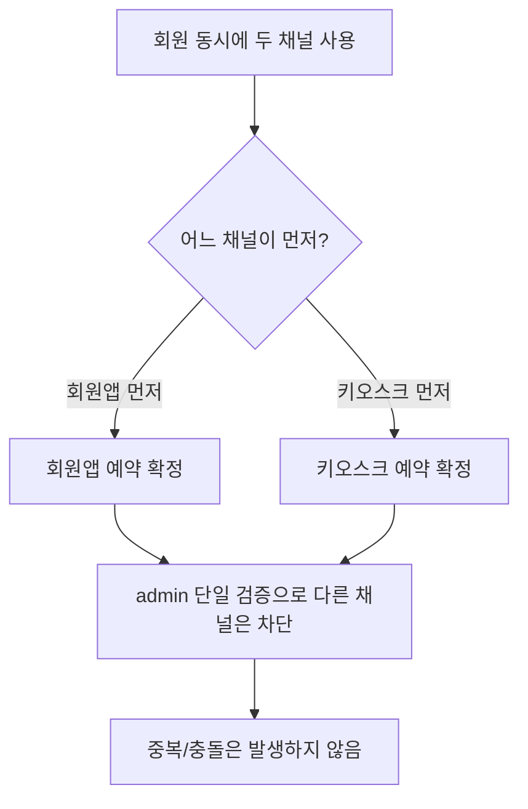

# 키오스크 ↔ 회원앱(client) 연동 다이어그램

> 작성일: 2026-05-04
> kiosk-pando 시점에서 client(회원앱)와 만나는 흐름

## 1. 전체 채널 관계

키오스크와 회원앱은 직접 통신하지 않는다 (단, QR 토큰의 시각적 노출은 예외). 모든 동기화는 admin을 경유한다.

## 2. 시퀀스 — 회원앱 QR로 키오스크 출석

## 3. 시퀀스 — 키오스크 출석 후 락커 번호 앱 발송

## 4. 시퀀스 — 키오스크 골프 예약 후 회원앱 알림

## 5. 시퀀스 — 골프 대기 자동 승격

## 6. 같은 회원의 동시 시도 충돌 방지

admin 단일 검증으로 동시 충돌은 발생하지 않는다.

## 7. 회원앱 측 보강 필요 항목

| 항목 | 회원앱 화면 | 사유 |
|---|---|---|
| 락커 알림 카드 형식 | SCR-MA-150 | 키오스크 KIO-203 흐름 활성화 |
| QR 토큰 자동 재발급 | SCR-MA-110 | 키오스크 인식 안정성 |
| 키오스크 출처 표시(옵션) | SCR-MA-122/123 | 어느 채널에서 예약했는지 라벨 |

## 관련 산출물

- client/KIOSK-연동매트릭스.md
- client/화면설계서/D12-회원앱/SCR-MA-110-QR체크인/키오스크-연동.md
- client/화면설계서/D12-회원앱/SCR-MA-123-골프예약상세/키오스크-연동.md
- client/화면설계서/D12-회원앱/SCR-MA-150-알림센터/키오스크-연동.md
- 30_시나리오_시퀀스/X02, X05, X07, X08
