# N3 — 사이드바 계층 트리

> 사이드바 메뉴 구조를 계층 트리로 표현. 공통 네비게이션 규칙 기준.

```mermaid
flowchart TD
    SIDEBAR["사이드바 메뉴"]

    SIDEBAR --> GRP_DASH["대시보드"]
    GRP_DASH --> M_DASH["지점 대시보드 /"]
    GRP_DASH --> M_TASKS["오늘의 할일 /today-tasks"]

    SIDEBAR --> GRP_ADMIN["본사관리\n(primary/owner/)"]
    GRP_ADMIN --> M_SUPER["슈퍼 대시보드 /super-dashboard"]
    GRP_ADMIN --> M_BRANCH["지점 관리 /branches"]
    GRP_ADMIN --> M_BRPT["지점 리포트 /branch-report"]
    GRP_ADMIN --> M_KPI["KPI 대시보드 /kpi"]
    GRP_ADMIN --> M_KPIPREV["KPI 프리뷰 /kpi-preview"]
    GRP_ADMIN --> M_ONBOARD["온보딩 /onboarding"]
    GRP_ADMIN --> M_AUDIT["감사 로그 /audit-log"]
    GRP_ADMIN --> M_REPORTS["리포트 /reports"]

    SIDEBAR --> GRP_MEMBER["회원관리"]
    GRP_MEMBER --> M_MLIST["회원 목록 /"]
    M_MLIST --> M_MNEW["회원 등록 "]
    M_MLIST --> M_MEDIT["회원 수정 "]
    M_MLIST --> M_MDETAIL["회원 상세 "]
    M_MLIST --> M_MTRANSFER["회원 이관 "]
    GRP_MEMBER --> M_BODYCOMP["체성분 관리 /body-composition"]
    GRP_MEMBER --> M_ATTEND["출석 관리 /"]

    SIDEBAR --> GRP_CLASS["수업관리"]
    GRP_CLASS --> M_CAL["캘린더 /calendar"]
    GRP_CLASS --> M_LESSON["수업 관리 /lessons"]
    GRP_CLASS --> M_SCHED["시간표 등록 /class-schedule"]
    GRP_CLASS --> M_CSTAT["수업 현황 /class-stats"]
    GRP_CLASS --> M_ISTAT["강사 현황 /instructor-status"]
    GRP_CLASS --> M_CTMPL["수업 템플릿 /class-templates"]
    GRP_CLASS --> M_SCREQ["일정 요청 /schedule-requests"]
    GRP_CLASS --> M_LCNT["횟수 관리 /lesson-counts"]
    GRP_CLASS --> M_VALID["유효 수업 /valid-lessons"]
    GRP_CLASS --> M_PEN["페널티 관리 /penalties"]
    GRP_CLASS --> M_PROG["운동 프로그램 /exercise-programs"]

    SIDEBAR --> GRP_SALES["매출관리"]
    GRP_SALES --> M_SALES["매출 현황 /sales"]
    M_SALES --> M_SSTAT["매출 통계 "]
    M_SALES --> M_SMGMT["통계 관리 "]
    GRP_SALES --> M_POS["POS /pos"]
    M_POS --> M_POSPY["POS 결제 "]
    GRP_SALES --> M_REFUND["환불 관리 /"]
    GRP_SALES --> M_DEFER["이연매출 /deferred-revenue"]
    GRP_SALES --> M_UNPAID["미수금 /unpaid"]

    SIDEBAR --> GRP_PROD["상품관리"]
    GRP_PROD --> M_PLIST["상품 목록 /"]
    M_PLIST --> M_PNEW["상품 등록 "]
    M_PLIST --> M_PEDIT["상품 수정 "]
    GRP_PROD --> M_DISC["할인 설정 /discount-settings"]

    SIDEBAR --> GRP_FAC["시설관리"]
    GRP_FAC --> M_LOCK["락커 관리 /locker"]
    M_LOCK --> M_LOCKMGMT["사물함 배정 "]
    GRP_FAC --> M_RFID["밴드/카드 /rfid"]
    GRP_FAC --> M_ROOM["운동룸 /rooms"]
    GRP_FAC --> M_GOLF["골프 타석 /golf-bays"]
    GRP_FAC --> M_CLOTH["운동복 /clothing"]

    SIDEBAR --> GRP_STAFF["직원관리"]
    GRP_STAFF --> M_SLIST["직원 목록 /staff"]
    M_SLIST --> M_SNEW["직원 등록 "]
    M_SLIST --> M_SEDIT["직원 수정 "]
    M_SLIST --> M_RESIGN["퇴사 처리 "]
    GRP_STAFF --> M_SATTEND["직원 근태 /staff/"]
    GRP_STAFF --> M_PAY["급여 관리 /payroll"]
    M_PAY --> M_PAYSTMT["급여 명세서 "]

    SIDEBAR --> GRP_MKT["마케팅"]
    GRP_MKT --> M_LEADS["리드 관리 /"]
    GRP_MKT --> M_MSG["메시지 발송 /message"]
    M_MSG --> M_AUTO["자동 알림 "]
    GRP_MKT --> M_COUPON["쿠폰 관리 "]
    GRP_MKT --> M_MILE["마일리지 /mileage"]
    GRP_MKT --> M_CONTRACT["전자계약 "]

    SIDEBAR --> GRP_SET["설정"]
    GRP_SET --> M_SET["센터 설정 /settings"]
    GRP_SET --> M_PERM["권한 설정 "]
    GRP_SET --> M_KIOSK["키오스크 "]
    GRP_SET --> M_IOT["IoT/출입 "]

    SIDEBAR --> GRP_ETC["기타"]
    GRP_ETC --> M_SUB["구독 관리 /subscription"]
    GRP_ETC --> M_NOTICE["공지사항 /notices"]

    classDef screen fill:#E3F2FD,stroke:#1976D2,color:#0D47A1
    classDef system fill:#EDE7F6,stroke:#5E35B2
    classDef group fill:#F5F5F5,stroke:#9E9E9E,color:#333,font-weight:bold

    class SIDEBAR,GRP_DASH,GRP_ADMIN,GRP_MEMBER,GRP_CLASS,GRP_SALES,GRP_PROD,GRP_FAC,GRP_STAFF,GRP_MKT,GRP_SET,GRP_ETC group
    class M_SUPER,M_BRANCH,M_BRPT,M_KPI,M_KPIPREV,M_ONBOARD,M_AUDIT,M_REPORTS system
```

---

## 사이드바 메뉴 그룹 요약

| 그룹 | 메뉴 수 | 주요 경로 | |------|--------|---------| | 대시보드 | 2 | `/`, `/today-tasks` | | 본사관리 | 8 | `/super-dashboard` ~ `/reports` | | 회원관리 | 7 | `/` ~ `/` | | 수업관리 | 11 | `/calendar` ~ `/exercise-programs` | | 매출관리 | 8 | `/sales` ~ `/unpaid` | | 상품관리 | 4 | `/` ~ `/discount-settings` | | 시설관리 | 6 | `/locker` ~ `/clothing` | | 직원/급여 | 7 | `/staff` ~ `` | | 마케팅 | 6 | `/` ~ `` | | 설정 | 4 | `/settings` ~ `` | | 기타 | 2 | `/subscription`, `/notices` |
